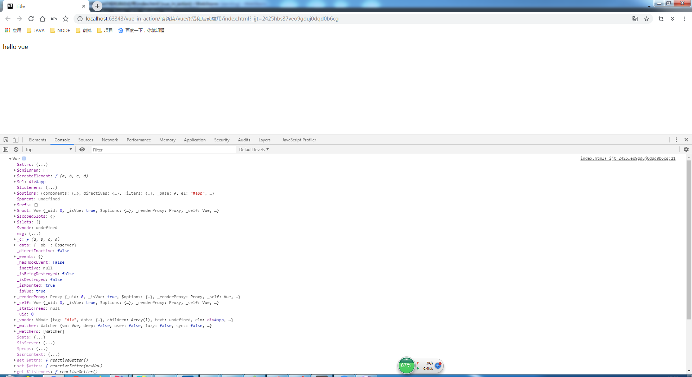
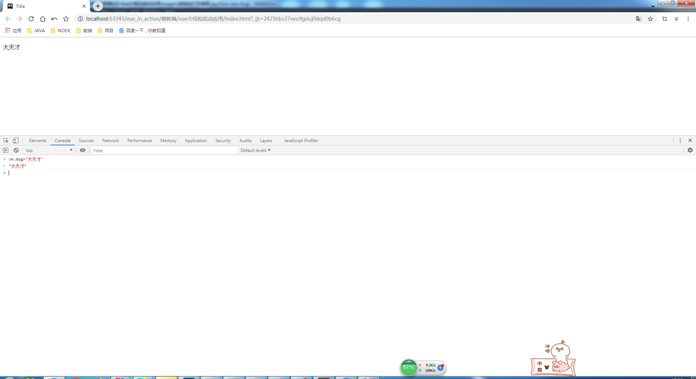

# Vue介绍和启动应用

> 知识大纲

1. Vue特点
    1. 构建用户界面，只关注View层
    2. 简单易学，简洁，轻量，快速
    3. 渐进式框架
        * 所谓的渐进式，可以一步一步，有阶段性的使用Vue，不必在一开始把所有的东西都用上
        * 申明式的渲染(Declarative Rendering)
        * 组件系统(Components System)
        * 客户端路由器(vue-router)
        * 大规模的状态管理(vuex)
        * 构建工具(vue-cli)
    
2. 框架VS库
    1. 库
        * 库，是一封装好的特定方法的集合，提供给开发者使用，库没有控制权，控制权在使用者手中
        * 代表: jQuery等
    2. 框架
        * 框架顾名思义就是一套架构，会基于自身的特点向用户提供一套相当完整的解决方案，
            而且控制权在框架的本身，使用者要找框架所规定的的某种规范进行开发
        * 代表: angular，vue等   
        
3. Vue的两个核心点
    1. 响应式的数据绑定
        * 当数据发生改变 -> 视图自动更新
        * 忘记操作Dom这回事，而是专注于操作数据
    2. 可组合的视图组件 
        * 把视图按照功能，切分若干基本单元
        * 组件可以一级一级组合成整个应用，形成了倒置的组件树
        * 使用组件的好处 -> 可维护，可重用，可测试   
 
> 练习
* 使用script标签引用vue.js      
* 编写代码
    ```html
    <!DOCTYPE html>
    <html lang="en">
    <head>
        <meta charset="UTF-8">
        <title>Title</title>
    </head>
    <body>
        <div id="app">
            <p>{{msg}}</p>
        </div>
        <script src="https://cdn.jsdelivr.net/npm/vue@2.6.10/dist/vue.js"></script>
        <script>
            let vm = new Vue({
                el: "#app",
                data(){
                    return {
                        msg: "hello vue"
                    }
                }
            });
            console.log(vm);
        </script>
    </body>
    </html>
    ```   
* 打开控制台看下打印信息 
    
          
    
* 在控制台玩耍，观察页面变化
    
             
    
* 说明了数据发生变化影响了视图

* [下一章-v-bind和v-on](../02-v-bind和v-on/v-bind和v-on.md)         