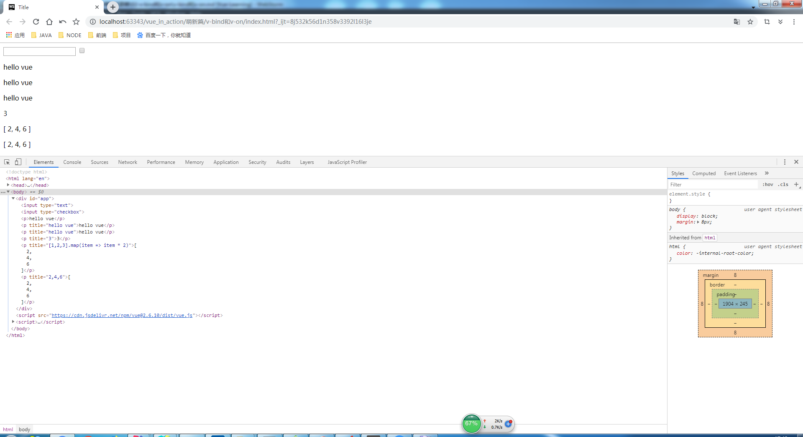
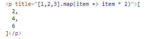
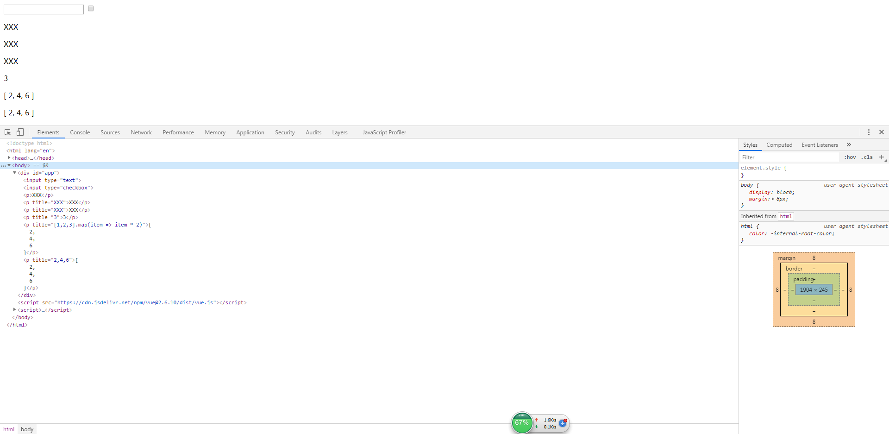
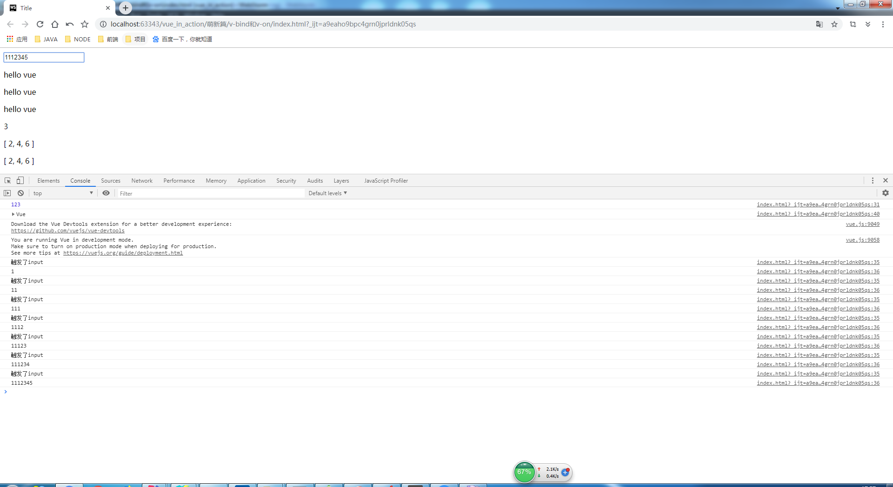

# v-bind和v-on

> 知识大纲

* directive
    1. 理解指令
        1. 是一种特殊的自定义行间属性，以v-开头
        2. 将数据和DOM做关联，当表达式的值改变时，响应式的作用在视图
        3. 预期的值为javascript的表达式
    2. 指令初体验
        * v-bind: 动态绑定数据，简写为:
        * v-on: 绑定事件，简写为@

> 练习
1. v-bind
    1. 先看代码
        ```html
        <!DOCTYPE html>
        <html lang="en">
        <head>
            <meta charset="UTF-8">
            <title>Title</title>
        </head>
        <body>
            <div id="app">
                <p>{{msg}}</p>
                <p v-bind:title="msg">{{msg}}</p>
                <p :title="msg">{{msg}}</p>
                <p :title="1+1+1">{{1+1+1}}</p>
                <p title="[1,2,3].map(item => item * 2)">{{[1,2,3].map(item => item * 2)}}</p>
                <p :title="[1,2,3].map(item => item * 2)">{{[1,2,3].map(item => item * 2)}}</p>
            </div>
            <script src="https://cdn.jsdelivr.net/npm/vue@2.6.10/dist/vue.js"></script>
            <script>
                let vm = new Vue({
                    el: "#app",
                    data(){
                        return {
                            msg: "hello vue"
                        }
                    }
                });
                console.log(vm);
            </script>
        </body>
        </html>
        ```
    2. 浏览器观察下结果
    
            
        
    3. 注意有个title属性没用使用bind，所以解析出来就是字符串  
    
          
        
    4. 控制台输入vm.msg="XXX"看下结果  
    
          
        
2. v-on 
    1. 代码如下
        ```
        <!DOCTYPE html>
        <html lang="en">
        <head>
            <meta charset="UTF-8">
            <title>Title</title>
        </head>
        <body>
            <div id="app">
                <input type="text" @input="inputHandle">
                <p>{{msg}}</p>
                <p v-bind:title="msg">{{msg}}</p>
                <p :title="msg">{{msg}}</p>
                <p :title="1+1+1">{{1+1+1}}</p>
                <p title="[1,2,3].map(item => item * 2)">{{[1,2,3].map(item => item * 2)}}</p>
                <p :title="[1,2,3].map(item => item * 2)">{{[1,2,3].map(item => item * 2)}}</p>
                <p>
                    {{fn()}}
                </p>
            </div>
            <script src="https://cdn.jsdelivr.net/npm/vue@2.6.10/dist/vue.js"></script>
            <script>
                let vm = new Vue({
                    el: "#app",
                    data(){
                        return {
                            msg: "hello vue"
                        }
                    },
                    methods:{
                        fn(){
                            console.log(123)
                        },
                        inputHandle(ev){
                            //this指向实例vm this === vm
                            console.log("触发了input");
                            console.log(ev.target.value);
                        }
                    }
                });
                console.log(vm);
            </script>
        </body>
        </html>
        ```  
    2. 控制台结果如下  
        
           
        
    3. 注意methods属性方法中的this指向vue的实例vm   
    
    4. 这个时候inputHandle里的代码改成这样
        ```
        inputHandle(e){
            this.msg = e.target.value;
        }
        ``` 
    5. 此时input框输入就能改变页面msg的值了
    6. 总结
        1. 数据 -> 页面 (数据msg渲染了页面)
        2. 页面 -> 数据 (页面的操作也能改变数据msg)
        3. 但e.target.value实际上还是操作了dom，所以接下去我们会学习v-model   
