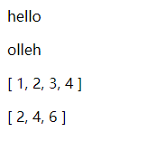
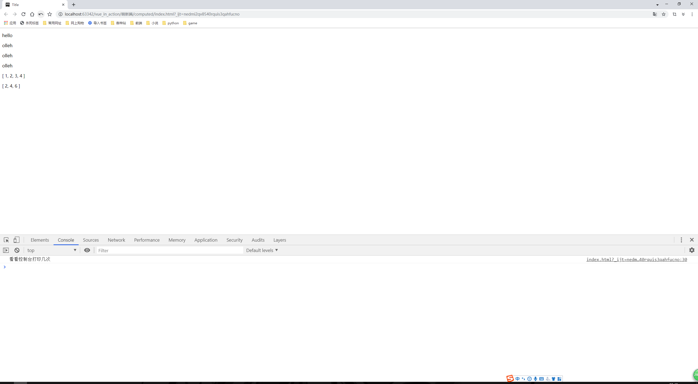
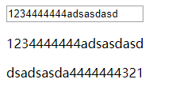

# 计算属性

> 知识大纲
1. 计算属性定义在computed中，它不是方法，属性的值是函数的返回值
2. 把对处理数据的逻辑抽离在计算属性中，使得模板更加轻易易读
3. 计算属性的值会被缓存，并根据依赖的数据变化而重新计算
4. 计算属性的使用
    1. 取值
        * 触发get函数，默认设置的函数
    2. 赋值
        * 触发set函数
        
> 练习
1. 未使用computed属性之前
    1. 先上代码
        ```html
        <!DOCTYPE html>
        <html lang="en">
        <head>
            <meta charset="UTF-8">
            <title>Title</title>
        </head>
        <body>
            <div id="app">
                <p>{{msg}}</p>
                <p>{{msg.split("").reverse().join("")}}</p>
                <p>{{list}}</p>
                <p>{{list.map(item => item * 2).filter(item => item <= 6)}}</p>
            </div>
            <script src="https://cdn.bootcss.com/vue/2.5.16/vue.min.js"></script>
            <script>
                new Vue({
                    el: "#app",
                    data(){
                        return {
                            msg: "hello",
                            list: [1,2,3,4]
                        }
                    }
                })
            </script>
        </body>
        </html>
        ```   
    2. 页面的效果是
        
          
        
2. 使用computed属性
    1. 先上代码
        ```html
        <!DOCTYPE html>
        <html lang="en">
        <head>
            <meta charset="UTF-8">
            <title>Title</title>
        </head>
        <body>
            <div id="app">
                <p>{{msg}}</p>
                <!--<p>{{msg.split("").reverse().join("")}}</p>-->
                <p>{{reverseMsg}}</p>
                <p>{{reverseMsg}}</p>
                <p>{{reverseMsg}}</p>
                <p>{{list}}</p>
                <!--<p>{{list.map(item => item * 2).filter(item => item <= 6)}}</p>-->
                <p>{{newList}}</p>
            </div>
            <script src="https://cdn.bootcss.com/vue/2.5.16/vue.min.js"></script>
            <script>
                new Vue({
                    el: "#app",
                    data(){
                        return {
                            msg: "hello",
                            list: [1,2,3,4]
                        }
                    },
                    computed:{
                        reverseMsg(){
                            console.log("看看控制台打印几次");
                            return this.msg.split("").reverse().join("");
                        },
                        newList(){
                            return this.list.map(item => item * 2).filter(item => item <= 6);
                        }
                    }
                })
            </script>
        </body>
        </html>
        ```
    2. 页面及控制台的展示
        
         
        
    3. 这个就很骚了，也是computed一个很好的地方，会把计算好的值缓存 
    
    4. 扩展  
        1. 先看代码
            ```html
            <!DOCTYPE html>
            <html lang="en">
            <head>
                <meta charset="UTF-8">
                <title>Title</title>
            </head>
            <body>
                <div id="app">
                    <input type="text" v-model="msg">
                    <p>{{msg}}</p>
                    <p>{{reverseMsg}}</p>
                </div>
                <script src="https://cdn.bootcss.com/vue/2.5.16/vue.min.js"></script>
                <script>
                    new Vue({
                        el: "#app",
                        data(){
                            return {
                                msg: "",
                            }
                        },
                        computed:{
                            reverseMsg(){
                                return this.msg.split("").reverse().join("");
                            }
                        }
                    })
                </script>
            </body>
            </html>
            ```   
        2. 页面的效果 
            
            
                
              