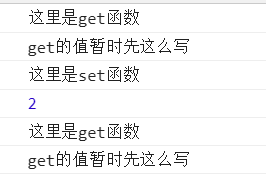
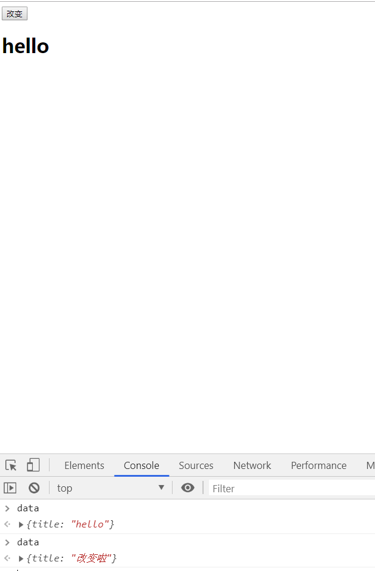
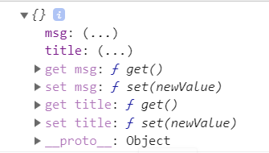

# Object.defineProperty实现响应的数据绑定

> 知识大纲
1. 参考[上一章](../09-Object.defineProperty数据描述/Object.defineProperty数据描述.md)的知识大纲
2. 声明式渲染
    1. 声明式
        * 只需要声明在哪里where，做什么what，而无需关心如何实现how
    2. 命令式
        * 需要以具体代码表达在哪里where做什么what，如何实现how
    3. 声明式渲染理解
        1. DOM状态只是数据状态的一个映射
        2. 所有的逻辑尽可能在状态的层面去进行
        3. 当状态改变了，view会被框架自动更新到合理的状态
        
> 练习 
1. 练习访问器描述
    1. 先上一段简单的代码 
        ```html
        let obj = {
            x: 1,
            y: 1
        };
        console.log(obj.x);
        obj.x = 2;
        console.log(obj.x);
        ```      
    2. 还是这段老土的代码，第一次打印1，第二次打印2
    3. 我们数据劫持下，这次看看get和set方法
        ```html
        let obj = {
            x: 1,
            y: 1
        };
        Object.defineProperty(obj, "x", {
           get(){
               console.log("这里是get函数");
               return "get的值暂时先这么写"
           },
           set(newValue){
               console.log("这里是set函数");
               console.log(newValue);
           }
        });
        console.log(obj.x);
        obj.x = 2;
        console.log(obj.x);
        ```    
    4. 这次打印的东西有点多，直接截图给大家看下    
    
        
        
    5. 很明显，当我们直接obj.x就会触发get函数，当我们obj.x=2的时候触发了set函数，
        因为我们的get函数返回值写死了一串字符串，所以`console.log(obj.x);`也打印了这么一串字符串
    6. 我们改写下我们的代码 
        ```
        let obj = {
            x: 1,
            y: 1
        };
        let value = 1;
        Object.defineProperty(obj, "x", {
           get(){
               // console.log("这里是get函数");
               return value
           },
           set(newValue){
               // console.log("这里是set函数");
               value = newValue;
           }
        });
        console.log(obj.x);
        obj.x = 2;
        console.log(obj.x);
        obj.x = 3;
        console.log(obj.x);
        ```
    7. 这个时候控制台打印的就是我们预期的1,2,3 

2. 实现响应的数据绑定  
    1. 先来段简单的代码
        ```
        <!DOCTYPE html>
        <html lang="en">
        <head>
            <meta charset="UTF-8">
            <title>Title</title>
        </head>
        <body>
            <div id="app">
                <button id="changeBtn">改变</button>
                <h1 id="title"></h1>
            </div>
            <script>
                let data = {
                    title: "hello"
                };
                let oH1 = document.getElementById("title");
                let oBtn = document.getElementById("changeBtn");
                oH1.innerText = data.title;
                oBtn.onclick = () => {
                    data.title = "改变啦"
                }
        
            </script>
        </body>
        </html>
        ```      
    2. 打开页面后，在控制台输入data，然后点击按钮，在控制台继续输入data 
        
           
    
    3. 很明显页面上的数据并没有改变，因为我们还没有实现这个功能  
    4. 我们实现下功能，最终代码是这样的
        ```html
        <!DOCTYPE html>
        <html lang="en">
        <head>
            <meta charset="UTF-8">
            <title>Title</title>
        </head>
        <body>
            <div id="app">
                <button id="changeBtn">改变</button>
                <h1 id="title"></h1>
            </div>
            <script>
                let data = {
                    title: "hello",
                    msg: "test"
                };
                let oH1 = document.getElementById("title");
                let oBtn = document.getElementById("changeBtn");
                oH1.innerText = data.title;
                oBtn.onclick = () => {
                    data.title = "改变啦"
                };
        
                observe(data);
                //observe 和 defineReactive做数据劫持
                function observe(obj){
                    // console.log(Object.keys(obj));
                    Object.keys(obj).forEach(key => {
                        defineReactive(obj, key, obj[key]);
                    })
                }
        
                function defineReactive(obj, key, value){
                    // console.log(obj, key, value);
                    Object.defineProperty(obj, key, {
                        get(){
                            return value;
                        },
                        set(newValue){
                            value = newValue;
                            oH1.innerText = newValue;
                        }
                    })
                }
        
                console.log(data);
        
            </script>
        </body>
        </html>
        ``` 
    5. 我们打印看下data被数据劫持后的样子，主要看下有get和set函数  
        
         
        
    6. 可以在vue的源码中看下实现，函数名observe, defineReactive             
    
3. 声明式和命令式
    1. 背景是给定个数组，如[1, 2, 3]，要求数组每个元素乘以2，返回这样一个新的数组
    2. 看代码理解更方便
        ```
        let arr = [1, 2, 3];
    
        //声明式
        let resultArr1 = arr.map(item => item * 2);
        console.log(resultArr1);
    
        //命令式
        let resultArr2 = [];
        for (let i = 0; i < arr.length; i++) {
            resultArr2.push(arr[i] * 2);
        }
        console.log(resultArr2);
        ```
    3. 打印的结果都是2, 4, 6，可以结合知识大纲理解声明式和命令式的区别

4. 声明式渲染
    * 结合知识大纲以及之前的练习加深理解  
            