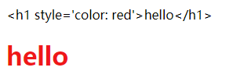
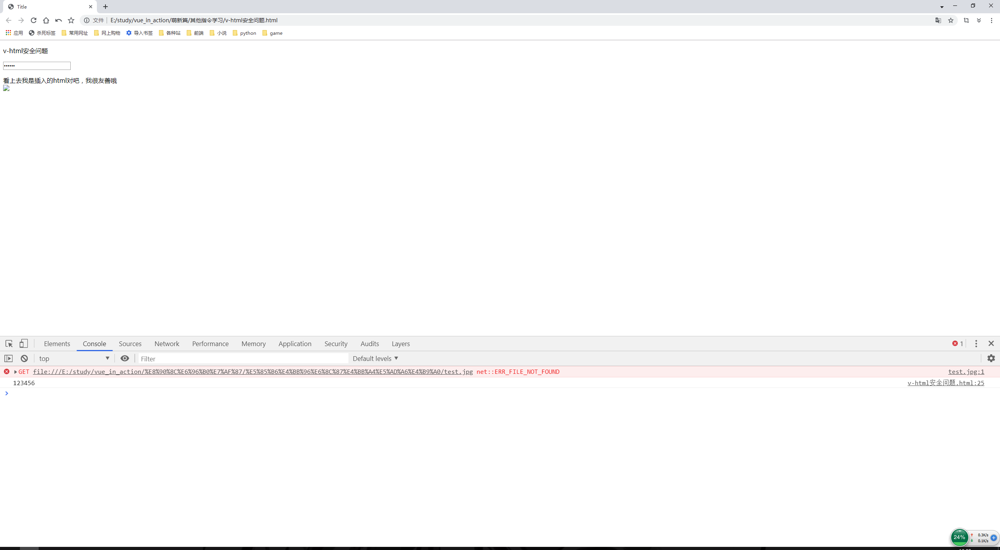
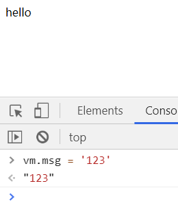

# 其他指令学习

> 知识大纲
1. v-text
    * 更新元素的textContent, 可代替{{}}
2. v-html
    * 更新元素的innerHTML
    * 不使用这个指令，插入的html结构不作为模板编译，作为文本显示
    * 不要插入不安全的html结构
3. v-cloak
    * 隐藏未编译的Mustache标签直到实例准备完毕
4. v-once
    * 只渲染一次，随后数据改变将不再重新渲染，视为静态内容，用于优化更新性能
5. 自定义指令
    * 对普通DOM元素进行底层操作，需要用到自定义指令
6. 钩子函数
    1. bind - 只调用一次，指令第一次绑定到元素时调用
    2. inserted - 被绑定元素插入父节点时调用
    3. update - 更新时调用
    4. componentUpdated - 更新完毕调用
    5. unbind - 只调用一次，指令与元素解绑时调用  
    
> 练习
1. v-text
    1. 其实和**{{}}**是差不多的，有些细节的区别，来看代码
        ```html
        <!DOCTYPE html>
        <html lang="en">
        <head>
            <meta charset="UTF-8">
            <title>Title</title>
        </head>
        <body>
            <div id="app">
                <p>{{msg}}</p>
                <p v-text="msg"></p>
            </div>
            <script src="https://cdn.bootcss.com/vue/2.5.16/vue.min.js"></script>
            <script>
                let vm = new Vue({
                    el: "#app",
                    data(){
                        return {
                            msg: "hello"
                        }
                    }
                })
            </script>
        </body>
        </html>
        ```    
    2. 在页面上的显示是一样的两个p标签，标签里的文字是hello
    3. 这个时候我们开个定时器在看下
        ```html
        <!DOCTYPE html>
        <html lang="en">
        <head>
            <meta charset="UTF-8">
            <title>Title</title>
        </head>
        <body>
            <div id="app">
                <p>{{msg}}</p>
                <p v-text="msg"></p>
            </div>
            <script src="https://cdn.bootcss.com/vue/2.5.16/vue.min.js"></script>
            <script>
                setTimeout(function(){
                    let vm = new Vue({
                        el: "#app",
                        data(){
                            return {
                                msg: "hello"
                            }
                        }
                    })
                }, 1000)
            </script>
        </body>
        </html>
        ```    
    4. 因为开了定时器，vue还没有进行渲染，原先p标签中的**{{msg}}**就展示在页面上了，过了1s后，才展示了2个hello
    5. 实际开发中，其实用双大括号比较多，比较方便，
        至于上面说的这个定时器问题，我们会通过另外个指令**v-cloak**解决 

2. v-html
    1. 先上代码 
        ```html
        <!DOCTYPE html>
        <html lang="en">
        <head>
            <meta charset="UTF-8">
            <title>Title</title>
        </head>
        <body>
            <div id="app">
                <p>{{msg}}</p>
                <p v-html="msg"></p>
            </div>
            <script src="https://cdn.bootcss.com/vue/2.5.16/vue.min.js"></script>
            <script>
                let vm = new Vue({
                    el: "#app",
                    data(){
                        return {
                            msg: "<h1 style='color: red'>hello</h1>"
                        }
                    }
                })
            </script>
        </body>
        </html>
        ``` 
    2. 打开浏览器看下结果
        
          
        
    3. 很明显v-html会渲染html结构,不使用指令的时候就是渲染出来一堆字符串
    4. 为什么说不要插入不安全的html结构，先上代码
        ```html
        <!DOCTYPE html>
        <html lang="en">
        <head>
            <meta charset="UTF-8">
            <title>Title</title>
        </head>
        <body>
        <div id="app">
            <p>{{msg}}</p>
            <input type="password" id="pwd" value="123456">
            <p v-html="attackHtml"></p>
        </div>
        <script src="https://cdn.bootcss.com/vue/2.5.16/vue.min.js"></script>
        <script>
            let vm = new Vue({
                el: "#app",
                data(){
                    return {
                        msg: "v-html安全问题",
                        attackHtml: `<div>看上去我是插入的html对吧，我很友善哦</div>
                                        `
                    }
                }
            })
        </script>
        </body>
        </html>
        ``` 
    5. 打开浏览器和开发者工具看结果
    
              
        
    6. 我们分析下代码，首先我们给了个password的input，也设定了密码123456，
        之后我们插入的一段html代码，有个img标签，src的地址是不存在的所以直接会调用onerror里的js代码，
         这段js代码就是获取了password的值，并在控制台打印
    
    7. 上述的情况就是插入了不安全的html结构，导致被攻击
    
3. v-cloak
    1. 先上代码
        ```html
        <!DOCTYPE html>
        <html lang="en">
        <head>
            <meta charset="UTF-8">
            <title>Title</title>
            <style>
                [v-cloak]{
                    display: none;
                }
            </style>
        </head>
        <body>
        <div id="app">
            <p v-cloak>{{msg}}</p>
            <p v-text="msg"></p>
        </div>
        <script src="https://cdn.bootcss.com/vue/2.5.16/vue.min.js"></script>
        <script>
            setTimeout(function(){
                let vm = new Vue({
                    el: "#app",
                    data(){
                        return {
                            msg: "hello"
                        }
                    }
                })
            }, 1000)
        </script>
        </body>
        </html>
        ```  
    2. 我们注意看下如何使用，首先在需要隐藏的标签上加上v-cloak指令
    3. 然后在style中对其修改样式
    4. 这样就达到了我们想要的效果，不会渲染出{{msg}}
    
4. v-once     
    1. 具体代码如下
        ```html
        <!DOCTYPE html>
        <html lang="en">
        <head>
            <meta charset="UTF-8">
            <title>Title</title>
        </head>
        <body>
        <div id="app">
            <p v-once>{{msg}}</p>
        </div>
        <script src="https://cdn.bootcss.com/vue/2.5.16/vue.min.js"></script>
        <script>
            let vm = new Vue({
                el: "#app",
                data(){
                    return {
                        msg: "hello"
                    }
                }
            })
        </script>
        </body>
        </html>
        ```    
    2. 在我们没有加入v-once指令前，我们在控制台输入`vm.msg = '123'`，
        页面也会跟着我们数据的改变重新渲染
    3. 加上v-once指的就是只渲染一次，所以我们看到的结果就是
    
        
        
    4. 和我们预期的一致    
    
                                                 