# Vue-01

> 知识大纲

* 组件基本分类
    * 根组件
    * 可复用的功能组件
* 根组件创建
    * `new Vue(创建组件所需要的一些配置选项)`
* 可复用的功能组件 - 之后会在巩固
    * `Vue.Component(创建组件所需要的一些配置选项)`  
* render
    * type: (createElement: () => VNode) => VNode
    * 发挥js最大的编程能力，直接创建VNode(虚拟DOM对象)，优先级高于el和template
    * 有更强大的编程能力
    * 有更高的性能  
* 组件中的数据 - data 
* Object.defineProperty监听拦截的一些问题
    * 对象新增属性 - 这个直接改不会劫持
    * 数组方法 - 以下方法是会劫持的
        * push
        * pop
        * shift
        * unshift
        * splice
        * sort
        * reverse
    * 数组新增值 - `arr[100] = ""` - 不会劫持
    * 数组length属性 - `arr.length = 100` - 不会劫持 
    * vue对数组中的push，pop等方法重新包装，所以在vue中调用这些方法，可以对数组的修改进行监听拦截 
    * 关于之前新增属性，无法劫持监听的，我们可以使用set
        ```js
        Vue.set(app.user, "gender", '男');
        app.$set(app.user, 'age', 30);
        ```                     
* 指令-`v-xxx`，指令的值是用引号括起来的表达式，后期还可以自定义属于自己的指令
    * 内容输出
    * 循环
    * 逻辑
    * 属性绑定
    * 事件
    * 其他
* 指令修饰符
    * 一个指令可以包含的内容包括
        * 指令名称
        * 指令值
        * 指令参数
        * 指令修饰符
    * 代码格式`<组件 指令:参数.修饰符1.修饰符2="值"/>`
    * .lazy
        * 取代input监听change事件
    * .number
        * 输入字符串转为有效的数字
    * trim
        * 输入首尾空格过滤 
* 事件绑定
    * v-on简写@
    * 选项methods                      

> 练习

1. vue初始化
    * 先上代码
        ```html
        <!DOCTYPE html>
        <html lang="en">
        <head>
            <meta charset="UTF-8">
            <meta name="viewport" content="width=device-width, initial-scale=1.0">
            <meta http-equiv="X-UA-Compatible" content="ie=edge">
            <title>Document</title>
        </head>
        <body>
            <div id="app"></div>
            <script src="../js/vue.js"></script>
            <script>
                let app = new Vue({
                    template: `<div>梅利奥猪猪</div>`
                })
                console.log(app);
                app.$mount("#app");
            </script>
        </body>
        </html>        
        ```
    * 来看截图

        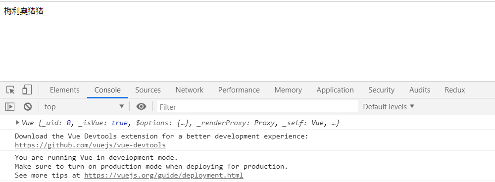 

    * 其实就是生命个template模板，然后挂载到我们的id为app的节点上  
    * 我们在来看另外种方式挂载，这种方式就不需要`app.$mount("#app");` 
        ```js
        let app = new Vue({
            el: "#app",
            template: `<div>梅利奥猪猪</div>`
        })        
        ```
    * 这里还有个细节，我们这么处理下
        * 只给个el选项
            ```js
            let app = new Vue({
                el: "#app"
            })            
            ```
        * 页面div#app下直接写点内容 
            ```html
            <div id="app">
                梅利奥猪猪
            </div>            
            ```
        * 实际上Vue会把上述的html结构当做是个template    
    * 这里还可以玩个优先级的问题，完整代码如下
        ```html
        <!DOCTYPE html>
        <html lang="en">
        <head>
            <meta charset="UTF-8">
            <meta name="viewport" content="width=device-width, initial-scale=1.0">
            <meta http-equiv="X-UA-Compatible" content="ie=edge">
            <title>Document</title>
        </head>
        <body>
            <div id="app">
                梅利奥猪猪
            </div>
            <script src="../js/vue.js"></script>
            <script>
                /* let app = new Vue({
                    template: `<div>梅利奥猪猪</div>`
                })
                console.log(app);
                app.$mount("#app"); */

                /* let app = new Vue({
                    el: "#app",
                    template: `<div>梅利奥猪猪</div>`
                }) */

                /* let app = new Vue({
                    el: "#app"
                }) */
                let app = new Vue({
                    el: "#app",
                    template: `<div>梅利奥猪猪 - 看看是我优先级高还是默认html里面的优先级高</div>`
                })
            </script>
        </body>
        </html>        
        ```    
    * 打开页面看下，事实证明是我们的template的优先级更高一些

        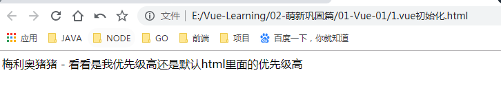     

    * 这边还有些细节要学习，比如el选项，不能把body，html作为我们的挂载点，因为我们的模板最终是替换
        * 这里演示下替换是什么意思，我们先讲script中的vue代码注释掉，来看下页面

            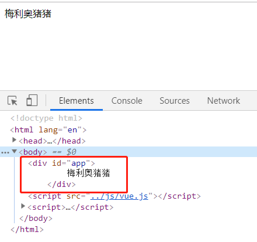

        * 很明显，就是我们一开始写的div#app,然后在打开我们的注释，注意这里我们的模板就是个div，没有class也没有id

            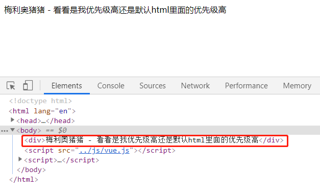 

        * 从这里我们就可以发现这里做的是替换的操作，由此可以知道，我们的body，html设计上就是不可以挂载，如果设置了就会报错，因为替换的逻辑会把他们替换掉，这里简单做下实验，给大家看下报错的信息 

            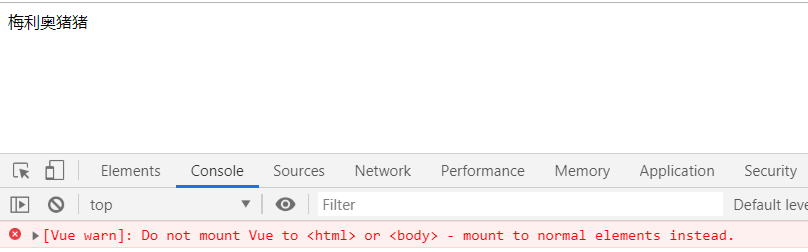   

        * 在次强调，替换的逻辑是会包含你设置的元素的，如前面演示的el是#app，他是包含#app一起替换的  

    * template选项，每一个组件的根元素有且只能有一个，这个就不演示了，和react一样，**有且只有一个**   
    * 接下来我们简单了解下渲染render函数，实际过程是`html模板 => VDOM(虚拟DOM对象) => DOM元素`，可以在去看下课程大纲，后续深入学习后会在补充 

2. vue中的数据
    * data选项必须是个对象，如果直接给data一个数字，即`data: 8`，这种就会直接报错了
    * 那对象数据如何去访问呢，来看代码
        ```html
        <!DOCTYPE html>
        <html lang="en">
        <head>
            <meta charset="UTF-8">
            <meta name="viewport" content="width=device-width, initial-scale=1.0">
            <meta http-equiv="X-UA-Compatible" content="ie=edge">
            <title>Document</title>
        </head>
        <body>
            <div id="app">
                {{title}}
            </div>
            <script src='../js/vue.js'></script>
            <script>
                let app = new Vue({
                    el: "#app",
                    data: {
                        title: "猪猪带你起飞"
                    }
                });
                console.log(app);
            </script>
        </body>
        </html>        
        ```
    * 接着我们来打印下app，然后来找下data，然后发现了_data，能看到该属性已经被劫持 
    * 在Vue的实例对象下也会被添加，也就是说app.title也能取到我们的这个数据 
    * 还有个$data，大家也能看到数据被劫持

        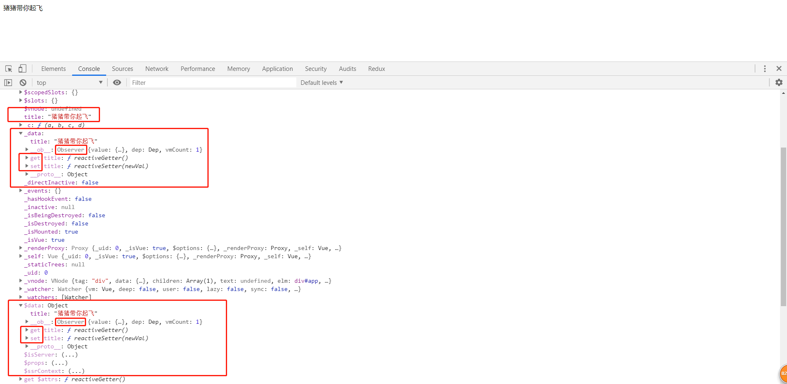

    * 所以我们在控制台可以这么玩

        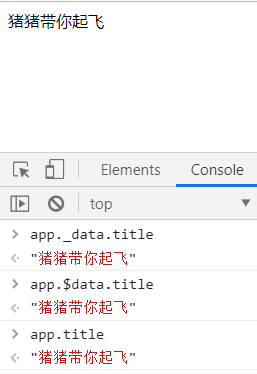    

    * 这里我们可以注意个细节，因为app下我们发现属性，有_xxx也有$xxx，所以我们在data选项，配置这个对象的时候，不能用下划线或者$开头的key 

    * 因为有数据劫持，所以前面我们控制台还可以这么玩`app.title = "我是你们的猪大佬"`，这样我们看到的页面就变成了  

        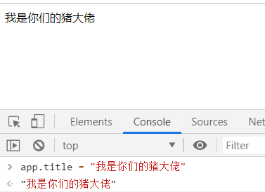

    * 上面的表现就是因为数据劫持，当数据改变后，我们的组件会重新渲染 
    * 然后我们来演示下数据劫持的一些细节问题，可以看下大纲Object.defineProperty监听拦截的一些问题 
        ```html
        <!DOCTYPE html>
        <html lang="en">
        <head>
            <meta charset="UTF-8">
            <meta name="viewport" content="width=device-width, initial-scale=1.0">
            <meta http-equiv="X-UA-Compatible" content="ie=edge">
            <title>Document</title>
        </head>
        <body>
            <div id="app">
                <p>{{title}}</p>
                <p>姓名 - {{user.name}}</p>
                <p>年龄 - {{user.age}}</p>
            </div>
            <script src='../js/vue.js'></script>
            <script>
                let app = new Vue({
                    el: "#app",
                    data: {
                        title: "猪猪带你起飞",
                        user: {
                            name: "gqf",
                        }
                    }
                })
                console.log(app);
            </script>
        </body>
        </html>        
        ``` 
    * 注意观察，此时我们的data传了个user，但只设置了名字，然后在渲染的时候，我们多写了个年龄，此时我们如果使用`app.user.age=28`试下，就能发现，页面没有重新渲染    

        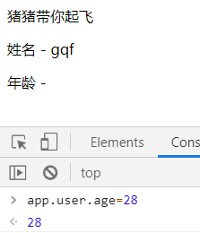 

    * 原因其实是一开始data的数据劫持，相当于遍历了一开始设置的属性，然后通过defineProperty数据劫持，然后新增的属性是没有被劫持的，所以导致了这么个问题，所以后续的属性需要被劫持，需要重新defineProperty，Vue提供给我们方法可以搞定这个，那就是set,这里可以看下知识大纲，然后我们也实际操作一下吧

        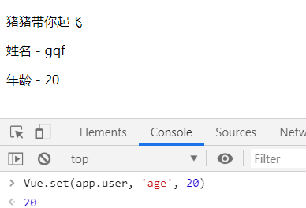    

    * 也就是说，set之后这个属性就已经被劫持了，之后我们再用`app.user.age = 50`修改数据，页面就会重新渲染    
    * 接下来我们再来玩下数组
        ```html
        <!DOCTYPE html>
        <html lang="en">
        <head>
            <meta charset="UTF-8">
            <meta name="viewport" content="width=device-width, initial-scale=1.0">
            <meta http-equiv="X-UA-Compatible" content="ie=edge">
            <title>Document</title>
        </head>
        <body>
            <div id="app">
                <p>{{title}}</p>
                <p>姓名 - {{user.name}}</p>
                <p>年龄 - {{user.age}}</p>
                <p>{{arr}}</p>
            </div>
            <script src='../js/vue.js'></script>
            <script>
                let app = new Vue({
                    el: "#app",
                    data: {
                        title: "猪猪带你起飞",
                        user: {
                            name: "gqf",
                        },
                        arr: [1, 2, 3]
                    }
                })
                console.log(app);
            </script>
        </body>
        </html>        
        ```
    * 然后各种试下[],length发现没有用, 其实数据是改了，就是试图没渲染，即没有数据劫持，没有拦截

        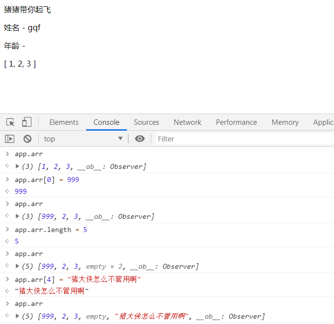     

    * 接着我们试下push，发现就可以了，实际上是vue重写了数组的一些方法，比如说`Array.prototype.push = function(...args){}`,
    实现了原本的功能，并且在push后重新通过defineProperty去劫持，官网上称这些为变异方法(详细去看知识大纲列出来的数组方法)

        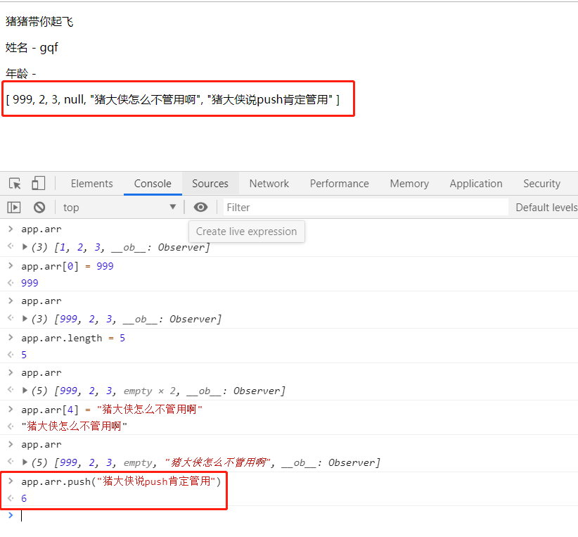    

3. vue中的指令
    * v-text
        * 先上代码 
            ```html
            <!DOCTYPE html>
            <html lang="en">
            <head>
                <meta charset="UTF-8">
                <meta name="viewport" content="width=device-width, initial-scale=1.0">
                <meta http-equiv="X-UA-Compatible" content="ie=edge">
                <title>Document</title>
            </head>
            <body>
                <div id="app">
                    <p>hello, {{title}}</p>
                    <p v-text="title">hello</p>
                </div>
                <script src="../js/vue.js"></script>
                <script>
                    let app = new Vue({
                        el: "#app",
                        data: {
                            title: "我是梅利奥猪猪"
                        }
                    })
                </script>
            </body>
            </html>        
            ``` 
        * 上述代码我们能看到v-text把hello也一起替换掉了 

            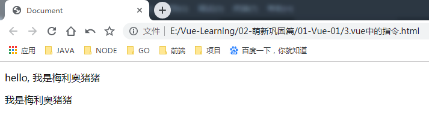

        * 还有个就是很基础的，指令的引号中，填的是表达式，所以下面的代码页面呈现的就是title和6
            ```html
            <p v-text="'title'"></p>
            <p v-text="1+2+3"></p>
            ``` 
        * 这边在看个有意思的现象，我们把el选项先注释掉，然后开个定时器使用$mount去挂载      
            ```html
            <!DOCTYPE html>
            <html lang="en">
            <head>
                <meta charset="UTF-8">
                <meta name="viewport" content="width=device-width, initial-scale=1.0">
                <meta http-equiv="X-UA-Compatible" content="ie=edge">
                <title>Document</title>
            </head>
            <body>
                <div id="app">
                    <p>hello, {{title}}</p>
                    <p v-text="title">hello</p>
                    <p v-text="'title'"></p>
                    <p v-text="1+2+3"></p>
                </div>
                <script src="../js/vue.js"></script>
                <script>
                    let app = new Vue({
                        // el: "#app",
                        data: {
                            title: "我是梅利奥猪猪"
                        }
                    })
                    setTimeout(() => {
                        app.$mount("#app");
                    }, 1000)
                </script>
            </body>
            </html>            
            ```
        * 我们会发现页面在一开始渲染的时候，看到了我们的大胡子语法，但是使用指令的就没这个问题 

    * v-cloak
        * 个人感觉是解决了前面2个一起的问题，首先我们知道使用大胡子语法不使用指令，会导致页面一开始渲染的时候就让用户看到了大胡子，这个明显不太好，但使用v-text又会把html全部替换掉，这个时候我们可以用v-cloak配合样式，这样一开始既不会看到大胡子，而且也不会把整个html都替换掉，下面来讲下具体改怎么写
        * 我们这次把定时器的间隔调整到5000毫秒，为了看下v-cloak的效果`<p v-cloak>hello - {{title}}</p>`
        * 这个时候我们发现，和之前的那个没用指令的的一样，页面一开始会看到大胡子~ 

            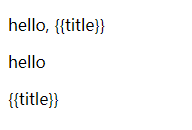 

        * 但我们这个时候可以来个操作，就是通过css去控制，就能解决这个问题了
            ```css
            [v-cloak]{
                display: none;
            }            
            ```
    
    * v-html和v-text区别就不演示了，其实v-html主要为了防止xss攻击，默认情况下输出是不会作为html解析的，通过v-html可以让内容作为html进行解析
    
    * v-once - 只渲染元素和组件一次，后期的更新不再渲染，这个就如同字面的意思，也不做演示了
    
    * v-pre - 忽略这个元素和它子元素内容的编译，其实就是不解析   
    
    * v-show和v-if，在萌新玩耍篇的时候已经讲过了，一个是控制display(该元素肯定会创建)，一个是元素是否创建，所以当一个元素要经常切换隐藏显示的话，一般用v-show，针对不经常切换状态使用v-if
    
    * v-else，其实就是和if一起使用的，这个简单演示下怎么写的，然后我们在控制台使用`app.isLogin = !app.isLogin;`就可以来回切换了
        ```html
        <!DOCTYPE html>
        <html lang="en">
        <head>
            <meta charset="UTF-8">
            <meta name="viewport" content="width=device-width, initial-scale=1.0">
            <meta http-equiv="X-UA-Compatible" content="ie=edge">
            <title>Document</title>
            <style>
                [v-cloak]{
                    display: none;
                }
            </style>
        </head>
        <body>
            <div id="app">
                <p>hello, {{title}}</p>
                <p v-text="title">hello</p>
                <p v-text="'title'"></p>
                <p v-text="1+2+3"></p>
                <p v-cloak>hello - {{title}}</p>
                <hr/>
                <p v-if="isLogin">猪猪(已登录)</p>
                <p v-else>未登陆</p>
            </div>
            <script src="../js/vue.js"></script>
            <script>
                let app = new Vue({
                    // el: "#app",
                    data: {
                        title: "我是梅利奥猪猪",
                        isLogin: true
                    }
                })
                setTimeout(() => {
                    app.$mount("#app");
                }, 100)
            </script>
        </body>
        </html>        
        ```   
   
    * v-else-if
        ```html
        <div id='root'>
        　　<div v-if='show==="a"'>this is a</div>
        　　<div v-else-if='show==="b"'>this is b</div>
        　　<div v-else>this is others</div>
        </div>


        <script>
        　　var vm = new Vue({
        　　　　el:'#root',
        　　　　data:{
        　　　　　　show:'a'
        　　　　}
        　　})
        </script>        
        ```  

    * v-for - 这个就是循环遍历，这里演示下对象的遍历吧
        ```html
        <div v-for="(value, key, index) in user">
            {{value}} - {{key}} - {{index}}
        </div>        
        ``` 

    * :key - 这个和react一样的问题，这个还是简单演示下吧
        * 先上代码，注意我们这里先不绑定key，选中几个，然后打开控制台，这么玩`app.arr.sort(_ => Math.random() - 0.5)`
            ```html
            <!DOCTYPE html>
            <html lang="en">
            <head>
                <meta charset="UTF-8">
                <meta name="viewport" content="width=device-width, initial-scale=1.0">
                <meta http-equiv="X-UA-Compatible" content="ie=edge">
                <title>Document</title>
            </head>
            <body>
                <div id="app">
                    <p v-for="user in arr">
                        <input type="checkbox"> {{user.name}} - {{user.age}}
                    </p>
                </div>
                <script src="../js/vue.js"></script>
                <script>
                    let app = new Vue({
                        el: "#app",
                        data: {
                            arr: [
                                {
                                    id: 1,
                                    name: "梅利奥猪猪",
                                    age: 28
                                },
                                {
                                    id: 2,
                                    name: "张三",
                                    age: 3
                                },
                                {
                                    id: 3,
                                    name: "李四",
                                    age: 4
                                },
                                {
                                    id: 4,
                                    name: "王五",
                                    age: 5
                                },
                                {
                                    id: 5,
                                    name: "赵六",
                                    age: 6
                                },
                            ]
                        }
                    })
                </script>
            </body>
            </html>        
            ```   
        * 这个时候就会发现，随机排序并没有带着我们的checkbox和数据一起走，这个就是不加key导致的结果，然后我们加上key，注意key属性是绑定所以要用`:key`，并且是写在循环的元素上，所以代码是这样的`<p v-for="user in arr" :key="user.id">`  
        * 然后就解决了这个问题，其实是因为diff算法，如果不加key，页面的结构是没有变化的，只改变了数据，我们可以通过控制台element就能发现，但是加上key，就能告诉Vue，希望数据跟着元素一起走 
        * 这里仔细思考下，其实是能想明白为什么key的属性不能用数组的下标，因为下标不能表示数组里元素的唯一性，随机排序后，下表肯定变化了，但id肯定是唯一标识    

    * v-bind - 属性绑定  
        * 直接上代码，清晰明了的说明什么是属性绑定
            ```html
            <!DOCTYPE html>
            <html lang="en">
            <head>
                <meta charset="UTF-8">
                <meta name="viewport" content="width=device-width, initial-scale=1.0">
                <meta http-equiv="X-UA-Compatible" content="ie=edge">
                <title>Document</title>
            </head>
            <body>
                <div id="app">
                    <p id="idName">梅利奥猪猪</p>
                    <p :id="idName">梅利奥猪猪</p>
                </div>
                <script src="../js/vue.js"></script>
                <script>
                    let app = new Vue({
                        el: "#app",
                        data: {
                            idName: "gqf"
                        }
                    })
                </script>
            </body>
            </html>            
            ```
        * 上述代码可以看到，如果不使用`:id`，这样绑定的就不是表达式，所以还可以通过控制台element看到

            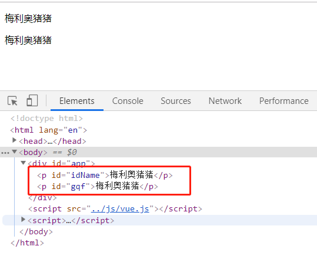  

        * 这里再演示个动态添加class的例子 
            ```html
            <!DOCTYPE html>
            <html lang="en">
            <head>
                <meta charset="UTF-8">
                <meta name="viewport" content="width=device-width, initial-scale=1.0">
                <meta http-equiv="X-UA-Compatible" content="ie=edge">
                <title>Document</title>
            </head>
            <body>
                <div id="app">
                    <p id="idName">梅利奥猪猪</p>
                    <p :id="idName">梅利奥猪猪</p>
                    <p :class="{'box1': isActive, 'box2': isChecked}"></p>
                </div>
                <script src="../js/vue.js"></script>
                <script>
                    let app = new Vue({
                        el: "#app",
                        data: {
                            idName: "gqf",
                            isActive: true,
                            isChecked: false
                        }
                    })
                </script>
            </body>
            </html>            
            ``` 
        * isActive和isChecked分别控制了对应的class是否添加  

    * v-model - 双向数据绑定
        * v-bind是单向数据流，先来看下这个例子
            ```html
            <!DOCTYPE html>
            <html lang="en">
            <head>
                <meta charset="UTF-8">
                <meta name="viewport" content="width=device-width, initial-scale=1.0">
                <meta http-equiv="X-UA-Compatible" content="ie=edge">
                <title>Document</title>
            </head>
            <body>
                <div id="app">
                    <input type="text" :value="val">
                </div>
                <script src="../js/vue.js"></script>
                <script>
                    let app = new Vue({
                        el: "#app",
                        data: {
                            val: "1",
                        }
                    })
                </script>
            </body>
            </html>            
            ```
        * 从上述代码中我们可以知道，我们把值val绑定在input上，所以当我们在控制台敲`app.val = '10'`，页面input框里的值也会变成10  

            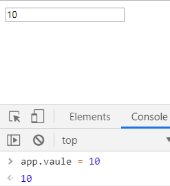

        * 但我们如果直接在输入框改变值，是不会影响到我们本身的数据的，其实我们玩过react的话，知道受控组件，然后我们也可以尝试改下这个例子      
            ```html
            <!DOCTYPE html>
            <html lang="en">
            <head>
                <meta charset="UTF-8">
                <meta name="viewport" content="width=device-width, initial-scale=1.0">
                <meta http-equiv="X-UA-Compatible" content="ie=edge">
                <title>Document</title>
            </head>
            <body>
                <div id="app">
                    <input type="text" :value="val" @blur="fn">
                    {{val}}
                </div>
                <script src="../js/vue.js"></script>
                <script>
                    let app = new Vue({
                        el: "#app",
                        data: {
                            val: "1",
                        },
                        methods:{
                            fn(e){
                                this.val = e.target.value;
                            }
                        }
                    })
                </script>
            </body>
            </html>                        
            ``` 
        * 但实际上不需要这么麻烦，我们有v-model，直接`<input type="text" v-model="val">`就可以了 
        * 接着我们来玩下绑定表单的单选框复选框下拉框
            ```html
            <!DOCTYPE html>
            <html lang="en">
            <head>
                <meta charset="UTF-8">
                <meta name="viewport" content="width=device-width, initial-scale=1.0">
                <meta http-equiv="X-UA-Compatible" content="ie=edge">
                <title>Document</title>
            </head>
            <body>
                <div id="app">
                    <input type="text" :value="val" @blur="fn">
                    {{val}}
                    <input type="text" v-model="val">
                    <hr>
                    <h1>单选</h1>
                    <input type="radio" name="gender" value="male" v-model="gender"> 男
                    <input type="radio" name="gender" value="female" v-model="gender"> 女
                    <hr>
                    <h1>复选</h1>
                    <input type="checkbox" name="hobby" value="eat" v-model="hobby"> 吃
                    <input type="checkbox" name="hobby" value="play" v-model="hobby"> 玩
                    <input type="checkbox" name="hobby" value="sleep" v-model="hobby"> 睡
                    <br>
                    <input type="checkbox" v-model="isChecked"> 同意以上是你的兴趣
                    <hr>
                    <h1>下拉框</h1>
                    <select v-model="selectedValue">
                        <option value="1">1</option>
                        <option value="2">2</option>
                        <option value="3">3</option>
                    </select>
                </div>
                <script src="../js/vue.js"></script>
                <script>
                    let app = new Vue({
                        el: "#app",
                        data: {
                            val: "1",
                            gender: "male",
                            hobby: ["eat"],
                            isChecked: true,
                            selectedValue: "2"
                        },
                        methods:{
                            fn(e){
                                this.val = e.target.value;
                            }
                        }
                    })
                </script>
            </body>
            </html>                       
            ```   

    * 指令修饰符
        * 先来个简单的例子，先写个双绑，具体啥效果大家也知道
            ```html
            <!DOCTYPE html>
            <html lang="en">
            <head>
                <meta charset="UTF-8">
                <meta name="viewport" content="width=device-width, initial-scale=1.0">
                <meta http-equiv="X-UA-Compatible" content="ie=edge">
                <title>Document</title>
            </head>
            <body>
                <div id="app">
                    <input type="text" v-model="modelValue">
                    <br>
                    {{modelValue}}
                </div>
                <script src="../js/vue.js"></script>
                <script>
                    let app = new Vue({
                        el: "#app",
                        data: {
                            modelValue: 1
                        }
                    })
                </script>
            </body>
            </html>            
            ```
        * 我们在v-model后面加上修饰符.lazy再看下效果，发现光标移开即失去焦点的时候页面在发生变化，说明了lazy就把原先input事件干成了change事件  

        * 接着我们在来看个例子 
            ```html
            <!DOCTYPE html>
            <html lang="en">
            <head>
                <meta charset="UTF-8">
                <meta name="viewport" content="width=device-width, initial-scale=1.0">
                <meta http-equiv="X-UA-Compatible" content="ie=edge">
                <title>Document</title>
            </head>
            <body>
                <div id="app">
                    <input type="text" v-model.lazy="modelValue">
                    <br>
                    {{modelValue}}

                    <hr>

                    <input type="text" v-model="n1">
                    +
                    <input type="text" v-model="n2">
                    =
                    {{n1 + n2}}

                </div>
                <script src="../js/vue.js"></script>
                <script>
                    let app = new Vue({
                        el: "#app",
                        data: {
                            modelValue: 1,
                            n1: 0,
                            n2: 0,
                        }
                    })
                </script>
            </body>
            </html>            
            ```
        * 上述例子说明了，其实input的值改好后是个字符串，然后字符串拼接就变成了这样

            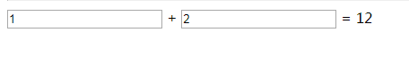  

        * 这个时候大家肯定说，那我其实在`{{n1 + n2}}`的时候，转成Number相加就可以了，效果的确可以实现，但是肯定用修饰符的方式更为方便        

        * 所以我们可以接着使用修饰符`.number`，这样就解决了这个问题 
            ```html
            <input type="text" v-model.number="n1">
            +
            <input type="text" v-model.number="n2">
            =
            {{n1 + n2}}            
            ``` 

        * 注意不同的指令有不同的修饰符

    * 事件绑定
        * 先上代码，完成个简单的效果就是让数字自增
            ```html
            <!DOCTYPE html>
            <html lang="en">
            <head>
                <meta charset="UTF-8">
                <meta name="viewport" content="width=device-width, initial-scale=1.0">
                <meta http-equiv="X-UA-Compatible" content="ie=edge">
                <title>Document</title>
            </head>
            <body>
                <div id="app">
                    {{val}}
                    <button @click="val++">让数字自增</button>
                </div>
                <script src="../js/vue.js"></script>
                <script>
                    let app = new Vue({
                        el: "#app",
                        data: {
                            val: 1
                        }
                    })
                </script>
            </body>
            </html>            
            ```
        * 复杂的就是写在函数里，要在methods选项里写，写在全局是没有用的   
            ```html
            <!DOCTYPE html>
            <html lang="en">
            <head>
                <meta charset="UTF-8">
                <meta name="viewport" content="width=device-width, initial-scale=1.0">
                <meta http-equiv="X-UA-Compatible" content="ie=edge">
                <title>Document</title>
            </head>
            <body>
                <div id="app">
                    {{val}}
                    <button @click="val++">让数字自增1</button>
                    <button @click="fn">让数字自增2</button>
                </div>
                <script src="../js/vue.js"></script>
                <script>
                    let app = new Vue({
                        el: "#app",
                        data: {
                            val: 1
                        },
                        methods:{
                            fn(){
                                this.val += 2;
                            }
                        }
                    })
                </script>
            </body>
            </html>            
            ```  
        * 注意vue中事件函数的this指向该组件实例，如果我们需要事件对象，可以在方法函数里传个参数e，默认情况下，函数的第一个参数是事件对象
        * 有时候，函数不是直接被事件调用，下面看个例子，其实很简单，就是点击哪个li，给li添加样式
            ```html
            <!DOCTYPE html>
            <html lang="en">
            <head>
                <meta charset="UTF-8">
                <meta name="viewport" content="width=device-width, initial-scale=1.0">
                <meta http-equiv="X-UA-Compatible" content="ie=edge">
                <title>Document</title>
                <style>
                    .checked{
                        background-color: red;
                        color: white;
                    }
                </style>
            </head>
            <body>
                <div id="app">
                    {{val}}
                    <button @click="val++">让数字自增1</button>
                    <button @click="fn">让数字自增2</button>

                    <hr>
                    <ul>
                        <li 
                            v-for="user in users" 
                            :key="user.id" 
                            :class="{'checked': user.checked}"
                            @click="doCheck(user, $event)"
                        >
                            {{user.name}} - {{user.age}}
                        </li>
                    </ul>
                </div>
                <script src="../js/vue.js"></script>
                <script>
                    let app = new Vue({
                        el: "#app",
                        data: {
                            val: 1,
                            users: [
                                {
                                    id: 1,
                                    name: "zhangsan",
                                    age: 21,
                                    checked: false,
                                },
                                {
                                    id: 2,
                                    name: "lisi",
                                    age: 22,
                                    checked: false,
                                },
                                {
                                    id: 3,
                                    name: "wangwu",
                                    age: 23,
                                    checked: false,
                                },
                            ]
                        },
                        methods:{
                            fn(){
                                this.val += 2;
                            },
                            doCheck(user, e){
                                console.log(user, e)
                                user.checked = !user.checked;
                            }
                        }
                    })
                </script>
            </body>
            </html>            
            ```
        * 注意$event是固定写法
        * 关于事件绑定的一些修饰符可以看下[事件系统](../../01-萌新玩耍篇/12-事件系统/事件系统.md)
        * 这里可以在随意举一个例子，一个是div右键点击没菜单，一个是阻止冒泡
            ```html
            <!DOCTYPE html>
            <html lang="en">
            <head>
                <meta charset="UTF-8">
                <meta name="viewport" content="width=device-width, initial-scale=1.0">
                <meta http-equiv="X-UA-Compatible" content="ie=edge">
                <title>Document</title>
                <style>
                    .box{
                        width: 100px;
                        height: 100px;
                        background-color: red;
                    }
                    #wrap{
                        width: 500px;
                        height: 500px;
                        background-color: skyblue;
                    }
                </style>
            </head>
            <body>
                <div id="app">
                    <div class="box" @contextmenu.prevent="fn"></div>

                    <hr>

                    <div id="wrap" @click="alertWrap">
                        <button @click.stop="buttonClick">1</button>
                        <button @click="buttonClick">2</button>
                        <button @click="buttonClick">3</button>
                    </div>
                </div>
                <script src="../js/vue.js"></script>
                <script>
                    let app = new Vue({
                        el: "#app",
                        data: {
                            
                        },
                        methods:{
                            fn(){
                                console.log("其实就想看下在div右键菜单会不会出来是否被阻止")
                            },
                            alertWrap(){
                                alert("this is wrap")
                            },
                            buttonClick(){
                                console.log("click btn")
                            }
                        }
                    })
                </script>
            </body>
            </html>                      
            ```
        * 提个细节，比如所有的button都要阻止冒泡，其实就可以给父级的那个div，给个修饰符self    

> 知道你还不过瘾继续吧 

* [返回目录](../../README.md) 
