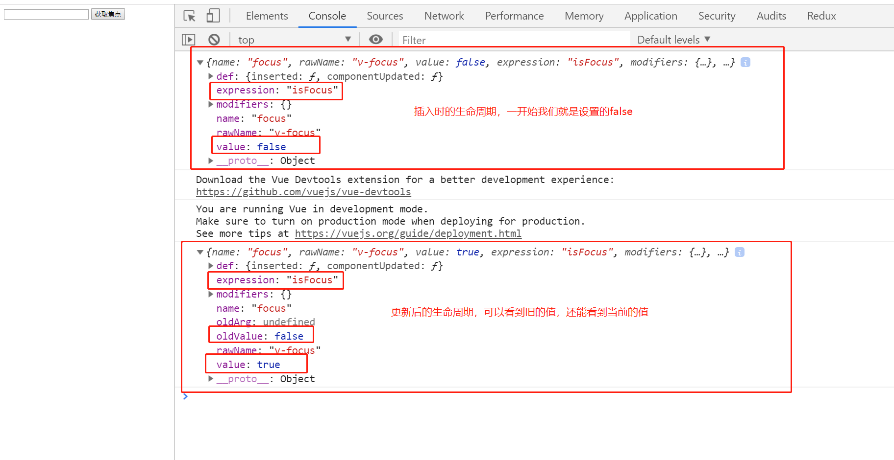
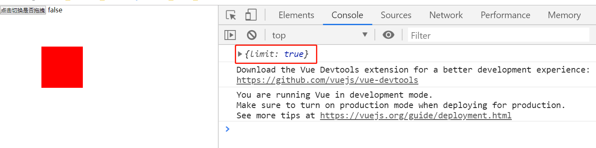
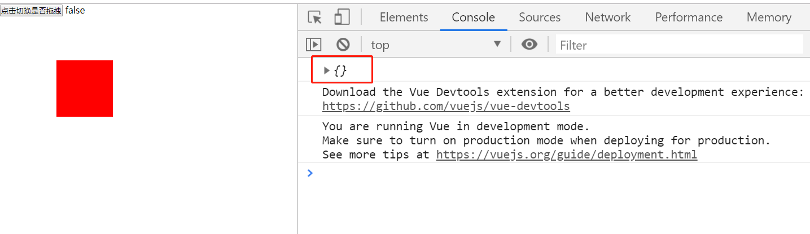
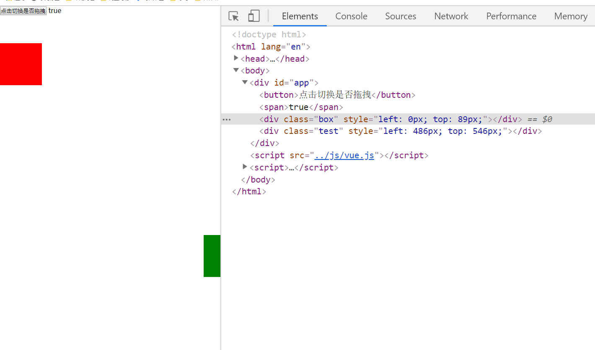

# Vue-02

> 知识大纲

* 自定义指令
    * 注册指令
        1. 全局指令 - `Vue.directive("指令名称",{指令配置})`
        2. 局部指令 
            ```js
            new Vue({
                el: "#app",
                directives: {
                    "指令名称": {指令配置} 
                }
            })
            ```
    * 指令生命周期钩子函数
        * bind - 只调用一次，指令第一次绑定在元素的时候调用，在这里可以进行一次性的初始化配置 - 可以理解相当于document.createElement，创建出来但还没有插入dom
        * inserted - 被绑定元素插入父节点的时候调用(仅保证父节点存在，但不一定已被插入文档中) - 可以理解相当于appendChild或者insertBefore，插入dom的操作
        * update - 所在组件更新的时候调用
        * componentUpdated - 所在组件更新完成后调用
        * unbind - 只调用一次，指令与元素解绑时调用
    * 不同生命周期在调用的时候同时会接收到传入的一些不同的参数
        * el - 指令绑定的元素，可以直接用来操作DOM
        * binding - 一个对象，包含以下属性
            * name - 指令名，不包括v-前缀
            * value - 指令的绑定值(作为表达式解析后的值)
            * expression - 指令绑定的表达式(字符串)
            * arg - 传给指令的参数，可选
            * modifiers - 传给指令的修饰符组成的对象，可选，每个修饰符对应一个布尔值
            * oldValue - 指令绑定的前一个值，仅在update和componentUpdated钩子中可用，无论值是否改变都可用            

> 练习

1. 自定义指令
    * 我们先玩玩全局指令，做个input元素聚焦的效果，如果不使用vue，我们应该就是获取这个元素后然后使用focus方法，现在就希望通过一个指令v-focus，加在input元素上，就实现这样的效果
    * 先说个题外话，有个属性叫做autofocus，页面一进来也能自动聚焦，但不太适合后期控制，比如我们的需求是，点击个按钮，才让input获取焦点，这个时候获取元素后，肯定也是调用focus方法，而不是加个autofocus的属性(加了貌似也没用)
    * 我们先使用个不用指令的方式来设置焦点，这里使用了ref这个属性，是用来获取元素的
        ```html
        <!DOCTYPE html>
        <html lang="en">
        <head>
            <meta charset="UTF-8">
            <meta name="viewport" content="width=device-width, initial-scale=1.0">
            <meta http-equiv="X-UA-Compatible" content="ie=edge">
            <title>Document</title>
        </head>
        <body>
            <div id="app">
                <input type="text" ref="inputEl">
                <button @click="setFocus">设置焦点</button>
            </div>
            <script src="../js/vue.js"></script>
            <script>
                let app = new Vue({
                    el: "#app",
                    methods: {
                        setFocus(){
                            let inputEl = this.$refs.inputEl;
                            inputEl.focus();
                        }
                    }
                })
            </script>
        </body>
        </html>        
        ```
    * 然后在做这个自定义指令例子前先给大家看下这段代码
        ```js
        window.onload = function(){
            let input = document.createElement("input");
            document.body.appendChild(input);
            input.focus();
        }        
        ``` 
    * 以上代码很简单，就是有个input框在插入body后，然后让它获取焦点，但如果我们把获取焦点放在插入之前，那就不能获取焦点了，因为获取焦点的前提，必须这个input已经在dom中了，所以等等我们自定义指令，focus这步需要放在inserted这个生命周期，如果放在bind就没有用
    * 现在我们来写下自定义指令，注意在自定义指令注册的时候不需要写v-，但在页面中元素使用的时候需要加上v- 
        ```html
        <!DOCTYPE html>
        <html lang="en">
        <head>
            <meta charset="UTF-8">
            <meta name="viewport" content="width=device-width, initial-scale=1.0">
            <meta http-equiv="X-UA-Compatible" content="ie=edge">
            <title>Document</title>
        </head>
        <body>
            <div id="app">
                <input type="text" v-focus>
            </div>
            <script src="../js/vue.js"></script>
            <script>
                /* window.onload = function(){
                    let input = document.createElement("input");
                    document.body.appendChild(input);
                    input.focus();
                } */

                Vue.directive("focus", {
                    bind(el, binding){
                        console.log(el, binding)
                        el.value = "梅利奥猪猪带你飞了吧"
                    },
                    inserted(el, binding){
                        console.log(el, binding)
                        el.focus();
                    }
                })

                new Vue({
                    el: "#app"
                })
            </script>
        </body>
        </html>        
        ``` 
    * 打开页面一看效果就实现了，这个时候小伙伴们可能会说，我并不希望一进页面就获取焦点，可以使用指令设置个属性，比如`v-focus="false"`，然后点击按钮改成true，相当于点击按钮在获取焦点嘛，显然是可以的，我们一步一步在完善下我们的案例
    * 先来打印下生命周期的binding，这里主要使用2个生命周期，一个是inserted，刚插入dom，还有个就是componentUpdated，组件更新完成后，来观察下value的值
        ```html
        <!DOCTYPE html>
        <html lang="en">
        <head>
            <meta charset="UTF-8">
            <meta name="viewport" content="width=device-width, initial-scale=1.0">
            <meta http-equiv="X-UA-Compatible" content="ie=edge">
            <title>Document</title>
        </head>
        <body>
            <div id="app">
                <input type="text" v-focus="isFocus">
                <button @click="setFocus">获取焦点</button>
            </div>
            <script src="../js/vue.js"></script>
            <script>
                Vue.directive("focus", {
                    inserted(el, binding){
                        console.log(binding)
                        
                    },
                    componentUpdated(el, binding){
                        console.log(binding)
                    }
                })

                new Vue({
                    el: "#app",
                    data: {
                        isFocus: false
                    },
                    methods: {
                        setFocus(){
                            this.isFocus = true;
                        }
                    }
                })
            </script>
        </body>
        </html>        
        ```   

           

    * 好的，知道了这些，我们就可以这样玩了
        ```html
        <!DOCTYPE html>
        <html lang="en">
        <head>
            <meta charset="UTF-8">
            <meta name="viewport" content="width=device-width, initial-scale=1.0">
            <meta http-equiv="X-UA-Compatible" content="ie=edge">
            <title>Document</title>
        </head>
        <body>
            <div id="app">
                <input type="text" v-focus="isFocus">
                <button @click="setFocus">获取焦点/失去焦点</button>
            </div>
            <script src="../js/vue.js"></script>
            <script>
                Vue.directive("focus", {
                    inserted(el, {value}){
                        if(value){
                            el.focus();
                        }
                    },
                    componentUpdated(el, {value}){
                        if(value){
                            el.focus();
                        }
                    }
                })

                new Vue({
                    el: "#app",
                    data: {
                        isFocus: false
                    },
                    methods: {
                        setFocus(){
                            this.isFocus = !this.isFocus;
                        }
                    }
                })
            </script>
        </body>
        </html>        
        ```  

2. 自定义拖拽指令  
    * 给元素加上v-drag
    * 添加事件实际上只要在bind的时候添加就可以了，不需要等插入dom后在添加    
    * 最简单的一个拖拽实现如下
        ```html
        <!DOCTYPE html>
        <html lang="en">
        <head>
            <meta charset="UTF-8">
            <meta name="viewport" content="width=device-width, initial-scale=1.0">
            <meta http-equiv="X-UA-Compatible" content="ie=edge">
            <title>自定义拖拽指令</title>
            <style>
                *{
                    padding: 0;
                    margin: 0;
                }
                .box{
                    position: absolute;
                    left: 100px;
                    top: 100px;
                    width: 100px;
                    height: 100px;
                    background-color: red;
                }
            </style>
        </head>
        <body>
            <div id="app">
                <div class="box" v-drag></div>
            </div>
            <script src="../js/vue.js"></script>
            <script>
                Vue.directive("drag", {
                    bind(el, binding){
                        let start = {
                            x: 0,
                            y: 0,
                        }
                        let now = {
                            x: 0,
                            y: 0,
                        }
                        function move(e){
                            now.x = e.clientX;
                            now.y = e.clientY;
                            let dis = {
                                x: now.x - start.x,
                                y: now.y - start.y,
                            }
                            el.style.left = dis.x + "px";
                            el.style.top = dis.y + "px";
                        }
                        el.addEventListener("mousedown", function(e){
                            start.x = e.clientX - this.offsetLeft;
                            start.y = e.clientY - this.offsetTop;
                            document.addEventListener("mousemove", move);
                            document.addEventListener("mouseup", function(){
                                document.removeEventListener("mousemove", move);
                            }, {once: true})
                        })
                    }
                })
                let app = new Vue({
                    el: "#app",

                })
            </script>
        </body>
        </html>        
        ```   
    * 接着我们接着扩展，和前面焦点的例子一样，我们也给v-drag弄个开关，然后点击按钮切换，true的时候能拖拽false的时候不能拖拽   
        ```html
        <!DOCTYPE html>
        <html lang="en">
        <head>
            <meta charset="UTF-8">
            <meta name="viewport" content="width=device-width, initial-scale=1.0">
            <meta http-equiv="X-UA-Compatible" content="ie=edge">
            <title>自定义拖拽指令</title>
            <style>
                *{
                    padding: 0;
                    margin: 0;
                }
                .box{
                    position: absolute;
                    left: 100px;
                    top: 100px;
                    width: 100px;
                    height: 100px;
                    background-color: red;
                }
            </style>
        </head>
        <body>
            <div id="app">
                <button @click="isDrag=!isDrag">点击切换是否拖拽</button> <span>{{isDrag}}</span>
                <div class="box" v-drag="isDrag"></div>
            </div>
            <script src="../js/vue.js"></script>
            <script>
                Vue.directive("drag", {
                    bind(el, binding){
                        el.isDrag = binding.value; //挂在el上
                        let start = {
                            x: 0,
                            y: 0,
                        }
                        let now = {
                            x: 0,
                            y: 0,
                        }
                        function move(e){
                            now.x = e.clientX;
                            now.y = e.clientY;
                            let dis = {
                                x: now.x - start.x,
                                y: now.y - start.y,
                            }
                            el.style.left = dis.x + "px";
                            el.style.top = dis.y + "px";
                        }
                        el.addEventListener("mousedown", function(e){
                            e.preventDefault();
                            e.stopPropagation();
                            if(!el.isDrag){
                                return;
                            }
                            start.x = e.clientX - this.offsetLeft;
                            start.y = e.clientY - this.offsetTop;
                            document.addEventListener("mousemove", move);
                            document.addEventListener("mouseup", function(){
                                document.removeEventListener("mousemove", move);
                            }, {once: true})
                        })
                    },
                    update(el, binding){
                        el.isDrag = binding.value;
                    }
                })
                let app = new Vue({
                    el: "#app",
                    data: {
                        isDrag: false,
                    }
                })
            </script>
        </body>
        </html>        
        ```   
    * 这个就实现了我们前面说的效果，别着急我们还可以接着扩展，比如限制拖拽，不能超出屏幕之类的，使用传说中的修饰符`v-drag.limit="true"` 
    * 这个limit的值，可以通过`binding.modifiers`去获取，这边我们加上limit看下效果，然后删掉limit在看下效果 

        

        

    * 所以我们很方便可以知道一个指令是否加上了修饰符，下面来看下我们实现的代码 
        ```html
        <!DOCTYPE html>
        <html lang="en">
        <head>
            <meta charset="UTF-8">
            <meta name="viewport" content="width=device-width, initial-scale=1.0">
            <meta http-equiv="X-UA-Compatible" content="ie=edge">
            <title>自定义拖拽指令</title>
            <style>
                *{
                    padding: 0;
                    margin: 0;
                }
                .box{
                    position: absolute;
                    left: 100px;
                    top: 100px;
                    width: 100px;
                    height: 100px;
                    background-color: red;
                }
            </style>
        </head>
        <body>
            <div id="app">
                <button @click="isDrag=!isDrag">点击切换是否拖拽</button> <span>{{isDrag}}</span>
                <div class="box" v-drag.limit="isDrag"></div>
            </div>
            <script src="../js/vue.js"></script>
            <script>
                Vue.directive("drag", {
                    bind(el, binding){
                        el.isDrag = binding.value; //挂在el上
                        el.isLimit = binding.modifiers.limit; //判断修饰符.limit
                        let start = {
                            x: 0,
                            y: 0,
                        }
                        let now = {
                            x: 0,
                            y: 0,
                        }
                        function move(e){
                            now.x = e.clientX;
                            now.y = e.clientY;
                            let dis = {
                                x: now.x - start.x,
                                y: now.y - start.y,
                            }
                            let L = dis.x;
                            let T = dis.y;
                            if(el.isLimit){
                                L = Math.min(Math.max(0, L), window.innerWidth - el.offsetWidth);
                                T = Math.min(Math.max(0, T), window.innerHeight - el.offsetHeight);
                            }
                            el.style.left = L + "px";
                            el.style.top = T + "px";
                        }
                        el.addEventListener("mousedown", function(e){
                            e.preventDefault();
                            e.stopPropagation();
                            if(!el.isDrag){
                                return;
                            }
                            start.x = e.clientX - this.offsetLeft;
                            start.y = e.clientY - this.offsetTop;
                            document.addEventListener("mousemove", move);
                            document.addEventListener("mouseup", function(){
                                document.removeEventListener("mousemove", move);
                            }, {once: true})
                        })
                    },
                    componentUpdated(el, binding){
                        el.isDrag = binding.value;
                    }
                })
                let app = new Vue({
                    el: "#app",
                    data: {
                        isDrag: false,
                    }
                })
            </script>
        </body>
        </html>        
        ```

    * 实现效果后其实我们可以玩下，比如2个div，一个设置limit一个不设置，非常有意思  
        ```html
        <div class="box" v-drag.limit="isDrag"></div>
        <div class="test" v-drag="isDrag"></div>        
        ```      

         

    * 很明显一个被我限制范围了，一个被我拖出屏幕外了~     

> 知道你还不过瘾继续吧    

* [返回目录](../../README.md) 