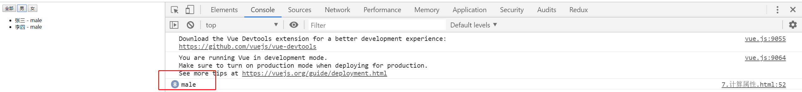
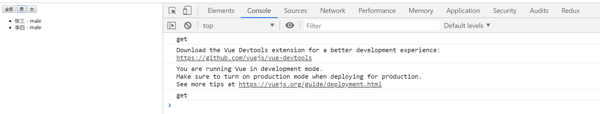
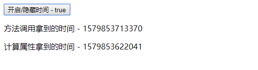
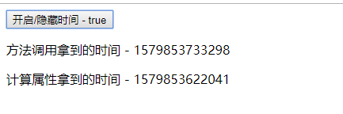
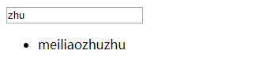
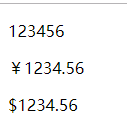
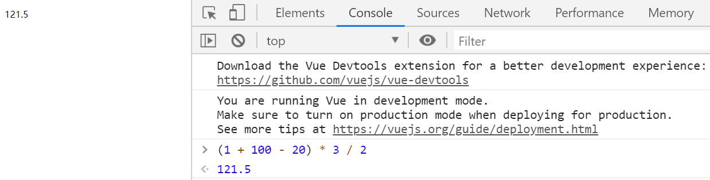

# Vue-02

> 知识大纲

* 自定义指令
    * 注册指令
        1. 全局指令 - `Vue.directive("指令名称",{指令配置})`
        2. 局部指令 
            ```js
            new Vue({
                el: "#app",
                directives: {
                    "指令名称": {指令配置} 
                }
            })
            ```
    * 指令生命周期钩子函数
        * bind - 只调用一次，指令第一次绑定在元素的时候调用，在这里可以进行一次性的初始化配置 - 可以理解相当于document.createElement，创建出来但还没有插入dom
        * inserted - 被绑定元素插入父节点的时候调用(仅保证父节点存在，但不一定已被插入文档中) - 可以理解相当于appendChild或者insertBefore，插入dom的操作
        * update - 所在组件更新的时候调用
        * componentUpdated - 所在组件更新完成后调用
        * unbind - 只调用一次，指令与元素解绑时调用
    * 不同生命周期在调用的时候同时会接收到传入的一些不同的参数
        * el - 指令绑定的元素，可以直接用来操作DOM
        * binding - 一个对象，包含以下属性
            * name - 指令名，不包括v-前缀
            * value - 指令的绑定值(作为表达式解析后的值)
            * expression - 指令绑定的表达式(字符串)
            * arg - 传给指令的参数，可选
            * modifiers - 传给指令的修饰符组成的对象，可选，每个修饰符对应一个布尔值
            * oldValue - 指令绑定的前一个值，仅在update和componentUpdated钩子中可用，无论值是否改变都可用    

* computed
    * 在实际应用中，我们会有一些原始数据，同时在应用中又会有一些数据是根据某些原始数据派生出来的，针对这样的一种情况，vue定义了一个专门来处理这种派生数据的选项**computed**

* watch
    * 有的时候，我们需要的派生数据是通过异步的方式去处理的，这个时候，计算属性就不太好用了(不能处理异步)，所以我们可以使用另外个选项**watch**
    * 多层监听
        * 对于多层数据的监听，可以使用字符串加点的语法
            ```js
            watch: {
                'a.b.c': function(){
                    //...
                }
            }
            ```
    * 深度监听
        * 默认情况下，watch只对当前指定的值进行一层监听，如果需要对对象进行深层监听可以这么做
            ```js
            watch: {
                a: {
                    handler(){
                        console.log("a deep")
                    },
                    deep: true
                }
            }
            ```

* 过滤器
    * 过滤器是一个使用在双大括号插值和v-bind中，用于过滤输出内容的函数
    * 假设有一个用于把内容转为大写的过滤函数**toUpperCase**,用法差不多就是`{{content | toUpperCase}}`
        * | - 管道符，表示数组自左至右通过管道符进行传递
        * 过滤器可以有多个，执行顺序从左至右，过滤器函数第一个参数的值就是其管道符前一个的结果
    * 注册过滤器
        * 全局过滤器 - `Vue.filter("过滤器名称", 过滤器函数)`
        * 局部过滤器
            ```js
            Vue.component("组件", {
                ...,
                filters: {
                    "过滤器名称": 过滤器函数
                }
            })
            ```                

> 练习

1. 自定义指令
    * 我们先玩玩全局指令，做个input元素聚焦的效果，如果不使用vue，我们应该就是获取这个元素后然后使用focus方法，现在就希望通过一个指令v-focus，加在input元素上，就实现这样的效果
    * 先说个题外话，有个属性叫做autofocus，页面一进来也能自动聚焦，但不太适合后期控制，比如我们的需求是，点击个按钮，才让input获取焦点，这个时候获取元素后，肯定也是调用focus方法，而不是加个autofocus的属性(加了貌似也没用)
    * 我们先使用个不用指令的方式来设置焦点，这里使用了ref这个属性，是用来获取元素的
        ```html
        <!DOCTYPE html>
        <html lang="en">
        <head>
            <meta charset="UTF-8">
            <meta name="viewport" content="width=device-width, initial-scale=1.0">
            <meta http-equiv="X-UA-Compatible" content="ie=edge">
            <title>Document</title>
        </head>
        <body>
            <div id="app">
                <input type="text" ref="inputEl">
                <button @click="setFocus">设置焦点</button>
            </div>
            <script src="../js/vue.js"></script>
            <script>
                let app = new Vue({
                    el: "#app",
                    methods: {
                        setFocus(){
                            let inputEl = this.$refs.inputEl;
                            inputEl.focus();
                        }
                    }
                })
            </script>
        </body>
        </html>        
        ```
    * 然后在做这个自定义指令例子前先给大家看下这段代码
        ```js
        window.onload = function(){
            let input = document.createElement("input");
            document.body.appendChild(input);
            input.focus();
        }        
        ``` 
    * 以上代码很简单，就是有个input框在插入body后，然后让它获取焦点，但如果我们把获取焦点放在插入之前，那就不能获取焦点了，因为获取焦点的前提，必须这个input已经在dom中了，所以等等我们自定义指令，focus这步需要放在inserted这个生命周期，如果放在bind就没有用
    * 现在我们来写下自定义指令，注意在自定义指令注册的时候不需要写v-，但在页面中元素使用的时候需要加上v- 
        ```html
        <!DOCTYPE html>
        <html lang="en">
        <head>
            <meta charset="UTF-8">
            <meta name="viewport" content="width=device-width, initial-scale=1.0">
            <meta http-equiv="X-UA-Compatible" content="ie=edge">
            <title>Document</title>
        </head>
        <body>
            <div id="app">
                <input type="text" v-focus>
            </div>
            <script src="../js/vue.js"></script>
            <script>
                /* window.onload = function(){
                    let input = document.createElement("input");
                    document.body.appendChild(input);
                    input.focus();
                } */

                Vue.directive("focus", {
                    bind(el, binding){
                        console.log(el, binding)
                        el.value = "梅利奥猪猪带你飞了吧"
                    },
                    inserted(el, binding){
                        console.log(el, binding)
                        el.focus();
                    }
                })

                new Vue({
                    el: "#app"
                })
            </script>
        </body>
        </html>        
        ``` 
    * 打开页面一看效果就实现了，这个时候小伙伴们可能会说，我并不希望一进页面就获取焦点，可以使用指令设置个属性，比如`v-focus="false"`，然后点击按钮改成true，相当于点击按钮在获取焦点嘛，显然是可以的，我们一步一步在完善下我们的案例
    * 先来打印下生命周期的binding，这里主要使用2个生命周期，一个是inserted，刚插入dom，还有个就是componentUpdated，组件更新完成后，来观察下value的值
        ```html
        <!DOCTYPE html>
        <html lang="en">
        <head>
            <meta charset="UTF-8">
            <meta name="viewport" content="width=device-width, initial-scale=1.0">
            <meta http-equiv="X-UA-Compatible" content="ie=edge">
            <title>Document</title>
        </head>
        <body>
            <div id="app">
                <input type="text" v-focus="isFocus">
                <button @click="setFocus">获取焦点</button>
            </div>
            <script src="../js/vue.js"></script>
            <script>
                Vue.directive("focus", {
                    inserted(el, binding){
                        console.log(binding)
                        
                    },
                    componentUpdated(el, binding){
                        console.log(binding)
                    }
                })

                new Vue({
                    el: "#app",
                    data: {
                        isFocus: false
                    },
                    methods: {
                        setFocus(){
                            this.isFocus = true;
                        }
                    }
                })
            </script>
        </body>
        </html>        
        ```   

           

    * 好的，知道了这些，我们就可以这样玩了
        ```html
        <!DOCTYPE html>
        <html lang="en">
        <head>
            <meta charset="UTF-8">
            <meta name="viewport" content="width=device-width, initial-scale=1.0">
            <meta http-equiv="X-UA-Compatible" content="ie=edge">
            <title>Document</title>
        </head>
        <body>
            <div id="app">
                <input type="text" v-focus="isFocus">
                <button @click="setFocus">获取焦点/失去焦点</button>
            </div>
            <script src="../js/vue.js"></script>
            <script>
                Vue.directive("focus", {
                    inserted(el, {value}){
                        if(value){
                            el.focus();
                        }
                    },
                    componentUpdated(el, {value}){
                        if(value){
                            el.focus();
                        }
                    }
                })

                new Vue({
                    el: "#app",
                    data: {
                        isFocus: false
                    },
                    methods: {
                        setFocus(){
                            this.isFocus = !this.isFocus;
                        }
                    }
                })
            </script>
        </body>
        </html>        
        ```  

2. 自定义拖拽指令  
    * 给元素加上v-drag
    * 添加事件实际上只要在bind的时候添加就可以了，不需要等插入dom后在添加    
    * 最简单的一个拖拽实现如下
        ```html
        <!DOCTYPE html>
        <html lang="en">
        <head>
            <meta charset="UTF-8">
            <meta name="viewport" content="width=device-width, initial-scale=1.0">
            <meta http-equiv="X-UA-Compatible" content="ie=edge">
            <title>自定义拖拽指令</title>
            <style>
                *{
                    padding: 0;
                    margin: 0;
                }
                .box{
                    position: absolute;
                    left: 100px;
                    top: 100px;
                    width: 100px;
                    height: 100px;
                    background-color: red;
                }
            </style>
        </head>
        <body>
            <div id="app">
                <div class="box" v-drag></div>
            </div>
            <script src="../js/vue.js"></script>
            <script>
                Vue.directive("drag", {
                    bind(el, binding){
                        let start = {
                            x: 0,
                            y: 0,
                        }
                        let now = {
                            x: 0,
                            y: 0,
                        }
                        function move(e){
                            now.x = e.clientX;
                            now.y = e.clientY;
                            let dis = {
                                x: now.x - start.x,
                                y: now.y - start.y,
                            }
                            el.style.left = dis.x + "px";
                            el.style.top = dis.y + "px";
                        }
                        el.addEventListener("mousedown", function(e){
                            start.x = e.clientX - this.offsetLeft;
                            start.y = e.clientY - this.offsetTop;
                            document.addEventListener("mousemove", move);
                            document.addEventListener("mouseup", function(){
                                document.removeEventListener("mousemove", move);
                            }, {once: true})
                        })
                    }
                })
                let app = new Vue({
                    el: "#app",

                })
            </script>
        </body>
        </html>        
        ```   
    * 接着我们接着扩展，和前面焦点的例子一样，我们也给v-drag弄个开关，然后点击按钮切换，true的时候能拖拽false的时候不能拖拽   
        ```html
        <!DOCTYPE html>
        <html lang="en">
        <head>
            <meta charset="UTF-8">
            <meta name="viewport" content="width=device-width, initial-scale=1.0">
            <meta http-equiv="X-UA-Compatible" content="ie=edge">
            <title>自定义拖拽指令</title>
            <style>
                *{
                    padding: 0;
                    margin: 0;
                }
                .box{
                    position: absolute;
                    left: 100px;
                    top: 100px;
                    width: 100px;
                    height: 100px;
                    background-color: red;
                }
            </style>
        </head>
        <body>
            <div id="app">
                <button @click="isDrag=!isDrag">点击切换是否拖拽</button> <span>{{isDrag}}</span>
                <div class="box" v-drag="isDrag"></div>
            </div>
            <script src="../js/vue.js"></script>
            <script>
                Vue.directive("drag", {
                    bind(el, binding){
                        el.isDrag = binding.value; //挂在el上
                        let start = {
                            x: 0,
                            y: 0,
                        }
                        let now = {
                            x: 0,
                            y: 0,
                        }
                        function move(e){
                            now.x = e.clientX;
                            now.y = e.clientY;
                            let dis = {
                                x: now.x - start.x,
                                y: now.y - start.y,
                            }
                            el.style.left = dis.x + "px";
                            el.style.top = dis.y + "px";
                        }
                        el.addEventListener("mousedown", function(e){
                            e.preventDefault();
                            e.stopPropagation();
                            if(!el.isDrag){
                                return;
                            }
                            start.x = e.clientX - this.offsetLeft;
                            start.y = e.clientY - this.offsetTop;
                            document.addEventListener("mousemove", move);
                            document.addEventListener("mouseup", function(){
                                document.removeEventListener("mousemove", move);
                            }, {once: true})
                        })
                    },
                    update(el, binding){
                        el.isDrag = binding.value;
                    }
                })
                let app = new Vue({
                    el: "#app",
                    data: {
                        isDrag: false,
                    }
                })
            </script>
        </body>
        </html>        
        ```   
    * 这个就实现了我们前面说的效果，别着急我们还可以接着扩展，比如限制拖拽，不能超出屏幕之类的，使用传说中的修饰符`v-drag.limit="true"` 
    * 这个limit的值，可以通过`binding.modifiers`去获取，这边我们加上limit看下效果，然后删掉limit在看下效果 

        

        

    * 所以我们很方便可以知道一个指令是否加上了修饰符，下面来看下我们实现的代码 
        ```html
        <!DOCTYPE html>
        <html lang="en">
        <head>
            <meta charset="UTF-8">
            <meta name="viewport" content="width=device-width, initial-scale=1.0">
            <meta http-equiv="X-UA-Compatible" content="ie=edge">
            <title>自定义拖拽指令</title>
            <style>
                *{
                    padding: 0;
                    margin: 0;
                }
                .box{
                    position: absolute;
                    left: 100px;
                    top: 100px;
                    width: 100px;
                    height: 100px;
                    background-color: red;
                }
            </style>
        </head>
        <body>
            <div id="app">
                <button @click="isDrag=!isDrag">点击切换是否拖拽</button> <span>{{isDrag}}</span>
                <div class="box" v-drag.limit="isDrag"></div>
            </div>
            <script src="../js/vue.js"></script>
            <script>
                Vue.directive("drag", {
                    bind(el, binding){
                        el.isDrag = binding.value; //挂在el上
                        el.isLimit = binding.modifiers.limit; //判断修饰符.limit
                        let start = {
                            x: 0,
                            y: 0,
                        }
                        let now = {
                            x: 0,
                            y: 0,
                        }
                        function move(e){
                            now.x = e.clientX;
                            now.y = e.clientY;
                            let dis = {
                                x: now.x - start.x,
                                y: now.y - start.y,
                            }
                            let L = dis.x;
                            let T = dis.y;
                            if(el.isLimit){
                                L = Math.min(Math.max(0, L), window.innerWidth - el.offsetWidth);
                                T = Math.min(Math.max(0, T), window.innerHeight - el.offsetHeight);
                            }
                            el.style.left = L + "px";
                            el.style.top = T + "px";
                        }
                        el.addEventListener("mousedown", function(e){
                            e.preventDefault();
                            e.stopPropagation();
                            if(!el.isDrag){
                                return;
                            }
                            start.x = e.clientX - this.offsetLeft;
                            start.y = e.clientY - this.offsetTop;
                            document.addEventListener("mousemove", move);
                            document.addEventListener("mouseup", function(){
                                document.removeEventListener("mousemove", move);
                            }, {once: true})
                        })
                    },
                    componentUpdated(el, binding){
                        el.isDrag = binding.value;
                    }
                })
                let app = new Vue({
                    el: "#app",
                    data: {
                        isDrag: false,
                    }
                })
            </script>
        </body>
        </html>        
        ```

    * 实现效果后其实我们可以玩下，比如2个div，一个设置limit一个不设置，非常有意思  
        ```html
        <div class="box" v-drag.limit="isDrag"></div>
        <div class="test" v-drag="isDrag"></div>        
        ```      

         

    * 很明显一个被我限制范围了，一个被我拖出屏幕外了~    

3. computed
    * 首先我们先来巩固个基础，那就是数组filter方法，是不会改变原数组的
    * 接下去我们会做个案例，其实就类似选项卡，比如一堆用户，性别有男有女，三个按钮，全部，男性，女性
    * 我们知道filter是不能改变原数组的，如果我们渲染的逻辑是根据users渲染，然后通过`users = users.filter(item => item.gender == gender)`这样就改变了原始数据会出现问题，所以我们在这种情况下，可能会使用其他方式，目的就是不修改我们的原始数据，接下来我们先实现下这个效果
        ```html
        <!DOCTYPE html>
        <html lang="en">
        <head>
            <meta charset="UTF-8">
            <meta name="viewport" content="width=device-width, initial-scale=1.0">
            <meta http-equiv="X-UA-Compatible" content="ie=edge">
            <title>Document</title>
        </head>
        <body>
            <div id="app">
                <button @click="changeGender('')">全部</button>
                <button @click="changeGender('male')">男</button>
                <button @click="changeGender('female')">女</button>
                <ul>
                    <li v-for="user in showUsers" :key="user.id">
                        {{user.name}} - {{user.gender}}
                    </li>
                </ul>
            </div>
            <script src="../js/vue.js"></script>
            <script>
                let users = [
                            {
                                id: 1,
                                name: "张三",
                                gender: "male"
                            },
                            {
                                id: 2,
                                name: "李四",
                                gender: "male"
                            },
                            {
                                id: 3,
                                name: "王五",
                                gender: "female"
                            },
                            {
                                id: 4,
                                name: "赵六",
                                gender: "female"
                            },
                        ]
                new Vue({
                    el: "#app",
                    data: {
                        users,
                        showUsers: users
                    },
                    methods:{
                        changeGender(gender){
                            console.log(gender);
                            if(gender){
                                this.showUsers = users.filter(item => item.gender === gender);
                            }else{
                                this.showUsers = users;
                            }
                        }
                    }
                })
            </script>
        </body>
        </html>        
        ```
    * 效果的确实现了，但每次点击都会调用事件，哪怕页面中的数据是没有变化的，比如我们多次点击男这个按钮，每次都会执行

        

    * 于是computed闪亮登场，主要可以解决这样的需求，派生数据
        1. 有原始的数据
        2. 有过滤的条件
        3. 需要缓存结果  

    * 所以代码改写下，然后测试下狂点男，就没有这个问题了
        ```html
        <!DOCTYPE html>
        <html lang="en">
        <head>
            <meta charset="UTF-8">
            <meta name="viewport" content="width=device-width, initial-scale=1.0">
            <meta http-equiv="X-UA-Compatible" content="ie=edge">
            <title>Document</title>
        </head>
        <body>
            <div id="app">
                <button @click="gender=''">全部</button>
                <button @click="gender='male'">男</button>
                <button @click="gender='female'">女</button>
                <ul>
                    <li v-for="user in showUsers" :key="user.id">
                        {{user.name}} - {{user.gender}}
                    </li>
                </ul>
            </div>
            <script src="../js/vue.js"></script>
            <script>
                let users = [
                            {
                                id: 1,
                                name: "张三",
                                gender: "male"
                            },
                            {
                                id: 2,
                                name: "李四",
                                gender: "male"
                            },
                            {
                                id: 3,
                                name: "王五",
                                gender: "female"
                            },
                            {
                                id: 4,
                                name: "赵六",
                                gender: "female"
                            },
                        ]
                new Vue({
                    el: "#app",
                    data: {
                        gender: "",
                        users,
                    },
                    computed: {
                        showUsers: {
                            get(){
                                console.log("get");
                                if(!this.gender){
                                    return this.users;
                                }
                                return this.users.filter(item => item.gender === this.gender)
                            }
                        }
                    }
                })
            </script>
        </body>
        </html>        
        ```
    * 下图就是狂点男，不会一直执行方法的证据，图中打印了2个get，一个就是页面刚开始渲染全部的users，还有个就是第一次点击男渲染的时候，后续在点就没之前那个问题了，实际上就是computed它有缓存，意思就是数据没有变化的话，他不会一直执行

           

    * 我们在写一个演示缓存的例子 
        ```html
        <!DOCTYPE html>
        <html lang="en">
        <head>
            <meta charset="UTF-8">
            <meta name="viewport" content="width=device-width, initial-scale=1.0">
            <meta http-equiv="X-UA-Compatible" content="ie=edge">
            <title>Document</title>
        </head>
        <body>
            <div id="app">
                <button @click="showDate=!showDate">开启/隐藏时间 - {{showDate}}</button>
                <div v-show="showDate">
                    <p>方法调用拿到的时间 - {{methodsNow()}}</p>
                    <p>计算属性拿到的时间 - {{computedNow}}</p>
                </div>
            </div>
            <script src="../js/vue.js"></script>
            <script>
                let app = new Vue({
                    el: "#app",
                    data: {
                        showDate: false
                    },
                    methods: {
                        methodsNow(){
                            return Date.now();
                        }
                    },
                    computed: {
                        computedNow(){
                            return Date.now();
                        }
                    }
                })
            </script>
        </body>
        </html>        
        ``` 
    * 然后我们点击玩下，就能发现，方法调用的每次拿到的时间戳是个新的值，而计算属性拿到的时间戳，就是缓存的一个值，它是不会改变的

        

          

    * 其实上述代码，computed用了个省略的写法，如果只需要用到get可以直接`xxx(){return xxx;}`, 完整的写法，其实还是像我们之前案例这样，一个对象，然后写个get函数

    * 下面来用下set，其实可以继续在我们之前那个性别选项卡上扩展，比如我们给每一项设置个checkbox，然后做个全选的功能
        ```html
        <!DOCTYPE html>
        <html lang="en">
        <head>
            <meta charset="UTF-8">
            <meta name="viewport" content="width=device-width, initial-scale=1.0">
            <meta http-equiv="X-UA-Compatible" content="ie=edge">
            <title>Document</title>
        </head>
        <body>
            <div id="app">
                <button @click="gender=''">全部</button>
                <button @click="gender='male'">男</button>
                <button @click="gender='female'">女</button>
                <ul>
                    <li v-for="user in showUsers" :key="user.id">
                        <input type="checkbox" v-model="user.checked">
                        {{user.name}} - {{user.gender}}
                    </li>
                </ul>
                <hr>
                <input type="checkbox" v-model="checkedAll"> 全选
            </div>
            <script src="../js/vue.js"></script>
            <script>
                let users = [
                            {
                                id: 1,
                                name: "张三",
                                gender: "male",
                                checked: true
                            },
                            {
                                id: 2,
                                name: "李四",
                                gender: "male",
                                checked: false
                            },
                            {
                                id: 3,
                                name: "王五",
                                gender: "female",
                                checked: false
                            },
                            {
                                id: 4,
                                name: "赵六",
                                gender: "female",
                                checked: true
                            },
                        ]
                new Vue({
                    el: "#app",
                    data: {
                        gender: "",
                        users,
                    },
                    computed: {
                        showUsers: {
                            get(){
                                console.log("get");
                                if(!this.gender){
                                    return this.users;
                                }
                                return this.users.filter(item => item.gender === this.gender)
                            }
                        },
                        checkedAll: {
                            get(){
                                return this.users.every(item => item.checked)
                            },
                            set(val){
                                this.users.forEach(item => {
                                    item.checked = val;
                                })
                            }
                        }
                    }
                })
            </script>
        </body>
        </html>        
        ```  

4. watch
    * 我们接下来做个例子，比如根据输入框模糊查找对应的用户，先用computed去实现下
        ```html
        <!DOCTYPE html>
        <html lang="en">
        <head>
            <meta charset="UTF-8">
            <meta name="viewport" content="width=device-width, initial-scale=1.0">
            <meta http-equiv="X-UA-Compatible" content="ie=edge">
            <title>Document</title>
        </head>
        <body>
            <div id="app">
                <input type="text" v-model="keyword">
                <ul>
                    <li v-for="user in showUsers" :key="user.id">
                        {{user.name}}
                    </li>
                </ul>
            </div>
            <script src="../js/vue.js"></script>
            <script>
                new Vue({
                    el: "#app",
                    data: {
                        keyword: "",
                        users: [
                            {
                                id: 1,
                                name: "zhangsan"
                            },
                            {
                                id: 2,
                                name: "lisi"
                            },
                            {
                                id: 3,
                                name: "wangwu"
                            },
                            {
                                id: 4,
                                name: "zhaoliu"
                            },
                            {
                                id: 5,
                                name: "meiliaozhuzhu"
                            },
                        ]
                    },
                    computed: {
                        showUsers(){
                            if(!this.keyword){
                                return []
                            }
                            return this.users.filter(item => item.name.includes(this.keyword))
                        }
                    }
                })
            </script>
        </body>
        </html>        
        ```

        

    * 接着我们就在前面的例子上改动下，不管是使用setTimeout的方式，还是Promise的方式都无法实现，证实了计算属性不支持异步任务      
    * 然后watch就闪亮登场了
        ```html
        <!DOCTYPE html>
        <html lang="en">
        <head>
            <meta charset="UTF-8">
            <meta name="viewport" content="width=device-width, initial-scale=1.0">
            <meta http-equiv="X-UA-Compatible" content="ie=edge">
            <title>Document</title>
        </head>
        <body>
            <div id="app">
                <input type="text" v-model="keyword">
                <ul>
                    <li v-for="user in showUsers" :key="user.id">
                        {{user.name}}
                    </li>
                </ul>
            </div>
            <script src="../js/vue.js"></script>
            <script>
                new Vue({
                    el: "#app",
                    data: {
                        keyword: "",
                        users: [
                            {
                                id: 1,
                                name: "zhangsan"
                            },
                            {
                                id: 2,
                                name: "lisi"
                            },
                            {
                                id: 3,
                                name: "wangwu"
                            },
                            {
                                id: 4,
                                name: "zhaoliu"
                            },
                            {
                                id: 5,
                                name: "meiliaozhuzhu"
                            },
                        ],
                        showUsers: []
                    },
                    watch: {
                        keyword(){
                            setTimeout(_ => {
                                if(!this.keyword){
                                    this.showUsers = []
                                }else{
                                    this.showUsers = this.users.filter(item => item.name.includes(this.keyword))
                                }
                            }, 1000)
                        }
                    }
                })
            </script>
        </body>
        </html>        
        ```
    * watch其实可以有2个参数，newValue,oldValue,前面我们就用了一个参数，就代表着新的值
    * 还有些比较高端的监听，详细请看知识大纲  

5. 过滤器  
    * 先来个例子，不使用过滤器，把**123456分**展示为**1234.56元** 
        ```html
        <!DOCTYPE html>
        <html lang="en">
        <head>
            <meta charset="UTF-8">
            <meta name="viewport" content="width=device-width, initial-scale=1.0">
            <meta http-equiv="X-UA-Compatible" content="ie=edge">
            <title>Document</title>
        </head>
        <body>
            <div id="app">
                <p>{{price}}</p>
                <p>{{RMB(price)}}</p>
            </div>
            <script src="../js/vue.js"></script>
            <script>
                new Vue({
                    el: "#app",
                    data: {
                        price: 123456,
                    },
                    methods: {
                        RMB(price){
                            return '￥' + (price / 100).toFixed(2)
                        }
                    }
                })
            </script>
        </body>
        </html>                
        ```   
    * 接着我们用过滤器来实现下，顺便扩展点功能，比如可以在传个参数，看是人民币还是美元
        ```html
        <!DOCTYPE html>
        <html lang="en">
        <head>
            <meta charset="UTF-8">
            <meta name="viewport" content="width=device-width, initial-scale=1.0">
            <meta http-equiv="X-UA-Compatible" content="ie=edge">
            <title>Document</title>
        </head>
        <body>
            <div id="app">
                <p>{{price}}</p>
                <p>{{price | money}}</p>
                <p>{{price | money("$")}}</p>
            </div>
            <script src="../js/vue.js"></script>
            <script>
                Vue.filter("money", function(price, type = "￥"){
                    return type + (price / 100).toFixed(2);
                })
                new Vue({
                    el: "#app",
                    data: {
                        price: 123456,
                    },
                })
            </script>
        </body>
        </html>        
        ``` 
    * 页面的效果也呈现出来了

          

    * 其实过滤器是一种视觉享受，下面举个简单的例子，比如嵌套调用，c调用b，b调用a，伪代码如下
        ```js
        c(b(a(val)))
        ``` 
    * 有时候可能还不止一个参数，比如a接受值和1，b接受值和2，c接受值和3
        ```js
        c(b(a(val, 1), 2), 3)
        ```  
    * 上述代码就可以看到，a传入了我们要处理的值，和1，然后b接受结果，在多传个2，最后再是c接受结果，在多传个参数3，如果使用过滤器，这个代码就会变成
        ```html
        <p>{{val | a(1) | b(2) | c(3)}}</p>
        ```         
    * 玩一个类似的过滤器，加减乘除对应abcd 
        ```html
        <!DOCTYPE html>
        <html lang="en">
        <head>
            <meta charset="UTF-8">
            <meta name="viewport" content="width=device-width, initial-scale=1.0">
            <meta http-equiv="X-UA-Compatible" content="ie=edge">
            <title>Document</title>
        </head>
        <body>
            <div id="app">
                <!-- (1 + 100 - 20) * 3 / 2 -->
                <p>{{num | a(100) | b(20) | c(3) | d(2)}}</p>
            </div>
            <script src="../js/vue.js"></script>
            <script>
                new Vue({
                    el: "#app",
                    data: {
                        num: 1,
                    },
                    filters: {
                        a(result, num){
                            return result + num;
                        },
                        b(result, num){
                            return result - num;
                        },
                        c(result, num){
                            return result * num;
                        },
                        d(result, num){
                            return result / num;
                        }
                    }
                })
            </script>
        </body>
        </html>        
        ``` 

          

    

> 知道你还不过瘾继续吧    

* [返回目录](../../README.md) 