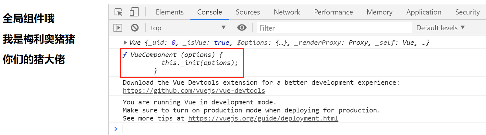
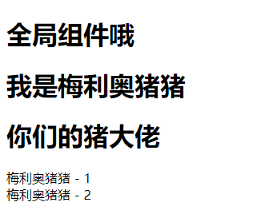
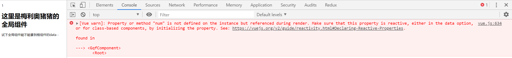
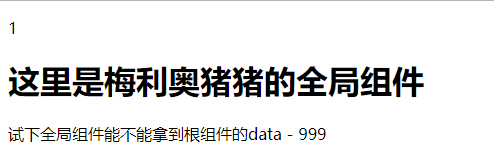
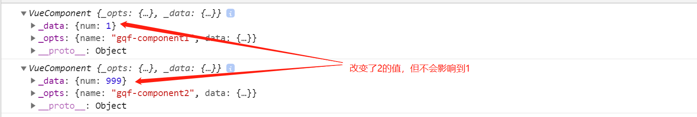
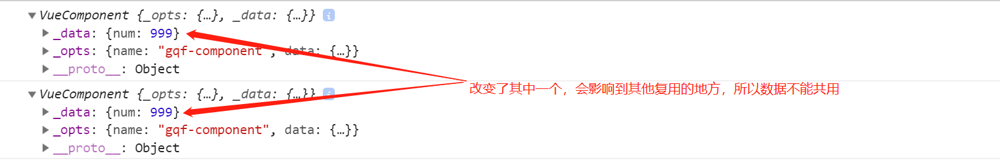
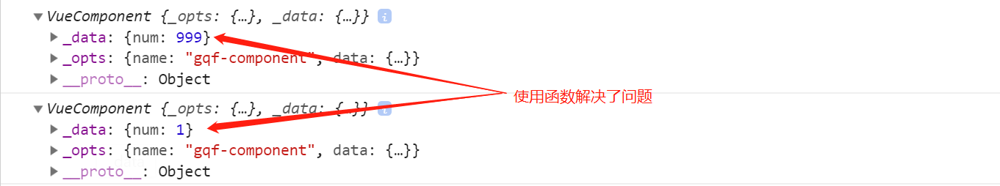

# Vue-03

> 知识大纲

* 组件的注册
    * 在Vue中，我们可以通过new Vue来创建一个组件，不过通常他是作为整个应用的顶层根组件存在的，我们还可以通过另外的方式来注册一个更为通用的组件
    * Vue.component
        * `Vue.component("组件名称", {组件选项})`
        * 组件名称遵循自定义组件命名规范，全小写，连字符(虽然驼峰也可以，但还是最好遵循规范)
        * 组件选项与new Vue选项配置基本一致，但也有一些细节的不同
* 全局组件与局部组件
    * 通过Vue.component注册的组件我们称为全局组件，因为他们可以在任意范围内使用，我们还可以定义局部组件
    * 局部组件这么定义
        ```js
        new Vue({
            ...,
            components: {
                '组件名称': {组件选项}
            }
        })
        ```
    * 在一个组件内部通过components选项注册的组件是局部组件，只能在当前的components选项所在的组件内部使用
    * 注意局部组件的注册只能在当前注册的组件中使用，不能再它的子组件中使用    

> 练习

1. 创建组件
    * 先根据语法，玩下全局组件
        ```html
        <!DOCTYPE html>
        <html lang="en">
        <head>
            <meta charset="UTF-8">
            <meta name="viewport" content="width=device-width, initial-scale=1.0">
            <meta http-equiv="X-UA-Compatible" content="ie=edge">
            <title>Document</title>
        </head>
        <body>
            <div id="app">
                <gqf-component></gqf-component>   
            </div>
            <script src="../js/vue.js"></script>
            <script>
                let gqfComponent = Vue.component("gqf-component", {
                    template: `
                                <div>
                                    <h1>全局组件哦</h1>
                                    <h1>我是梅利奥猪猪</h1>
                                    <h1>你们的猪大佬</h1>
                                </div>
                    `
                })
                let app = new Vue({
                    el: "#app"
                })
                console.log(app);
                console.log(gqfComponent);
            </script>
        </body>
        </html>        
        ```
    * 来看下打印的内容，主要看下组件，发现这个是个函数 

           

    * 我个人理解就是组件的工厂函数，或者说是构造函数，在页面中标签使用的时候，相当于new出来这个组件实例，这里如果我们直接在js中写`gqfComponent()`是会报错的

    * 在试下局部组件，这次我们就在gqfComponent注册的全局组件中，加个components的选项  
        ```js
        let gqfComponent = Vue.component("gqf-component", {
            template: `
                        <div>
                            <h1>全局组件哦</h1>
                            <h1>我是梅利奥猪猪</h1>
                            <h1>你们的猪大佬</h1>
                            <gqf-component1></gqf-component1>
                            <gqf-component2></gqf-component2>
                        </div>
            `,
            components: {
                'gqf-component1': {
                    template: "<div>梅利奥猪猪 - 1</div>"
                },
                'gqf-component2': {
                    template: "<div>梅利奥猪猪 - 2</div>"
                },
            }
        })        
        ``` 
    * 注意局部组件只能在注册它的组件中使用，所以我们能看到在template选项中，我们在里面使用了局部组件    

        

2. 可复用组件中的data 
    * 每个组件都有自己私有的状态，在react中就是state，Vue中就是data
    * 注意data选项的数据，只有在当前组件中使用
    * 每个组件都是独立的，我们可以写这么个案例测试下 
        ```html
        <!DOCTYPE html>
        <html lang="en">
        <head>
            <meta charset="UTF-8">
            <meta name="viewport" content="width=device-width, initial-scale=1.0">
            <meta http-equiv="X-UA-Compatible" content="ie=edge">
            <title>Document</title>
        </head>
        <body>
            <div id="app">
                <p>{{num}}</p>
                <gqf-component></gqf-component>
            </div>
            <script src="../js/vue.js"></script>
            <script>
                Vue.component("gqf-component", {
                    template: `<div>
                                    <h1>这里是梅利奥猪猪的全局组件</h1>
                                    <p>试下全局组件能不能拿到根组件的data - {{num}}</p>
                                </div>`
                })
                new Vue({
                    el: "#app",
                    data: {
                        num: 1
                    }
                })
            </script>
        </body>
        </html>        
        ``` 
    * 然后一看，控制台就报错了 

           

    * 那我们给个data选项，注意这边要给个函数，如果就用`data:{}`也会报错
        ```js
        Vue.component("gqf-component", {
            data(){
                return {
                    num: 999
                }
            },
            template: `<div>
                            <h1>这里是梅利奥猪猪的全局组件</h1>
                            <p>试下全局组件能不能拿到根组件的data - {{num}}</p>
                        </div>`
        })        
        ``` 
    * 这个时候就没问题了，注意data必须是个函数，并且要返回个对象

          

3. 为什么可复用组件的data选项必须是个返回值是对象的函数 
    * 先来看下这段代码
        ```html
        <!DOCTYPE html>
        <html lang="en">
        <head>
            <meta charset="UTF-8">
            <meta name="viewport" content="width=device-width, initial-scale=1.0">
            <meta http-equiv="X-UA-Compatible" content="ie=edge">
            <title>Document</title>
        </head>
        <body>
            <script>
                class VueComponent{
                    constructor(options){
                        this._opts = options;
                        this._data = this._opts.data;
                    }
                }

                let gqfComponent1 = new VueComponent({
                    name: "gqf-component1",
                    data: {
                        num: 1
                    }
                }) 

                let gqfComponent2 = new VueComponent({
                    name: "gqf-component2",
                    data: {
                        num: 1
                    }
                })

                gqfComponent2._data.num = 999;

                console.log(gqfComponent1)
                console.log(gqfComponent2)

            </script>
        </body>
        </html>        
        ``` 
    * 因为每个对象的拥有的成员是独立的，所以即使一开始的初始值是一样的，其中一个对象改变了值，不会影响另外个对象的值     

          

    * 接着我们来模拟下Vue.component首先他是要返回个函数，其次实际上他在返回函数中，又return了VueComponent实例  
        ```js
        let Vue = {};
        Vue.component = function(name, options){
            return function(){
                return new VueComponent({
                    name,
                    ...options,
                })
            }
        }        
        ``` 
    * 然后一样，我们使用下这个方法，相当于注册了个组件
        ```js
        let gqfComponent = Vue.component("gqf-component", {
            data: {
                num: 1,
            }
        })
        ```    
    * 当然我们知道，注册好组件后，我们就是为了能够复用，在页面中使用这个组件，相当于就调用了方法，我们可以这么模拟同一个组件调用了多次
        ```js
        let gqfComponent1 = gqfComponent();
        let gqfComponent2 = gqfComponent();
        ``` 
    * 这种情况下我们就能发现个问题，模板可以复用，选项可以复用，但是数据，总不能都一样吧，因为如果我们改了其中一个的数据会影响到另外个
        ```js
        gqfComponent1._data.num = 999;

        console.log(gqfComponent1)
        console.log(gqfComponent2)        
        ``` 

        

    * 所以Vue想出了办法，必须使用函数，这样调用函数返回的对象作为组件独立的数据 
        ```js
        let Vue = {};
        Vue.component = function(name, options){
            return function(){
                return new VueComponent({
                    name,
                    ...options,
                    data: options.data(), //每次都会调用下，返回个对象，这样就不是共用一份数据了
                })
            }
        }

        let gqfComponent = Vue.component("gqf-component", {
            // data: {
            //     num: 1,
            // }
            data(){
                return {
                    num: 1
                }
            }
        })

        let gqfComponent1 = gqfComponent();
        let gqfComponent2 = gqfComponent();

        gqfComponent1._data.num = 999;

        console.log(gqfComponent1)
        console.log(gqfComponent2)        
        ```

    * 然后在来看结果，果然解决了这个问题，这样数据就是独立的了 

           


> 知道你还不过瘾继续吧  

* [返回目录](../../README.md) 