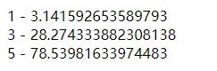
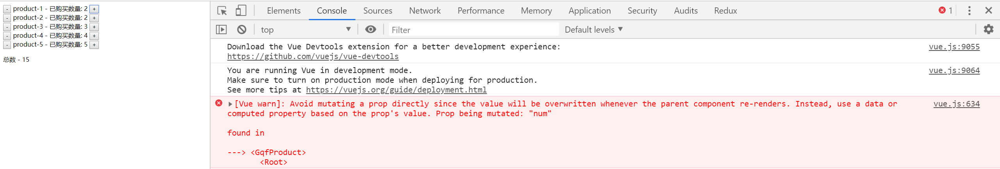
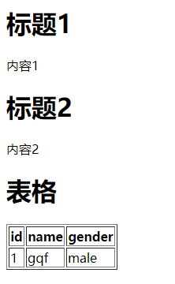
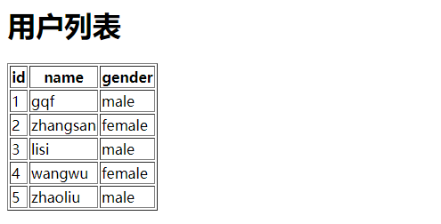

# Vue-03

> 知识大纲

* 组件的注册
    * 在Vue中，我们可以通过new Vue来创建一个组件，不过通常他是作为整个应用的顶层根组件存在的，我们还可以通过另外的方式来注册一个更为通用的组件
    * Vue.component
        * `Vue.component("组件名称", {组件选项})`
        * 组件名称遵循自定义组件命名规范，全小写，连字符(虽然驼峰也可以，但还是最好遵循规范)
        * 组件选项与new Vue选项配置基本一致，但也有一些细节的不同
* 全局组件与局部组件
    * 通过Vue.component注册的组件我们称为全局组件，因为他们可以在任意范围内使用，我们还可以定义局部组件
    * 局部组件这么定义
        ```js
        new Vue({
            ...,
            components: {
                '组件名称': {组件选项}
            }
        })
        ```
    * 在一个组件内部通过components选项注册的组件是局部组件，只能在当前的components选项所在的组件内部使用
    * 注意局部组件的注册只能在当前注册的组件中使用，不能再它的子组件中使用  
* data和props
    * data必须是个函数，且需要返回个对象
    * props定义的属性和data不能冲突   
* 组件通讯
    * 不要修改props传入的数据
    * 父组件通过props传入数据到子组件内部，但是子组件内部不要修改外部传入的props，vue提供了一种事件机制通知父级更新，父级中使用子组件的时候，监听对应的事件绑定对应的处理函数即可 
    * v-model的使用
        * prop指定要绑定的属性，默认是value
        * event指定要绑定触发的事件，默认是input事件
    * .sync
        * 通过v-model来进行双向绑定，会给状态维护带来一定的问题，因为修改比较隐蔽，同时也只能处理一个prop的绑定，我们还可以通过另外种方式来达到这个目的，那就是用sync
        * `:xxx.sync = ""`
        * `this.$emit(update:xxx, ...)`      
* 插槽
    * 默认情况下，组件模板解析后会替换整个组件的内容，如果我们想在组件引用被包含的内容，可以通过vue提供的内置组件slot来获取 
    * 具名插槽 - 给插槽起名字
    * 作用域插槽 - 拿到数据渲染       


> 练习

1. 创建组件
    * 先根据语法，玩下全局组件
        ```html
        <!DOCTYPE html>
        <html lang="en">
        <head>
            <meta charset="UTF-8">
            <meta name="viewport" content="width=device-width, initial-scale=1.0">
            <meta http-equiv="X-UA-Compatible" content="ie=edge">
            <title>Document</title>
        </head>
        <body>
            <div id="app">
                <gqf-component></gqf-component>   
            </div>
            <script src="../js/vue.js"></script>
            <script>
                let gqfComponent = Vue.component("gqf-component", {
                    template: `
                                <div>
                                    <h1>全局组件哦</h1>
                                    <h1>我是梅利奥猪猪</h1>
                                    <h1>你们的猪大佬</h1>
                                </div>
                    `
                })
                let app = new Vue({
                    el: "#app"
                })
                console.log(app);
                console.log(gqfComponent);
            </script>
        </body>
        </html>        
        ```
    * 来看下打印的内容，主要看下组件，发现这个是个函数 

           

    * 我个人理解就是组件的工厂函数，或者说是构造函数，在页面中标签使用的时候，相当于new出来这个组件实例，这里如果我们直接在js中写`gqfComponent()`是会报错的

    * 在试下局部组件，这次我们就在gqfComponent注册的全局组件中，加个components的选项  
        ```js
        let gqfComponent = Vue.component("gqf-component", {
            template: `
                        <div>
                            <h1>全局组件哦</h1>
                            <h1>我是梅利奥猪猪</h1>
                            <h1>你们的猪大佬</h1>
                            <gqf-component1></gqf-component1>
                            <gqf-component2></gqf-component2>
                        </div>
            `,
            components: {
                'gqf-component1': {
                    template: "<div>梅利奥猪猪 - 1</div>"
                },
                'gqf-component2': {
                    template: "<div>梅利奥猪猪 - 2</div>"
                },
            }
        })        
        ``` 
    * 注意局部组件只能在注册它的组件中使用，所以我们能看到在template选项中，我们在里面使用了局部组件    

        

2. 可复用组件中的data 
    * 每个组件都有自己私有的状态，在react中就是state，Vue中就是data
    * 注意data选项的数据，只有在当前组件中使用
    * 每个组件都是独立的，我们可以写这么个案例测试下 
        ```html
        <!DOCTYPE html>
        <html lang="en">
        <head>
            <meta charset="UTF-8">
            <meta name="viewport" content="width=device-width, initial-scale=1.0">
            <meta http-equiv="X-UA-Compatible" content="ie=edge">
            <title>Document</title>
        </head>
        <body>
            <div id="app">
                <p>{{num}}</p>
                <gqf-component></gqf-component>
            </div>
            <script src="../js/vue.js"></script>
            <script>
                Vue.component("gqf-component", {
                    template: `<div>
                                    <h1>这里是梅利奥猪猪的全局组件</h1>
                                    <p>试下全局组件能不能拿到根组件的data - {{num}}</p>
                                </div>`
                })
                new Vue({
                    el: "#app",
                    data: {
                        num: 1
                    }
                })
            </script>
        </body>
        </html>        
        ``` 
    * 然后一看，控制台就报错了 

           

    * 那我们给个data选项，注意这边要给个函数，如果就用`data:{}`也会报错
        ```js
        Vue.component("gqf-component", {
            data(){
                return {
                    num: 999
                }
            },
            template: `<div>
                            <h1>这里是梅利奥猪猪的全局组件</h1>
                            <p>试下全局组件能不能拿到根组件的data - {{num}}</p>
                        </div>`
        })        
        ``` 
    * 这个时候就没问题了，注意data必须是个函数，并且要返回个对象

          

3. 为什么可复用组件的data选项必须是个返回值是对象的函数 
    * 先来看下这段代码
        ```html
        <!DOCTYPE html>
        <html lang="en">
        <head>
            <meta charset="UTF-8">
            <meta name="viewport" content="width=device-width, initial-scale=1.0">
            <meta http-equiv="X-UA-Compatible" content="ie=edge">
            <title>Document</title>
        </head>
        <body>
            <script>
                class VueComponent{
                    constructor(options){
                        this._opts = options;
                        this._data = this._opts.data;
                    }
                }

                let gqfComponent1 = new VueComponent({
                    name: "gqf-component1",
                    data: {
                        num: 1
                    }
                }) 

                let gqfComponent2 = new VueComponent({
                    name: "gqf-component2",
                    data: {
                        num: 1
                    }
                })

                gqfComponent2._data.num = 999;

                console.log(gqfComponent1)
                console.log(gqfComponent2)

            </script>
        </body>
        </html>        
        ``` 
    * 因为每个对象的拥有的成员是独立的，所以即使一开始的初始值是一样的，其中一个对象改变了值，不会影响另外个对象的值     

          

    * 接着我们来模拟下Vue.component首先他是要返回个函数，其次实际上他在返回函数中，又return了VueComponent实例  
        ```js
        let Vue = {};
        Vue.component = function(name, options){
            return function(){
                return new VueComponent({
                    name,
                    ...options,
                })
            }
        }        
        ``` 
    * 然后一样，我们使用下这个方法，相当于注册了个组件
        ```js
        let gqfComponent = Vue.component("gqf-component", {
            data: {
                num: 1,
            }
        })
        ```    
    * 当然我们知道，注册好组件后，我们就是为了能够复用，在页面中使用这个组件，相当于就调用了方法，我们可以这么模拟同一个组件调用了多次
        ```js
        let gqfComponent1 = gqfComponent();
        let gqfComponent2 = gqfComponent();
        ``` 
    * 这种情况下我们就能发现个问题，模板可以复用，选项可以复用，但是数据，总不能都一样吧，因为如果我们改了其中一个的数据会影响到另外个
        ```js
        gqfComponent1._data.num = 999;

        console.log(gqfComponent1)
        console.log(gqfComponent2)        
        ``` 

        

    * 所以Vue想出了办法，必须使用函数，这样调用函数返回的对象作为组件独立的数据 
        ```js
        let Vue = {};
        Vue.component = function(name, options){
            return function(){
                return new VueComponent({
                    name,
                    ...options,
                    data: options.data(), //每次都会调用下，返回个对象，这样就不是共用一份数据了
                })
            }
        }

        let gqfComponent = Vue.component("gqf-component", {
            // data: {
            //     num: 1,
            // }
            data(){
                return {
                    num: 1
                }
            }
        })

        let gqfComponent1 = gqfComponent();
        let gqfComponent2 = gqfComponent();

        gqfComponent1._data.num = 999;

        console.log(gqfComponent1)
        console.log(gqfComponent2)        
        ```

    * 然后在来看结果，果然解决了这个问题，这样数据就是独立的了 

           

4. props
    * 来计算不同半径的圆的面积吧
        ```html
        <!DOCTYPE html>
        <html lang="en">
        <head>
            <meta charset="UTF-8">
            <meta name="viewport" content="width=device-width, initial-scale=1.0">
            <meta http-equiv="X-UA-Compatible" content="ie=edge">
            <title>Document</title>
        </head>
        <body>
            <div id="app">
                <gqf-circle :r="r1"></gqf-circle>
                <gqf-circle :r="r2"></gqf-circle>
                <gqf-circle :r="r3"></gqf-circle>
            </div>
            <script src="../js/vue.js"></script>
            <script>
                Vue.component("gqf-circle", {
                    props: ["r"],
                    template: `<div>{{r}} - {{Math.PI * r * r}}</div>`
                })

                let app = new Vue({
                    el: "#app",
                    data: {
                        r1: 1,
                        r2: 3,
                        r3: 5,
                    }
                })
            </script>
        </body>
        </html>        
        ```
    * 结果如下

           

5. 父子组件通讯     
    * 先来做个简单的案例，就是一堆商品，每个商品维护个数量，然后点击加减数量可以增减，最后统计下总数    
        ```html
        <!DOCTYPE html>
        <html lang="en">
        <head>
            <meta charset="UTF-8">
            <meta name="viewport" content="width=device-width, initial-scale=1.0">
            <meta http-equiv="X-UA-Compatible" content="ie=edge">
            <title>Document</title>
        </head>
        <body>
            <div id="app">
                <gqf-product v-for="product in products" :key="product.id" :product="product"></gqf-product>
                <p>总数 - {{sum}}</p>
            </div>
            <script src="../js/vue.js"></script>
            <script>
                Vue.component("gqf-product", {
                    props: ["product"],
                    template: `
                        <div>
                            <button @click="minus">-</button>
                            <span> {{product.name}} - 已购买数量: {{product.num}} </span>
                            <button @click="product.num++">+</button>
                        </div>
                    `,
                    methods: {
                        minus(){
                            this.product.num--;
                            if(this.product.num < 0){
                                this.product.num = 0;
                            }
                        }
                    }
                })
                let app = new Vue({
                    el: "#app",
                    data: {
                        products: [
                            {
                                id: 1,
                                name: "product-1",
                                num: 1,
                            },
                            {
                                id: 2,
                                name: "product-2",
                                num: 2,
                            },
                            {
                                id: 3,
                                name: "product-3",
                                num: 3,
                            },
                            {
                                id: 4,
                                name: "product-4",
                                num: 4,
                            },
                            {
                                id: 5,
                                name: "product-5",
                                num: 5,
                            },
                        ]
                    },
                    computed: {
                        sum(){
                            return this.products.reduce((n, item) => {
                                return n + item.num
                            }, 0)
                        }
                    }
                })
            </script>
        </body>
        </html>        
        ```
    * 效果的确是实现了，但有个比较大的问题，因为我们在组件中传入的是个对象，对象传递是址传递 
    * vue其实是不建议你直接修改传进去的值的，因为传入的数据不仅仅是当前组件使用，可能其他组件也在使用这个数据，为了保证数据操作的安全性，接下来，我们把例子在做个简单的调整，比如我们在多传个数量
        ```html
        <!DOCTYPE html>
        <html lang="en">
        <head>
            <meta charset="UTF-8">
            <meta name="viewport" content="width=device-width, initial-scale=1.0">
            <meta http-equiv="X-UA-Compatible" content="ie=edge">
            <title>Document</title>
        </head>
        <body>
            <div id="app">
                <gqf-product v-for="product in products" :key="product.id" :product="product" :num="product.num"></gqf-product>
                <p>总数 - {{sum}}</p>
            </div>
            <script src="../js/vue.js"></script>
            <script>
                Vue.component("gqf-product", {
                    props: ["product", "num"],
                    template: `
                        <div>
                            <button @click="minus">-</button>
                            <span> {{product.name}} - 已购买数量: {{num}} </span>
                            <button @click="num++">+</button>
                        </div>
                    `,
                    methods: {
                        minus(){
                            this.num--;
                            if(this.num < 0){
                                this.num = 0;
                            }
                        }
                    }
                })
                let app = new Vue({
                    el: "#app",
                    data: {
                        products: [
                            {
                                id: 1,
                                name: "product-1",
                                num: 1,
                            },
                            {
                                id: 2,
                                name: "product-2",
                                num: 2,
                            },
                            {
                                id: 3,
                                name: "product-3",
                                num: 3,
                            },
                            {
                                id: 4,
                                name: "product-4",
                                num: 4,
                            },
                            {
                                id: 5,
                                name: "product-5",
                                num: 5,
                            },
                        ]
                    },
                    computed: {
                        sum(){
                            return this.products.reduce((n, item) => {
                                return n + item.num
                            }, 0)
                        }
                    }
                })
            </script>
        </body>
        </html>        
        ```
    * 这个时候点击加号就会报错，下面的求和运算也会有问题

            

    * 这个时候，最正确的做法就是通知父级(数据持有人)去改  
        ```html
        <!DOCTYPE html>
        <html lang="en">
        <head>
            <meta charset="UTF-8">
            <meta name="viewport" content="width=device-width, initial-scale=1.0">
            <meta http-equiv="X-UA-Compatible" content="ie=edge">
            <title>Document</title>
        </head>
        <body>
            <div id="app">
                <gqf-product 
                    v-for="product in products" 
                    :key="product.id" 
                    :product="product" 
                    :num="product.num"
                    @edit="edit"
                >
                </gqf-product>
                <p>总数 - {{sum}}</p>
            </div>
            <script src="../js/vue.js"></script>
            <script>
                Vue.component("gqf-product", {
                    props: ["product", "num"],
                    template: `
                        <div>
                            <button @click="minus">-</button>
                            <span> {{product.name}} - 已购买数量: {{num}} </span>
                            <button @click="add">+</button>
                        </div>
                    `,
                    methods: {
                        minus(){
                            let result = this.num - 1;
                            if(result < 0){
                                result = 0;
                            }
                            this.$emit("edit", this.product, result);
                        },
                        add(){
                            this.$emit("edit", this.product, this.num + 1);
                        }
                    }
                })
                let app = new Vue({
                    el: "#app",
                    data: {
                        products: [
                            {
                                id: 1,
                                name: "product-1",
                                num: 1,
                            },
                            {
                                id: 2,
                                name: "product-2",
                                num: 2,
                            },
                            {
                                id: 3,
                                name: "product-3",
                                num: 3,
                            },
                            {
                                id: 4,
                                name: "product-4",
                                num: 4,
                            },
                            {
                                id: 5,
                                name: "product-5",
                                num: 5,
                            },
                        ]
                    },
                    computed: {
                        sum(){
                            return this.products.reduce((n, item) => {
                                return n + item.num
                            }, 0)
                        }
                    },
                    methods:{
                        edit(product, num){
                            product.num = num;
                        }
                    }
                })
            </script>
        </body>
        </html>        
        ```
    * 此时效果就实现了，这里简单提下this.$emit的第一个参数，是自己随意定义的，比如定义了xxx，那在组件中监听就是@xxx，至于@xxx="xxx"，引号中的xxx就是父组件里methods定义的方法，再然后就是this.$emit后面的参数，对应的就是父组件方法中，对应的参数 

6. v-model的实现    
    * 直接上代码
        ```html
        <!DOCTYPE html>
        <html lang="en">
        <head>
            <meta charset="UTF-8">
            <meta name="viewport" content="width=device-width, initial-scale=1.0">
            <meta http-equiv="X-UA-Compatible" content="ie=edge">
            <title>Document</title>
        </head>
        <body>
            <div id="app">
                <gqf-product 
                    v-for="product in products" 
                    :key="product.id" 
                    :name="product.name"
                    v-model="product.num"
                >
                </gqf-product>
                <p>总数 - {{sum}}</p>
            </div>
            <script src="../js/vue.js"></script>
            <script>
                Vue.component("gqf-product", {
                    props: ["name", "num"],
                    model: {
                        prop: "num",
                        event: "edit"
                    },
                    template: `
                        <div>
                            <button @click="minus">-</button>
                            <span> {{name}} - 已购买数量: {{num}} </span>
                            <button @click="add">+</button>
                        </div>
                    `,
                    methods: {
                        minus(){
                            let result = this.num - 1;
                            if(result < 0){
                                result = 0;
                            }
                            this.$emit("edit", result);
                        },
                        add(){
                            this.$emit("edit", this.num + 1)
                        }
                    }
                })
                let app = new Vue({
                    el: "#app",
                    data: {
                        products: [
                            {
                                id: 1,
                                name: "product-1",
                                num: 1,
                            },
                            {
                                id: 2,
                                name: "product-2",
                                num: 2,
                            },
                            {
                                id: 3,
                                name: "product-3",
                                num: 3,
                            },
                            {
                                id: 4,
                                name: "product-4",
                                num: 4,
                            },
                            {
                                id: 5,
                                name: "product-5",
                                num: 5,
                            },
                        ]
                    },
                    computed: {
                        sum(){
                            return this.products.reduce((n, item) => {
                                return n + item.num
                            }, 0)
                        }
                    }
                })
            </script>
        </body>
        </html>        
        ```
    * v-model不需要在写`@edit="edit"`,也不需要在父组件methods里写方法了，只需要配置个model属性
    * 实际上是不推荐这种写法的，我们接下来看下sync

7. sync
    * 先上代码
        ```html
        <!DOCTYPE html>
        <html lang="en">
        <head>
            <meta charset="UTF-8">
            <meta name="viewport" content="width=device-width, initial-scale=1.0">
            <meta http-equiv="X-UA-Compatible" content="ie=edge">
            <title>Document</title>
        </head>
        <body>
            <div id="app">
                <gqf-product 
                    v-for="product in products" 
                    :key="product.id" 
                    :name="product.name"
                    :num.sync="product.num"
                >
                </gqf-product>
                <p>总数 - {{sum}}</p>
            </div>
            <script src="../js/vue.js"></script>
            <script>
                Vue.component("gqf-product", {
                    props: ["name", "num"],
                    template: `
                        <div>
                            <button @click="minus">-</button>
                            <span> {{name}} - 已购买数量: {{num}} </span>
                            <button @click="add">+</button>
                        </div>
                    `,
                    methods: {
                        minus(){
                            let result = this.num - 1;
                            if(result < 0){
                                result = 0;
                            }
                            this.$emit("update:num", result);
                        },
                        add(){
                            this.$emit("update:num", this.num + 1)
                        }
                    }
                })
                let app = new Vue({
                    el: "#app",
                    data: {
                        products: [
                            {
                                id: 1,
                                name: "product-1",
                                num: 1,
                            },
                            {
                                id: 2,
                                name: "product-2",
                                num: 2,
                            },
                            {
                                id: 3,
                                name: "product-3",
                                num: 3,
                            },
                            {
                                id: 4,
                                name: "product-4",
                                num: 4,
                            },
                            {
                                id: 5,
                                name: "product-5",
                                num: 5,
                            },
                        ]
                    },
                    computed: {
                        sum(){
                            return this.products.reduce((n, item) => {
                                return n + item.num
                            }, 0)
                        }
                    }
                })
            </script>
        </body>
        </html>        
        ```
    * 其实核心的代码就这2行
        * `:num.sync="product.num"`
        * `this.$emit("update:num", this.num + 1)`  

8. 插槽     
    * 讲插槽前，先简单实现个东西  
        ```html
        <!DOCTYPE html>
        <html lang="en">
        <head>
            <meta charset="UTF-8">
            <meta name="viewport" content="width=device-width, initial-scale=1.0">
            <meta http-equiv="X-UA-Compatible" content="ie=edge">
            <title>Document</title>
        </head>
        <body>
            <div id="app">
                <gqf-dialog title="标题1" content="内容1"></gqf-dialog>
                <gqf-dialog title="标题2" content="内容2"></gqf-dialog>
            </div>
            <script src="../js/vue.js"></script>
            <script>
                Vue.component("gqf-dialog", {
                    props: ["title", "content"],
                    template: `
                        <div>
                            <h1>{{title}}</h1>
                            <div>{{content}}</div>
                        </div>    
                    `
                })
                let app = new Vue({
                    el: "#app",
                    
                })
            </script>
        </body>
        </html>        
        ```
    * 现在因为内容比较简单，只是个简单的字符串，如果以后扩展成，是个表格，或者表单，是不是就比较麻烦了
    * 我们先来写个表格玩下，注意组件里要用v-html 
        ```html
        <!DOCTYPE html>
        <html lang="en">
        <head>
            <meta charset="UTF-8">
            <meta name="viewport" content="width=device-width, initial-scale=1.0">
            <meta http-equiv="X-UA-Compatible" content="ie=edge">
            <title>Document</title>
        </head>
        <body>
            <div id="app">
                <gqf-dialog title="标题1" content="内容1"></gqf-dialog>
                <gqf-dialog title="标题2" content="内容2"></gqf-dialog>
                <gqf-dialog 
                    title="表格" 
                    content="<table border='1'>
                                <thead>
                                    <tr>
                                        <th>id</th>
                                        <th>name</th>
                                        <th>gender</th>
                                    </tr>
                                </thead>
                                <tbody>
                                    <tr>
                                        <td>1</td>
                                        <td>gqf</td>
                                        <td>male</td>
                                    </tr>
                                </tbody>
                            </table>"
                >
                </gqf-dialog>
            </div>

            <!-- <table border='1'>
                <thead>
                    <tr>
                        <th>id</th>
                        <th>name</th>
                        <th>gender</th>
                    </tr>
                </thead>
                <tbody>
                    <tr>
                        <td>1</td>
                        <td>gqf</td>
                        <td>male</td>
                    </tr>
                </tbody>
            </table> -->
            <script src="../js/vue.js"></script>
            <script>
                Vue.component("gqf-dialog", {
                    props: ["title", "content"],
                    template: `
                        <div>
                            <h1>{{title}}</h1>
                            <div v-html="content"></div>
                        </div>    
                    `
                })
                let app = new Vue({
                    el: "#app",
                    
                })
            </script>
        </body>
        </html>        
        ```  
    * 效果是这样的

          

    * 很明显这样的写法非常的恶心，那肯定有小伙伴会说，那我就放在这个自定义组件里面不就可以了，类似这样
        ```html
        <gqf-dialog title="标题3">
            <table border='1'>
                <thead>
                    <tr>
                        <th>id</th>
                        <th>name</th>
                        <th>gender</th>
                    </tr>
                </thead>
                <tbody>
                    <tr>
                        <td>1</td>
                        <td>gqf</td>
                        <td>male</td>
                    </tr>
                </tbody>
            </table>
        </gqf-dialog>        
        ``` 
    * 然后打开页面看，并没有看到表格，实际上vue有slot组件，这个其实类似react的children，所以加上slot组件，就能看到效果了
        ```js
        Vue.component("gqf-dialog", {
            props: ["title", "content"],
            template: `
                <div>
                    <h1>{{title}}</h1>
                    <div>
                        <slot></slot>
                    </div>
                </div>    
            `
        })        
        ```           
    * 具名插槽
        * 其实很简单，就是有多个插槽
        * 为了区分，需要包在template标签下，并且添加属性，给插槽起下名字`v-slot:xxx`，不起名字的就是默认的插槽
        * 然后在定义组件的地方，这么写`<slot name="xxx"></slot>`
        * 具体代码如下
            ```html
            <!DOCTYPE html>
            <html lang="en">
            <head>
                <meta charset="UTF-8">
                <meta name="viewport" content="width=device-width, initial-scale=1.0">
                <meta http-equiv="X-UA-Compatible" content="ie=edge">
                <title>Document</title>
            </head>
            <body>
                <div id="app">
                    <gqf-dialog>
                        <template v-slot:title>
                            <h1>标题</h1>
                        </template>
                        <template>
                            <table border='1'>
                                <thead>
                                    <tr>
                                        <th>id</th>
                                        <th>name</th>
                                        <th>gender</th>
                                    </tr>
                                </thead>
                                <tbody>
                                    <tr>
                                        <td>1</td>
                                        <td>gqf</td>
                                        <td>male</td>
                                    </tr>
                                </tbody>
                            </table>
                        </template>
                    </gqf-dialog>
                </div>
                <script src="../js/vue.js"></script>
                <script>
                    Vue.component("gqf-dialog", {
                        props: ["title", "content"],
                        template: `
                            <div>
                                <div>
                                    <slot name="title"></slot>
                                </div>
                                <div>
                                    <slot></slot>
                                </div>
                            </div>    
                        `
                    })
                    let app = new Vue({
                        el: "#app",
                        
                    })
                </script>
            </body>
            </html>
            ```  
    * 作用域插槽
        * 其实就是传数据，因为内部的组件不能直接使用props传进来的数据，要做下处理
        * 我们先在根组件里定义下数据 
            ```js
            let app = new Vue({
                el: "#app",
                data: {
                    list: {
                        title: "用户列表",
                        users: [
                            {
                                id: 1,
                                name: "gqf",
                                gender: "male"
                            },
                            {
                                id: 2,
                                name: "zhangsan",
                                gender: "female"
                            },
                            {
                                id: 3,
                                name: "lisi",
                                gender: "male"
                            },
                            {
                                id: 4,
                                name: "wangwu",
                                gender: "female"
                            },
                            {
                                id: 5,
                                name: "zhaoliu",
                                gender: "male"
                            },
                        ]
                    }
                }
            })            
            ``` 
        * 接着就是传值给我们的gqf-dialog组件，主要代码如下 
            * `<gqf-dialog :list="list">`
            * `props: ["list"],`   
        * 在定义的组件里代码如下
            * `<slot name="title" :title="list.title"></slot>`
        * 在template标签里这么处理
            ```html
            <template v-slot:title="props">
                <h1>{{props.title}}</h1>
            </template>            
            ```  
        * 最终代码如下
            ```html
            <!DOCTYPE html>
            <html lang="en">
            <head>
                <meta charset="UTF-8">
                <meta name="viewport" content="width=device-width, initial-scale=1.0">
                <meta http-equiv="X-UA-Compatible" content="ie=edge">
                <title>Document</title>
            </head>
            <body>
                <div id="app">
                    <gqf-dialog :list="list">
                        <template v-slot:title="props">
                            <h1>{{props.title}}</h1>
                        </template>
                        <template v-slot="props">
                            <table border='1'>
                                <thead>
                                    <tr>
                                        <th>id</th>
                                        <th>name</th>
                                        <th>gender</th>
                                    </tr>
                                </thead>
                                <tbody>
                                    <tr v-for="user in props.users" :key="user.id">
                                        <td>{{user.id}}</td>
                                        <td>{{user.name}}</td>
                                        <td>{{user.gender}}</td>
                                    </tr>
                                </tbody>
                            </table>
                        </template>
                    </gqf-dialog>
                </div>
                <script src="../js/vue.js"></script>
                <script>
                    Vue.component("gqf-dialog", {
                        props: ["list"],
                        template: `
                            <div>
                                <div>
                                    <slot name="title" :title="list.title"></slot>
                                </div>
                                <div>
                                    <slot :users="list.users"></slot>
                                </div>
                            </div>    
                        `
                    })
                    let app = new Vue({
                        el: "#app",
                        data: {
                            list: {
                                title: "用户列表",
                                users: [
                                    {
                                        id: 1,
                                        name: "gqf",
                                        gender: "male"
                                    },
                                    {
                                        id: 2,
                                        name: "zhangsan",
                                        gender: "female"
                                    },
                                    {
                                        id: 3,
                                        name: "lisi",
                                        gender: "male"
                                    },
                                    {
                                        id: 4,
                                        name: "wangwu",
                                        gender: "female"
                                    },
                                    {
                                        id: 5,
                                        name: "zhaoliu",
                                        gender: "male"
                                    },
                                ]
                            }
                        }
                    })
                </script>
            </body>
            </html>            
            ```

                            

> 知道你还不过瘾继续吧  

* [返回目录](../../README.md) 