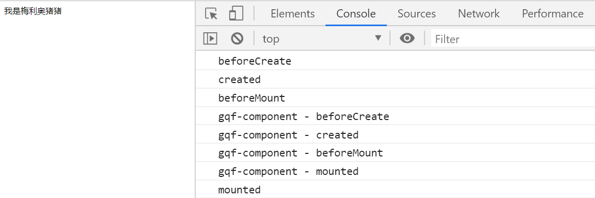
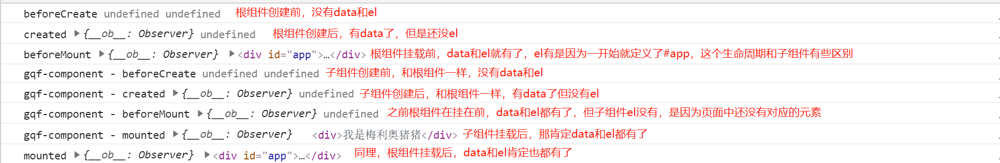
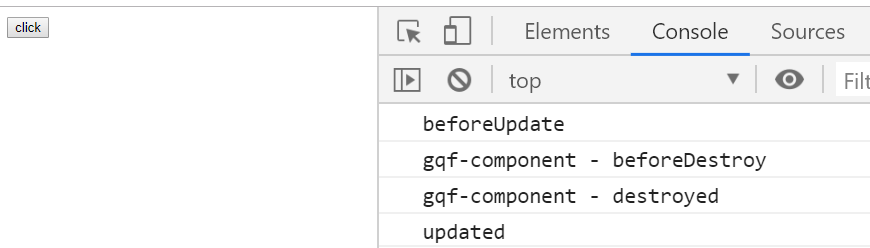
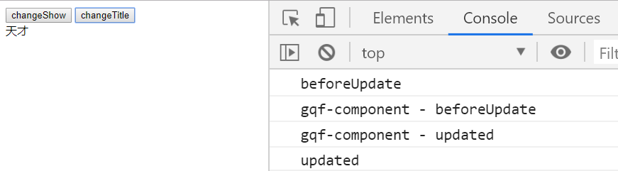
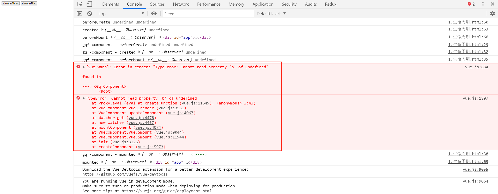
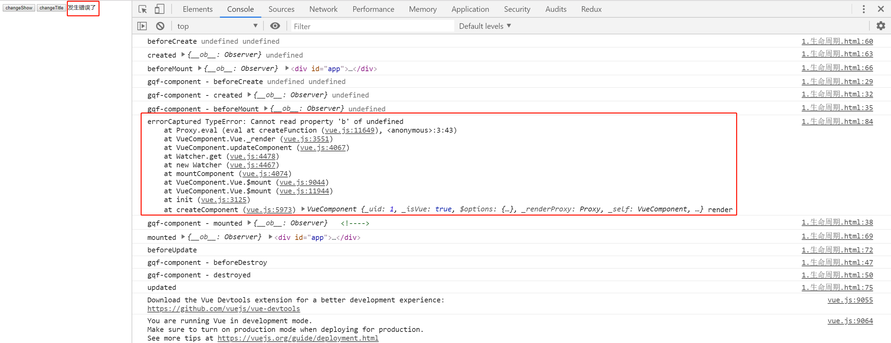
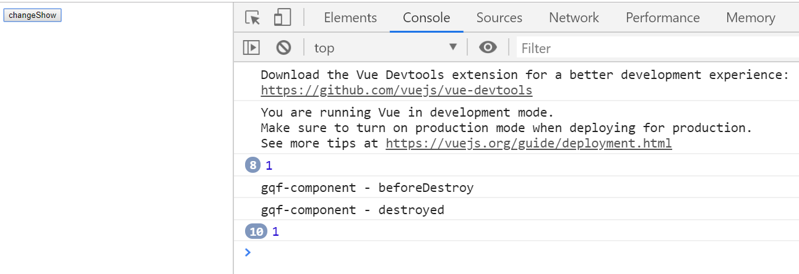
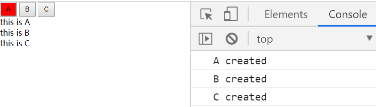
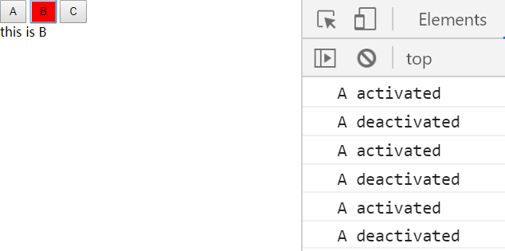

# Vue-04

> 知识大纲

* 生命周期

    

* 个人总结下，一般就是前后关系，请看下面的解说
    * beforeCreate - 创建前
        * 初始化阶段，应用不多
    * created - 创建后
        * 在实例创建完成后被立即调用，该阶段完成了对data中的数据的observer，该阶段可以处理一些异步任务
    * beforeMount - 挂载前
        * 在挂载开始之前被调用，应用不多
    * mounted - 挂载后
        * 该阶段执行完了模板解析，以及挂载。同时组件根组件元素被赋给了$el属性，该阶段可以通过DOM操作来对组件内部元素进行处理
    * beforeUpdate - 更新前
    * updated - 更新后
    * beforeDestroy - 摧毁前
    * destroyed - 摧毁后

* 还有个特殊的，捕获错误的 - errorCaptured 
    * 在父组件里添加这个生命周期
    * 如果子组件出现错误，就会调用这个生命周期
    * 代码如下，`(err: Error, vm: Component, info: string) => ?boolean`
        ```js
        errorCaptured(err, vm, info){
            console.log("errorCaptured", err, vm, info);
            //做些错误的逻辑处理~
            return false;
        }
        ```

* 动态组件
    * 有的时候，我们需要在多个不同的组件之间进行切换。虽然我们可以通过v-if处理，但是比较麻烦，vue提供了一个更方便的方式来处理这种情况
    * component是vue内置的一个组件，它提供一个is属性用来动态渲染不同的组件 
    * 但component组件在切换的时候依然会触发组件的销毁和重建，首先性能不好，其次会丢失组件状态(比如选项卡，其中一个内容有checkbox，不能保留这个checkbox的状态)     
    * 这个时候可以使用keep-alive组件
    * keep-alive在组件切换的时候，会保留这些组件的状态，以避免反复重复渲染导致的性能问题，它是个内置容器组件，使用keep-alive，内部包含的组件将增加激活，失活/冻结的状态(activated，deactivated) 
        ```html
        <keep-alive>
            <component :is="currentComponent"></component>
        </keep-alive>
        ```   

> 练习

1. 生命周期
    * 先来个简单的例子，老样子，先上代码
        ```html
        <!DOCTYPE html>
        <html lang="en">
        <head>
            <meta charset="UTF-8">
            <meta name="viewport" content="width=device-width, initial-scale=1.0">
            <meta http-equiv="X-UA-Compatible" content="ie=edge">
            <title>Document</title>
        </head>
        <body>
            <div id="app">
                <gqf-component></gqf-component>
            </div>
            <script src="../js/vue.js"></script>
            <script>
                let app = new Vue({
                    el: "#app",
                    components: {
                        "gqf-component": {
                            template: `<div>我是梅利奥猪猪</div>`,
                            beforeCreate(){
                                console.log("gqf-component - beforeCreate")
                            },
                            created(){
                                console.log("gqf-component - created")
                            },
                            beforeMount(){
                                console.log("gqf-component - beforeMount")
                            },
                            mounted(){
                                console.log("gqf-component - mounted")
                            },
                            beforeUpdate(){
                                console.log("gqf-component - beforeUpdate")
                            },
                            updated(){
                                console.log("gqf-component - updated")
                            },
                            beforeDestroy(){
                                console.log("gqf-component - beforeDestroy")
                            },
                            destroyed(){
                                console.log("gqf-component - destroyed")
                            },
                        }
                    },
                    beforeCreate(){
                        console.log("beforeCreate")
                    },
                    created(){
                        console.log("created")
                    },
                    beforeMount(){
                        console.log("beforeMount")
                    },
                    mounted(){
                        console.log("mounted")
                    },
                    beforeUpdate(){
                        console.log("beforeUpdate")
                    },
                    updated(){
                        console.log("updated")
                    },
                    beforeDestroy(){
                        console.log("beforeDestroy")
                    },
                    destroyed(){
                        console.log("destroyed")
                    },
                })
            </script>
        </body>
        </html>         
        ```
    * 来看下页面上打印的顺序，就能发现，父组件在挂在前会先去处理子组件，子组件处理好了以后在挂载，有点像栈

            

    * 接着我们在根组件，子组件打印this.$data, this.$el，然后再解释一波

        

    * 接着我们在来搞点事情，很简单，搞个开关，隐藏和显示子组件   
        ```html
        <!DOCTYPE html>
        <html lang="en">
        <head>
            <meta charset="UTF-8">
            <meta name="viewport" content="width=device-width, initial-scale=1.0">
            <meta http-equiv="X-UA-Compatible" content="ie=edge">
            <title>Document</title>
        </head>
        <body>
            <div id="app">
                <button @click="isShow = !isShow">click</button>
                <gqf-component v-if="isShow"></gqf-component>
            </div>
            <script src="../js/vue.js"></script>
            <script>
                let app = new Vue({
                    el: "#app",
                    components: {
                        "gqf-component": {
                            template: `<div>我是梅利奥猪猪</div>`,
                            beforeCreate(){
                                console.log("gqf-component - beforeCreate", this.$data, this.$el)
                            },
                            created(){
                                console.log("gqf-component - created", this.$data, this.$el)
                            },
                            beforeMount(){
                                console.log("gqf-component - beforeMount", this.$data, this.$el)
                            },
                            mounted(){
                                console.log("gqf-component - mounted", this.$data, this.$el)
                            },
                            beforeUpdate(){
                                console.log("gqf-component - beforeUpdate")
                            },
                            updated(){
                                console.log("gqf-component - updated")
                            },
                            beforeDestroy(){
                                console.log("gqf-component - beforeDestroy")
                            },
                            destroyed(){
                                console.log("gqf-component - destroyed")
                            },
                        }
                    },
                    data: {
                        isShow: true,
                    },
                    beforeCreate(){
                        console.log("beforeCreate", this.$data, this.$el)
                    },
                    created(){
                        console.log("created", this.$data, this.$el)
                    },
                    beforeMount(){
                        console.log("beforeMount", this.$data, this.$el)
                    },
                    mounted(){
                        console.log("mounted", this.$data, this.$el)
                    },
                    beforeUpdate(){
                        console.log("beforeUpdate")
                    },
                    updated(){
                        console.log("updated")
                    },
                    beforeDestroy(){
                        console.log("beforeDestroy")
                    },
                    destroyed(){
                        console.log("destroyed")
                    },
                })
            </script>
        </body>
        </html>         
        ``` 
    * 点击按钮玩一下，然后就能发现，根组件触发了更新前更新后的生命周期，而子组件触发了摧毁前摧毁后的生命周期

            

    * 为了演示子组件更新的生命周期，我们这边可以传入title属性，然后更改子组件的title  
        ```html
        <!DOCTYPE html>
        <html lang="en">
        <head>
            <meta charset="UTF-8">
            <meta name="viewport" content="width=device-width, initial-scale=1.0">
            <meta http-equiv="X-UA-Compatible" content="ie=edge">
            <title>Document</title>
        </head>
        <body>
            <div id="app">
                <button @click="isShow = !isShow">changeShow</button>
                <button @click="title=['天才','大佬','打游戏撸码的咸鱼'][Math.random()*3|0]">changeTitle</button>
                <gqf-component v-if="isShow" :title="title"></gqf-component>
            </div>
            <script src="../js/vue.js"></script>
            <script>
                let app = new Vue({
                    el: "#app",
                    components: {
                        "gqf-component": {
                            props: ["title"],
                            template: `<div>{{title}}</div>`,
                            beforeCreate(){
                                console.log("gqf-component - beforeCreate", this.$data, this.$el)
                            },
                            created(){
                                console.log("gqf-component - created", this.$data, this.$el)
                            },
                            beforeMount(){
                                console.log("gqf-component - beforeMount", this.$data, this.$el)
                            },
                            mounted(){
                                console.log("gqf-component - mounted", this.$data, this.$el)
                            },
                            beforeUpdate(){
                                console.log("gqf-component - beforeUpdate")
                            },
                            updated(){
                                console.log("gqf-component - updated")
                            },
                            beforeDestroy(){
                                console.log("gqf-component - beforeDestroy")
                            },
                            destroyed(){
                                console.log("gqf-component - destroyed")
                            },
                        }
                    },
                    data: {
                        isShow: true,
                        title: "我是梅利奥猪猪",
                    },
                    beforeCreate(){
                        console.log("beforeCreate", this.$data, this.$el)
                    },
                    created(){
                        console.log("created", this.$data, this.$el)
                    },
                    beforeMount(){
                        console.log("beforeMount", this.$data, this.$el)
                    },
                    mounted(){
                        console.log("mounted", this.$data, this.$el)
                    },
                    beforeUpdate(){
                        console.log("beforeUpdate")
                    },
                    updated(){
                        console.log("updated")
                    },
                    beforeDestroy(){
                        console.log("beforeDestroy")
                    },
                    destroyed(){
                        console.log("destroyed")
                    },
                })
            </script>
        </body>
        </html>         
        ```

          

    * 在来玩下捕获错误的生命周期
        * 先让代码报错，这个很容易吧，我们可以在组件里随意写一些东西类似这样`{{title.a.b.c}}`
        * 然后控制台就报错了，所以我们可以使用一种比较好的方式，现在根组件data里定义个数据，hasError默认为false

            

        * 然后html代码这么写
            ```html
            <template v-if="hasError">
                发生错误了
            </template>
            <template v-else>
                <gqf-component v-if="isShow" :title="title"></gqf-component>
            </template>            
            ```  
        * 然后加上我们父组件捕获错误的生命周期
            ```js
            errorCaptured(err, vm, info){
                console.log("errorCaptured", err, vm, info);
                this.hasError = true;
                return false;
            }            
            ```
        * 然后就能看到效果了

              

2. destroyed的生命周期  
    * 还是类似前面个案例，我们改造下，在子组件created的生命周期里，开个定时器   
        ```html
        <!DOCTYPE html>
        <html lang="en">
        <head>
            <meta charset="UTF-8">
            <meta name="viewport" content="width=device-width, initial-scale=1.0">
            <meta http-equiv="X-UA-Compatible" content="ie=edge">
            <title>Document</title>
        </head>
        <body>
            <div id="app">
                <button @click="isShow = !isShow">changeShow</button>
                <gqf-component v-if="isShow" :title="title"></gqf-component>
            </div>
            <script src="../js/vue.js"></script>
            <script>
                let app = new Vue({
                    el: "#app",
                    components: {
                        "gqf-component": {
                            props: ["title"],
                            template: `<div>{{title}}</div>`,
                            created(){
                                setInterval(() => {
                                    console.log(1);
                                }, 1000)
                            },
                            beforeDestroy(){
                                console.log("gqf-component - beforeDestroy")
                            },
                            destroyed(){
                                console.log("gqf-component - destroyed")
                            },
                        }
                    },
                    data: {
                        isShow: true,
                        title: "我是梅利奥猪猪",
                        hasError: false,
                    },
                })
            </script>
        </body>
        </html>         
        ``` 
    * 当我们点击按钮，把isShow改为false后，子组件就销毁了，但这个时候我们发现，定时器并没有关闭 

          

    * 所以我们要在摧毁的生命周期中clearInterval，这样摧毁组件的同时，也把定时器关闭了 
        ```js
        created(){
            this.timer = setInterval(() => {
                console.log(1);
            }, 1000)
        },
        destroyed(){
            console.log("gqf-component - destroyed")
            clearInterval(this.timer);
        },        
        ```  

3. 动态组件   
    * 目标是做个选项卡，我们先来第一步，定义3个组件abc，在搞3个按钮abc  
        ```html
        <!DOCTYPE html>
        <html lang="en">
        <head>
            <meta charset="UTF-8">
            <meta name="viewport" content="width=device-width, initial-scale=1.0">
            <meta http-equiv="X-UA-Compatible" content="ie=edge">
            <title>Document</title>
            <style>
                * {
                    padding: 0;
                    margin: 0;
                }
                button{
                    padding: 5px 10px;
                }
                button.active{
                    background-color: red;
                }
            </style>
        </head>
        <body>
            <div id="app">
                <button class="active">A</button>
                <button>B</button>
                <button>C</button>
                
                <aa></aa>
                <bb></bb>
                <cc></cc>
            </div>
            <script src="../js/vue.js"></script>
            <script>
                const aa = {
                    template: `<div>this is A</div>`,
                    created(){
                        console.log("A created")
                    },
                    destroyed(){
                        console.log("A destroyed")
                    }
                };
                const bb = {
                    template: `<div>this is B</div>`,
                    created(){
                        console.log("B created")
                    },
                    destroyed(){
                        console.log("B destroyed")
                    }
                };
                const cc = {
                    template: `<div>this is C</div>`,
                    created(){
                        console.log("C created")
                    },
                    destroyed(){
                        console.log("C destroyed")
                    }
                };
                let app = new Vue({
                    el: "#app",
                    components: {
                        aa,
                        bb,
                        cc
                    }
                })
            </script>
        </body>
        </html>        
        ```
    * 注意这边vue的原因不能使用a和b作为子组件的名称，所以起名为aa，bb，cc，然后页面的效果是这样的  

          

    * 先来个最原始的做法，我们可以给父组件定义个type，然后给3个按钮的点击事件修改type，然后在添加class的逻辑和v-if的逻辑 
        ```html
        <!DOCTYPE html>
        <html lang="en">
        <head>
            <meta charset="UTF-8">
            <meta name="viewport" content="width=device-width, initial-scale=1.0">
            <meta http-equiv="X-UA-Compatible" content="ie=edge">
            <title>Document</title>
            <style>
                * {
                    padding: 0;
                    margin: 0;
                }
                button{
                    padding: 5px 10px;
                }
                button.active{
                    background-color: red;
                }
            </style>
        </head>
        <body>
            <div id="app">
                <button @click="type='aa'" :class="type==='aa'?'active':''">A</button>
                <button @click="type='bb'" :class="type==='bb'?'active':''">B</button>
                <button @click="type='cc'" :class="type==='cc'?'active':''">C</button>
                
                <aa v-if="type==='aa'"></aa>
                <bb v-if="type==='bb'"></bb>
                <cc v-if="type==='cc'"></cc>
            </div>
            <script src="../js/vue.js"></script>
            <script>
                const aa = {
                    template: `<div>this is A</div>`,
                    created(){
                        console.log("A created")
                    },
                    destroyed(){
                        console.log("A destroyed")
                    }
                };
                const bb = {
                    template: `<div>this is B</div>`,
                    created(){
                        console.log("B created")
                    },
                    destroyed(){
                        console.log("B destroyed")
                    }
                };
                const cc = {
                    template: `<div>this is C</div>`,
                    created(){
                        console.log("C created")
                    },
                    destroyed(){
                        console.log("C destroyed")
                    }
                };
                let app = new Vue({
                    el: "#app",
                    components: {
                        aa,
                        bb,
                        cc
                    },
                    data: {
                        type: "aa"
                    }
                })
            </script>
        </body>
        </html>        
        ```
    * 最优解-动态组件
        * 我们可以把3个子组件改为component动态组件 
            ```html
            <component :is="type"></component>
            ```
        * 这样效果也直接出来了 
        * 然后我们还可以玩下keep-alive
            ```html
            <keep-alive>
                <component :is="type"></component>
            </keep-alive>            
            ``` 
        * 这个时候我们切换的时候发现生命周期destroyed就不会一直触发了，且b和c创建后，相当于abc都创建过了，也不会一直触发created的生命周期
        * 接着玩下keep-alive的2个生命周期activated(组件激活时调用)和deactivated(组件停用时调用)，我们就给aa加一下   
            ```js
            const aa = {
                template: `<div>this is A</div>`,
                created(){
                    console.log("A created")
                },
                destroyed(){
                    console.log("A destroyed")
                },
                activated(){
                    console.log("A activated")
                },
                deactivated(){
                    console.log("A deactivated")
                }
            };            
            ```
        * 然后就能看到效果了，来回切换~

                                          


> 知道你还不过瘾继续吧  

* [返回目录](../../README.md) 