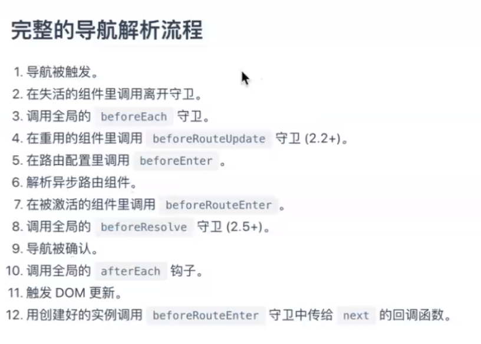
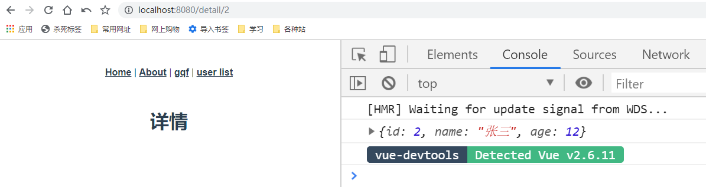
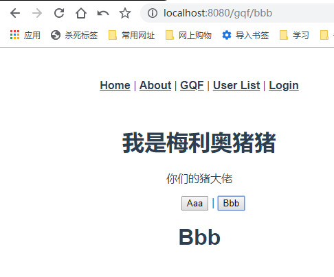

# Vue-05

> 准备工作

* 搭前端
    * 使用脚手架新建项目app，因为要用到路由，我们初始化的时候可以选择`Manually select features`
    * 然后选中Router
    * 这里我们先不用Linter/Formatter，所以取消选中这一项
    * 然后确认使用history mode，所以选择Y
    * 选择In package.json
    * save this as a preset for future projects? - 这里我选择了No

* 搭后端
    * 使用脚手架`koa-generator`，搭koa2项目，`koa2 server`
    * `cd server && yarn`，安装各个依赖
    * 启动项目`yarn start`，默认端口是3000 
    * 为了方便之后修改接口，可以改成热更新，start命令使用nodemon
    * `/users`随便返回点数据

        

    * 然后做个根据年龄排序和根据id查询的接口
        ```js
        const router = require('koa-router')()

        router.prefix('/users')

        let users = [
        {
            id: 1,
            name: "gqf",
            age: 28,
        },
        {
            id: 2,
            name: "张三",
            age: 12,
        },
        {
            id: 3,
            name: "李四",
            age: 40,
        },
        {
            id: 4,
            name: "王五",
            age: 35,
        },
        {
            id: 5,
            name: "赵六",
            age: 8,
        }

        ]

        router.get('/', function (ctx, next) {
        // ctx.body = 'this is a users response!'
        let sort = ctx.query.sort;
        if(sort){
            if(sort === "asc"){
            ctx.body = users.slice(0).sort((a, b) => a.age - b.age)
            }else{
            ctx.body = users.slice(0).sort((a, b) => b.age - a.age)
            }
        }else{
            ctx.body = users;
        }
        })

        router.get('/bar', function (ctx, next) {
        ctx.body = 'this is a users/bar response'
        })

        router.get('/:id', (ctx, next) => {
        let id = ctx.params.id;
        let user = users.find(item => item.id == id);
        ctx.body = user;
        })

        module.exports = router

        ```    

> 知识大纲

* 路由
    * 当应用变得复杂以后，我们就需要通过一种便捷，高效的方式来管理应用，最常见的就是通过路由
    * 把url与应用中对应的组件进行关联，通过不同的url访问不同的组件
    * vue-router的安装 - `npm i vue-router`或`yarn add vue-router`
    * Vue.use()，把vue-router安装到指定的Vue实例中
        ```js
        import Vue from 'vue'
        import VueRouter from 'vue-router'

        Vue.use(VueRouter)
        ```
    * 创建路由对象
        * 通过vue-router提供的Router构造函数(类)创建路由对象，路由对象包含了当前使用的模式(history,hash)，路由信息(url与组件的关系)等信息，可以在router文件夹下的index.js看到以下代码
            ```js
            import Vue from 'vue'
            import VueRouter from 'vue-router'
            import Home from '../views/Home.vue'

            Vue.use(VueRouter)

            const routes = [
                {
                    path: '/',
                    name: 'home',
                    component: Home
                },
                {
                    path: '/about',
                    name: 'about',
                    // route level code-splitting
                    // this generates a separate chunk (about.[hash].js) for this route
                    // which is lazy-loaded when the route is visited.
                    component: () => import(/* webpackChunkName: "about" */ '../views/About.vue')
                }
            ]

            const router = new VueRouter({
                mode: 'history',
                base: process.env.BASE_URL,
                routes
            })

            export default router

            ``` 
    * main.js里也要做处理，这个router的属性可以让每个组件有两个属性 **$router** 和 **$route** 
        ```js
        import Vue from 'vue'
        import App from './App.vue'
        import router from './router'

        Vue.config.productionTip = false

        new Vue({
        router,
        render: h => h(App)
        }).$mount('#app')

        ```        
    * 路由组件 - 放在了views文件夹下，我们能看到一个About组件和一个Home组件
    * 在src下的App.vue中可以看到router-link和router-view的用法
        ```vue
        <template>
            <div id="app">
                <div id="nav">
                <router-link to="/">Home</router-link> |
                <router-link to="/about">About</router-link>
                </div>
                <router-view/>
            </div>
        </template>

        <style>
        #app {
            font-family: 'Avenir', Helvetica, Arial, sans-serif;
            -webkit-font-smoothing: antialiased;
            -moz-osx-font-smoothing: grayscale;
            text-align: center;
            color: #2c3e50;
        }

        #nav {
            padding: 30px;
        }

        #nav a {
            font-weight: bold;
            color: #2c3e50;
        }

        #nav a.router-link-exact-active {
            color: #42b983;
        }
        </style>

        ```  

* 异步请求
    * 在实际的应用开发中，与后端交互，进行异步请求是很常见的需求
    * 使用axios，`npm i axios -S` 或 `yarn add axios -S`
    * 跨域问题的解决方法，在脚手架搭建的项目下，新建**vue.config.js**
        ```js
        module.exports = {
            devServer: {
            proxy: {
                '/api': {
                target: 'http://localhost:3000',
                pathRewrite: {
                    "^/api": ""
                },
                ws: true,
                changeOrigin: true
                },
            }
            }
        }        
        ```

* vue-devTools    
    * 直接将shell-chrome拖动到谷歌浏览器的扩展程序   

* 动态路由
    * 有的时候，我们需要把满足某种规则的路由全部匹配到同一个组件，比如不同商品的url
        ```
        /item/1
        /item/2
        /item/3
        ``` 
    * 我们不可能为每一个商品都定义一个独立的组件，而是把他们都映射到同一个组件，同时url后面部分为动态变化的部分，我们会在设计路由的时候进行特殊的处理
        ```
        {
            path: '/item/:itemId'
        }
        ```
    * $router对象
        * 该对象其实就是new ViewRouter得到的路由对象，通过该对象我们可以访问全局路由信息，调用路由下的方法，比如go，back，push等
    * $route对象    
        * 通过该对象可以访问与当前路由匹配的信息
    * queryString
        * `/item/1`其实用的是params
        * queryString其实就是问号后面的东西
    * 编程式导航
        ```js
        this.$router.push({
            name: 'home',
            query: {
                sort: ""
            }
        })
        ```
    * 路由组件的复用   
        * 为了提高性能，增强路由组件的复用，当路由切换使用的是同一个组件的时候，则会复用该路由组件，而不是摧毁重建，这个时候，我们就需要通过watch或路由相关的生命周期函数来处理切换路由导致的变化
        * 如果我切换的路由复用了组件，这个时候，我们可以通过watch来监听$route
            ```js
            watch: {
                $route(to, from){
                    console.log("route", to, from)
                }
            }
            ```

* 路由守卫
    * 解析流程

        

    * 当导航发生改变的时候，vue-router会在多个不同的地方调用指定的函数，也就是与路由有关的生命周期函数，也称为路由守卫
    * 组件内守卫
        * 定义在组件内的与路由有关的生命周期函数(守卫)
            * beforeRouteEnter
            * beforeRouteUpdate
            * beforeRouteLeave
    * 路由独享守卫
        * 可以在路由配置上直接定义beforeEnter守卫，相对来说，应用不多
            ```js
            const routes = [
                {
                    path: '/foo',
                    name: 'foo',
                    component: Foo,
                    beforeEnter: (to, from, next) => {

                    }
                },
            ]            
            ```
    * 全局守卫 
        * 全局守卫是注册在router对象`new VueRouter({...})`上的
            * beforeEach
            * beforeResolve
            * afterEach    

* 嵌套路由
    * 比如进入个路由后，该页面组件又是个比较复杂组件，里面可以再次嵌套路由
    * 在配置路由的时候有个属性children，它是属于父路由里面的，且会自动拼接父级的url，注意children的路由不需要加斜线
        ```js
        {
            path: "/xxx",
            component: xxx,
            children: [
                {
                    path: "xxx",
                    component: xxx,
                },
                {
                    path: "xxx",
                    component: xxx,
                }
            ]
        }
        ``` 

* 重定向
    * 有的时候，我们会根据某种需求对用户请求的页面进行重新定位
    * 在配置路由的时候，需要增加个新的路由不配置页面路由(其实相当于temp中转站)，然后添加属性redirect
        ```js
        redirect: _ => {
            let xxx = localStorage.getItem("xxx"); //看缓存里有没有
            return {name: xxx || 'xxx'}; //有的话就重定向
        }
        ```

* 别名
    * 重定向是从一个路由切换到另外个路由，而别名是不同的路由显示同一个页面，但是别名不存在跳转
        ```js
        {
            path: "/user",
            alias: "/member",
            component: User,
        }
        ```     

* 404
    * 记得写在路由配置最后
        ```js
        {
            path: "*",
            component: NotFound
        }
        ```

> 练习

1. 新增视图组件-gqf
    * 在views文件夹下新建Gqf.vue
        ```vue
        <template>
            <div>
                <h1>
                    我是梅利奥猪猪
                </h1>
                <p>
                    你们的猪大佬
                </p>
            </div>
        </template>       
        ```
    * 在路由配置中增加路由 
        ```js
        import Vue from 'vue'
        import VueRouter from 'vue-router'
        import Home from '../views/Home.vue'

        import Gqf from '@/views/Gqf.vue'

        Vue.use(VueRouter)

        const routes = [
        {
            path: '/',
            name: 'home',
            component: Home
        },
        {
            path: '/about',
            name: 'about',
            // route level code-splitting
            // this generates a separate chunk (about.[hash].js) for this route
            // which is lazy-loaded when the route is visited.
            component: () => import(/* webpackChunkName: "about" */ '../views/About.vue')
        },
        {
            path: '/gqf',
            name: 'gqf',
            component: Gqf,
        }
        ]

        const router = new VueRouter({
        mode: 'history',
        base: process.env.BASE_URL,
        routes
        })

        export default router

        ``` 
    * 最后在App.vue增加一行`<router-link to="/gqf">gqf</router-link>`
    * 然后就能看到这个华丽的效果了

            

    * `router`可以增加个属性tag，`tag="button"`，这样超链接就会变成按钮 
    * 接着我们把tag变成li试下   
        ```vue
        <template>
        <div id="app">
            <ul id="nav">
            <router-link tag="li" to="/">Home</router-link>
            <router-link tag="li" to="/about">About</router-link>
            <router-link tag="li" to="/gqf">gqf</router-link>
            </ul>
            <router-view/>
        </div>
        </template>

        <style>
        #app {
        font-family: 'Avenir', Helvetica, Arial, sans-serif;
        -webkit-font-smoothing: antialiased;
        -moz-osx-font-smoothing: grayscale;
        text-align: center;
        color: #2c3e50;
        }

        #nav {
        padding: 30px;
        }

        #nav li {
        font-weight: bold;
        color: #2c3e50;
        }

        #nav li.router-link-exact-active {
        color: #42b983;
        }
        </style>

        ```
    * 也没有任何问题，页面表现为

          

2. axios异步请求
    * 这边为了演示起来好看点，我们前面的li还是改成超链接，做个新的路由**用户列表**，专门用来请求我们的users数据
    * 先来个low的方式
        ```vue
        <template>
            <div>
                <h1>用户列表</h1>
            </div>
        </template>

        <script>

        import axios from 'axios'
        console.log(axios)

        export default {
            data(){
                return {
                    users: []
                }
            },
            async created(){
                let res = await axios({
                    url: "/api/users"
                });
                console.log(res.data);
            }
        }
        </script>        
        ``` 
    * 看下页面上是否打印数据 

         

    * 简单完善下这个例子
        ```vue
        <template>
            <div>
                <h1>用户列表</h1>
                <ul>
                    <li v-for="user in users" :key="user.id">
                        {{user.id}} - {{user.name}} - {{user.age}}
                    </li>
                </ul>
            </div>
        </template>

        <script>

        import axios from 'axios'
        // console.log(axios)

        export default {
            data(){
                return {
                    users: []
                }
            },
            async created(){
                let res = await axios({
                    url: "/api/users?sort=desc"
                });
                // console.log(res.data);
                this.users = res.data;
            }
        }
        </script>        
        ```

            

3. vue-devTools 
    * 有了这个调试工具我们打开控制台就能看到Vue这个选项 

         

    * 我们还可以在点到我们的视图组件User

            

4. 完善axios使用
    * 有的接口可能会调用多次该如何处理  
        * 比如我们可以在src文件夹下新建个api的文件夹，然后新建个index.js，专门来做这种处理
            ```js
            import axios from 'axios'

            async function getUsers(){
                let res = await axios({
                    url: "/api/users"
                })
                return res;
            }

            async function getUserById(id){
                let res = await axios({
                    url: `/api/users/${id}`
                })
                return res;
            }

            export default {
                getUsers,
                getUserById,
            }            
            ```
        * 然后我们在User.vue中就可以这么使用
            ```vue
            <template>
                <div>
                    <h1>用户列表</h1>
                    <ul>
                        <li v-for="user in users" :key="user.id">
                            {{user.id}} - {{user.name}} - {{user.age}}
                        </li>
                    </ul>
                </div>
            </template>

            <script>

            import api from '@/api/index.js'

            export default {
                data(){
                    return {
                        users: []
                    }
                },
                async created(){
                    let res = await api.getUsers();
                    this.users = res.data;
                    console.log("created", this.users)

                    let test = await api.getUserById(1);
                    console.log(test.data);
                }
            }
            </script>            
            ``` 
        * 然后看下控制台，这种封装是没有问题的

            

    * 统一管理URL的方式
        * 在api下新建个URL.js
            ```js
            export default {
                'USERS': '/api/users'
            }            
            ``` 
        * 然后就可以优化下api下的index.js了
            ```js
            import axios from 'axios'

            import URL from './URL'

            async function getUsers(){
                let res = await axios({
                    url: URL.USERS
                })
                return res;
            }

            async function getUserById(id){
                let res = await axios({
                    url: `${URL.USERS}/${id}`
                })
                return res;
            }

            export default {
                getUsers,
                getUserById,
            }            
            ``` 
        * 这样就方便维护了，比如代理变了，不使用`/api`了，我们改好这个名字后，只需要在去URL.js变更下名字就可以了  

    * axios挂在Vue的原型上，这样每个组件都可以通过this.$http来调用axios  
        * main.js里加上这个代码
            ```js
            import axios from 'axios';

            Vue.prototype.$http = axios;            
            ```
        * 我们可以在User.vue的created生命周期测试下，加上一行`console.log(this.$http)` 
        * 来看控制台

              

5. 动态路由 
    * 我们先把router-link配置好`<router-link :to="'/detail/'+user.id">{{user.name}}</router-link>`  
    * 然后我们随意点击个姓名，就能跳转到这样的一个路由`http://localhost:8080/detail/2`
    * 所以接下来我们应该写下视图组件Detail
    * 注意配置的路由应该是这样的
        ```js
        {
            path: '/detail/:id',
            name: 'detail',
            component: Detail,
        }        
        ``` 
    * 然后在Detail组件created的生命周期就可以调用我们前面封装的api了
        ```vue
        <template>
            <div>
                <h1>详情</h1>
            </div>
        </template>

        <script>

        import api from '@/api/index'

        export default {
            async created(){
                // console.log(this.$route)
                let id = this.$route.params.id;
                let res = await api.getUserById(id);
                console.log(res.data);
            }
        }
        </script>
        ```   
    * 页面上就能看到

          

    * 接着就是继续完善下这个例子
        ```vue
        <template>
            <div>
                <h1>详情</h1>
                <template v-if="user">
                    <p>id - {{user.id}}</p>
                    <p>name - {{user.name}}</p>
                    <p>age - {{user.age | showAge}}</p>
                </template>
                <template v-else>
                    没有该用户信息
                </template>
            </div>
        </template>

        <script>

        import api from '@/api/index'
        import filter from '@/filter/index'

        export default {
            data(){
                return {
                    user: null
                }
            },
            filters: {
                showAge: filter.showAge
            },
            async created(){
                // console.log(this.$route)
                let id = this.$route.params.id;
                let res = await api.getUserById(id);
                // console.log(res.data);
                this.user = res.data;
            }
        }
        </script>        
        ``` 
    * 这次在来完成个排序功能吧
        * 我们先去修改下我们api下的查询功能
            ```js
            async function getUsers(sort="desc"){
                let res = await axios({
                    url: `${URL.USERS}?sort=${sort}`
                })
                return res;
            }        
            ```   
        * 然后看下完整的实现代码吧
            ```vue
            <template>
                <div>
                    <h1>用户列表</h1>
                    <select @change="changeSort" v-model="sort">
                        <option value="desc">年龄从大到小</option>
                        <option value="asc">年龄从小到大</option>
                    </select>
                    <ul>
                        <li v-for="user in users" :key="user.id">
                            {{user.id}} - <router-link :to="'/detail/'+user.id">{{user.name}}</router-link> - {{user.age | showAge}}
                        </li>
                    </ul>
                </div>
            </template>

            <script>

            import api from '@/api/index.js'

            import filter from '@/filter/index.js'

            export default {
                data(){
                    return {
                        users: [],
                        sort: "desc",
                    }
                },
                methods: {
                    changeSort(){
                        this.$router.push({
                            name: "user",
                            query: {
                                sort: this.sort
                            }
                        })
                    },
                    async getUsers(){
                        this.sort = this.$route.query.sort || "desc";
                        let res = await api.getUsers(this.sort);
                        this.users = res.data;
                    }
                },
                async created(){
                    this.getUsers();
                },
                filters: {
                    showAge: filter.showAge,
                },
                watch: {
                    async $route(){
                        this.getUsers();
                    }
                }
            }
            </script>            
            ```

6. 路由守卫            
    * 先来玩下beforeRouteEnter，在User.vue中添加这个生命周期  
        ```js
        beforeRouteEnter(to, from, next){

        },        
        ```  
    * 我们发现如果不调用next方法，页面就不会调用接口获取数据了，如果在方法内调用`next()`，会发生什么你们懂的
    * 这边其实还可以玩下next方法里传的参数
        * `next(false)` - 其实和不写next是一样的
        * `next({name: "gqf"})` - 意思就是跳转gqf路由
        * `next(vm => {})` - 可以拿到vm
        * 所以之前在created的生命周期也可以改成这个
            ```js
            // async created(){
            //     this.getUsers();
            // },
            beforeRouteEnter(to, from, next){
                next(vm => {
                    vm.getUsers();
                })
            },            
            ```
    * 之前使用watch去监听$route，现在我们可以使用beforeRouteUpdate试下，注意调用接口要在next之后，因为next之前调用相当于是路由还没有更新时的状态
        ```js
        beforeRouteUpdate(to, from, next){
            //注意不能再next之前调用this.getUsers
            next();
            this.getUsers();
        },        
        ```
    * 上述代码就能完成我们之前的效果，相当于使用了路由守卫，我们就不需要之前的created生命周期，也不需要watch监听了
    * 路由独享守卫用的不多所以这里不重点说明，接下来来看下全局守卫
    * 我们打开router文件夹下的index.js，添加代码
    * 先来看下beforeEach，这个其实做的就是鉴权，进入路由前，如果没有调用next就进不去
        ```js
        router.beforeEach((to, from, next) => {
            next();
        })        
        ``` 
    * 这里模拟个简单的鉴权，比如说没有登录的话就不能进gqf路由 
        * 先简单写个登录的页面路由 
        * 然后在路由index中添加这样的代码
            ```js
            let user = {
                id: 0, //id为0模拟用户未登录
            }

            router.beforeEach((to, from, next) => {
                if(user.id === 0 && to.name === 'gqf'){
                    next({
                    name: 'login'
                    })
                }else{
                    next();
                }

            })            
            ```  
        * 我们发现当id是0的时候，我们点击gqf是进不去的，直接就跳转登录页面了，反之，id不为0就可以进入gqf页面
        * 注意条件`user.id === 0 && to.name === 'gqf'`，如果条件中没有to的那个条件，就会递归报错，相当于进入login页面，然后判断未登录，在进入login页面 

7. 嵌套路由 
    * 比如我们的gqf页面组件比较复杂，所以我们在views里面新建个文件夹Gqf
    * 新建2个页面路由Aaa和Bbb
    * 然后就是配置路由嵌套了，注意children的路由不需要加斜线
        ```js
        {
            path: '/gqf',
            name: 'gqf',
            component: Gqf,
            children: [
            {
                path: 'aaa',
                name: 'aaa',
                component: Aaa,
            },
            {
                path: 'bbb',
                name: 'bbb',
                component: Bbb,
            },
            ]
        },        
        ```
    * 接着就是去Gqf视图组件加代码了 
        ```js
        <template>
            <div>
                <h1>
                    我是梅利奥猪猪
                </h1>
                <p>
                    你们的猪大佬
                </p>
                <ul>
                    <router-link tag="button" :to="{name: 'aaa'}">Aaa</router-link> | 
                    <router-link tag="button" :to="{name: 'bbb'}">Bbb</router-link> 
                </ul>
                <router-view/>
            </div>
        </template>        
        ``` 
    * 页面呈现的结果 

          

    * 如果我们直接点击gqf发现并没有选中子的路由，如何设置默认的子路由，其实很简单，我们把子路由的path去掉就可以了
        ```js
        {
            path: '/gqf',
            name: 'gqf',
            component: Gqf,
            children: [
            {
                path: '', //这样默认就跳到这个路由
                name: 'aaa',
                component: Aaa,
            },
            {
                path: 'bbb',
                name: 'bbb',
                component: Bbb,
            },
            ]
        },        
        ```  

8. 重定向

9. 别名

10. 404


> 知道你还不过瘾继续吧   

* [返回目录](../../README.md) 