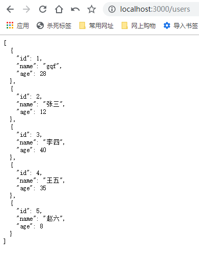
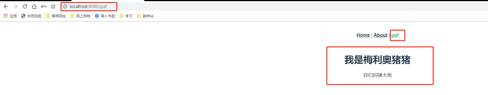
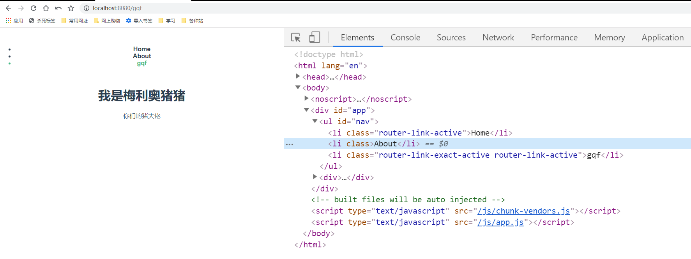
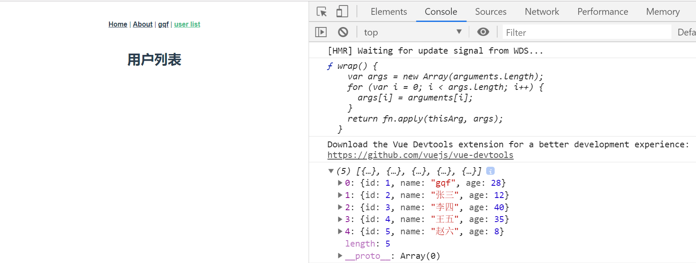
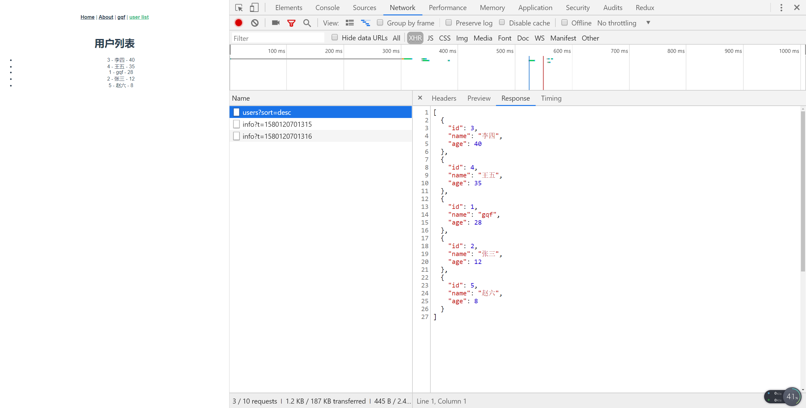
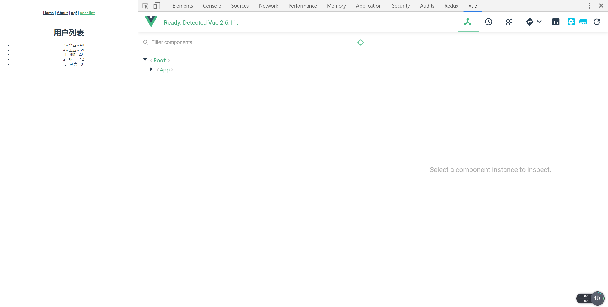
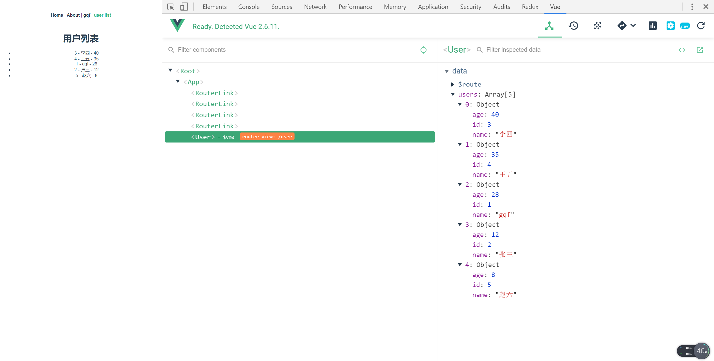
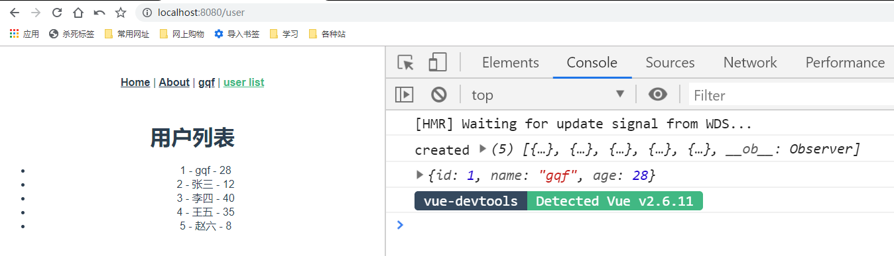
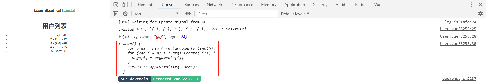

# Vue-05

> 准备工作
* 搭前端
    * 使用脚手架新建项目app，因为要用到路由，我们初始化的时候可以选择`Manually select features`
    * 然后选中Router
    * 这里我们先不用Linter/Formatter，所以取消选中这一项
    * 然后确认使用history mode，所以选择Y
    * 选择In package.json
    * save this as a preset for future projects? - 这里我选择了No
* 搭后端
    * 使用脚手架`koa-generator`，搭koa2项目，`koa2 server`
    * `cd server && yarn`，安装各个依赖
    * 启动项目`yarn start`，默认端口是3000 
    * 为了方便之后修改接口，可以改成热更新，start命令使用nodemon
    * `/users`随便返回点数据

        

    * 然后做个根据年龄排序和根据id查询的接口
        ```js
        const router = require('koa-router')()

        router.prefix('/users')

        let users = [
        {
            id: 1,
            name: "gqf",
            age: 28,
        },
        {
            id: 2,
            name: "张三",
            age: 12,
        },
        {
            id: 3,
            name: "李四",
            age: 40,
        },
        {
            id: 4,
            name: "王五",
            age: 35,
        },
        {
            id: 5,
            name: "赵六",
            age: 8,
        }

        ]

        router.get('/', function (ctx, next) {
        // ctx.body = 'this is a users response!'
        let sort = ctx.query.sort;
        if(sort){
            if(sort === "asc"){
            ctx.body = users.slice(0).sort((a, b) => a.age - b.age)
            }else{
            ctx.body = users.slice(0).sort((a, b) => b.age - a.age)
            }
        }else{
            ctx.body = users;
        }
        })

        router.get('/bar', function (ctx, next) {
        ctx.body = 'this is a users/bar response'
        })

        router.get('/:id', (ctx, next) => {
        let id = ctx.params.id;
        let user = users.find(item => item.id == id);
        ctx.body = user;
        })

        module.exports = router

        ```    

> 知识大纲

* 路由
    * 当应用变得复杂以后，我们就需要通过一种便捷，高效的方式来管理应用，最常见的就是通过路由
    * 把url与应用中对应的组件进行关联，通过不同的url访问不同的组件
    * vue-router的安装 - `npm i vue-router`或`yarn add vue-router`
    * Vue.use()，把vue-router安装到指定的Vue实例中
        ```js
        import Vue from 'vue'
        import VueRouter from 'vue-router'

        Vue.use(VueRouter)
        ```
    * 创建路由对象
        * 通过vue-router提供的Router构造函数(类)创建路由对象，路由对象包含了当前使用的模式(history,hash)，路由信息(url与组件的关系)等信息，可以在router文件夹下的index.js看到以下代码
            ```js
            import Vue from 'vue'
            import VueRouter from 'vue-router'
            import Home from '../views/Home.vue'

            Vue.use(VueRouter)

            const routes = [
                {
                    path: '/',
                    name: 'home',
                    component: Home
                },
                {
                    path: '/about',
                    name: 'about',
                    // route level code-splitting
                    // this generates a separate chunk (about.[hash].js) for this route
                    // which is lazy-loaded when the route is visited.
                    component: () => import(/* webpackChunkName: "about" */ '../views/About.vue')
                }
            ]

            const router = new VueRouter({
                mode: 'history',
                base: process.env.BASE_URL,
                routes
            })

            export default router

            ``` 
    * main.js里也要做处理，这个router的属性可以让每个组件有两个属性 **$router** 和 **$route** 
        ```js
        import Vue from 'vue'
        import App from './App.vue'
        import router from './router'

        Vue.config.productionTip = false

        new Vue({
        router,
        render: h => h(App)
        }).$mount('#app')

        ```        
    * 路由组件 - 放在了views文件夹下，我们能看到一个About组件和一个Home组件
    * 在src下的App.vue中可以看到router-link和router-view的用法
        ```vue
        <template>
            <div id="app">
                <div id="nav">
                <router-link to="/">Home</router-link> |
                <router-link to="/about">About</router-link>
                </div>
                <router-view/>
            </div>
        </template>

        <style>
        #app {
            font-family: 'Avenir', Helvetica, Arial, sans-serif;
            -webkit-font-smoothing: antialiased;
            -moz-osx-font-smoothing: grayscale;
            text-align: center;
            color: #2c3e50;
        }

        #nav {
            padding: 30px;
        }

        #nav a {
            font-weight: bold;
            color: #2c3e50;
        }

        #nav a.router-link-exact-active {
            color: #42b983;
        }
        </style>

        ```  

* 异步请求
    * 在实际的应用开发中，与后端交互，进行异步请求是很常见的需求
    * 使用axios，`npm i axios -S` 或 `yarn add axios -S`
    * 跨域问题的解决方法，在脚手架搭建的项目下，新建**vue.config.js**
        ```js
        module.exports = {
            devServer: {
            proxy: {
                '/api': {
                target: 'http://localhost:3000',
                pathRewrite: {
                    "^/api": ""
                },
                ws: true,
                changeOrigin: true
                },
            }
            }
        }        
        ```

* vue-devTools    
    * 直接将shell-chrome拖动到谷歌浏览器的扩展程序   

* 动态路由     

> 练习

1. 新增视图组件-gqf
    * 在views文件夹下新建Gqf.vue
        ```vue
        <template>
            <div>
                <h1>
                    我是梅利奥猪猪
                </h1>
                <p>
                    你们的猪大佬
                </p>
            </div>
        </template>       
        ```
    * 在路由配置中增加路由 
        ```js
        import Vue from 'vue'
        import VueRouter from 'vue-router'
        import Home from '../views/Home.vue'

        import Gqf from '@/views/Gqf.vue'

        Vue.use(VueRouter)

        const routes = [
        {
            path: '/',
            name: 'home',
            component: Home
        },
        {
            path: '/about',
            name: 'about',
            // route level code-splitting
            // this generates a separate chunk (about.[hash].js) for this route
            // which is lazy-loaded when the route is visited.
            component: () => import(/* webpackChunkName: "about" */ '../views/About.vue')
        },
        {
            path: '/gqf',
            name: 'gqf',
            component: Gqf,
        }
        ]

        const router = new VueRouter({
        mode: 'history',
        base: process.env.BASE_URL,
        routes
        })

        export default router

        ``` 
    * 最后在App.vue增加一行`<router-link to="/gqf">gqf</router-link>`
    * 然后就能看到这个华丽的效果了

            

    * `router`可以增加个属性tag，`tag="button"`，这样超链接就会变成按钮 
    * 接着我们把tag变成li试下   
        ```vue
        <template>
        <div id="app">
            <ul id="nav">
            <router-link tag="li" to="/">Home</router-link>
            <router-link tag="li" to="/about">About</router-link>
            <router-link tag="li" to="/gqf">gqf</router-link>
            </ul>
            <router-view/>
        </div>
        </template>

        <style>
        #app {
        font-family: 'Avenir', Helvetica, Arial, sans-serif;
        -webkit-font-smoothing: antialiased;
        -moz-osx-font-smoothing: grayscale;
        text-align: center;
        color: #2c3e50;
        }

        #nav {
        padding: 30px;
        }

        #nav li {
        font-weight: bold;
        color: #2c3e50;
        }

        #nav li.router-link-exact-active {
        color: #42b983;
        }
        </style>

        ```
    * 也没有任何问题，页面表现为

          

2. axios异步请求
    * 这边为了演示起来好看点，我们前面的li还是改成超链接，做个新的路由**用户列表**，专门用来请求我们的users数据
    * 先来个low的方式
        ```vue
        <template>
            <div>
                <h1>用户列表</h1>
            </div>
        </template>

        <script>

        import axios from 'axios'
        console.log(axios)

        export default {
            data(){
                return {
                    users: []
                }
            },
            async created(){
                let res = await axios({
                    url: "/api/users"
                });
                console.log(res.data);
            }
        }
        </script>        
        ``` 
    * 看下页面上是否打印数据 

         

    * 简单完善下这个例子
        ```vue
        <template>
            <div>
                <h1>用户列表</h1>
                <ul>
                    <li v-for="user in users" :key="user.id">
                        {{user.id}} - {{user.name}} - {{user.age}}
                    </li>
                </ul>
            </div>
        </template>

        <script>

        import axios from 'axios'
        // console.log(axios)

        export default {
            data(){
                return {
                    users: []
                }
            },
            async created(){
                let res = await axios({
                    url: "/api/users?sort=desc"
                });
                // console.log(res.data);
                this.users = res.data;
            }
        }
        </script>        
        ```

            

3. vue-devTools 
    * 有了这个调试工具我们打开控制台就能看到Vue这个选项 

         

    * 我们还可以在点到我们的视图组件User

            

4. 完善axios使用
    * 有的接口可能会调用多次该如何处理  
        * 比如我们可以在src文件夹下新建个api的文件夹，然后新建个index.js，专门来做这种处理
            ```js
            import axios from 'axios'

            async function getUsers(){
                let res = await axios({
                    url: "/api/users"
                })
                return res;
            }

            async function getUserById(id){
                let res = await axios({
                    url: `/api/users/${id}`
                })
                return res;
            }

            export default {
                getUsers,
                getUserById,
            }            
            ```
        * 然后我们在User.vue中就可以这么使用
            ```vue
            <template>
                <div>
                    <h1>用户列表</h1>
                    <ul>
                        <li v-for="user in users" :key="user.id">
                            {{user.id}} - {{user.name}} - {{user.age}}
                        </li>
                    </ul>
                </div>
            </template>

            <script>

            import api from '@/api/index.js'

            export default {
                data(){
                    return {
                        users: []
                    }
                },
                async created(){
                    let res = await api.getUsers();
                    this.users = res.data;
                    console.log("created", this.users)

                    let test = await api.getUserById(1);
                    console.log(test.data);
                }
            }
            </script>            
            ``` 
        * 然后看下控制台，这种封装是没有问题的

            

    * 统一管理URL的方式
        * 在api下新建个URL.js
            ```js
            export default {
                'USERS': '/api/users'
            }            
            ``` 
        * 然后就可以优化下api下的index.js了
            ```js
            import axios from 'axios'

            import URL from './URL'

            async function getUsers(){
                let res = await axios({
                    url: URL.USERS
                })
                return res;
            }

            async function getUserById(id){
                let res = await axios({
                    url: `${URL.USERS}/${id}`
                })
                return res;
            }

            export default {
                getUsers,
                getUserById,
            }            
            ``` 
        * 这样就方便维护了，比如代理变了，不使用`/api`了，我们改好这个名字后，只需要在去URL.js变更下名字就可以了  

    * axios挂在Vue的原型上，这样每个组件都可以通过this.$http来调用axios  
        * main.js里加上这个代码
            ```js
            import axios from 'axios';

            Vue.prototype.$http = axios;            
            ```
        * 我们可以在User.vue的created生命周期测试下，加上一行`console.log(this.$http)` 
        * 来看控制台

              

5. 动态路由                                                                     


> 知道你还不过瘾继续吧   

* [返回目录](../../README.md) 