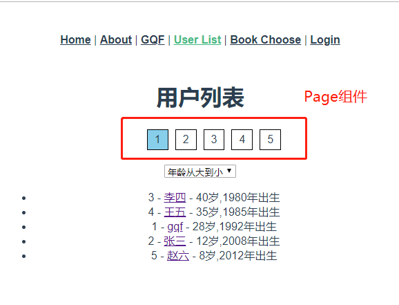

# Vue-06

> 知识大纲

* 路由组件传参
    * 我们通常把路由直接映射绑定的组件称为路由组件，也只有路由才能直接调用路由有关对象：$router，$route
    * 当我们一个组件即希望作为路由使用，又可能作为功能组件(某个页面中的一部分)去使用，这个时候路由组件传参的方式来做到这点
    * 路由配置 - props属性
        * `props: true` - 会根据path中`/xxx/:id`解析
        * `props: {id: 3, a: 1}` - 固定的值的写法
        * 不写死的方式
            ```js
            {
                ...,
                props(r){
                    //r $route
                    return {
                        id: r.params.id,
                        a: 1,
                    }
                }
            }
            ```

* 路由数据获取
    * 有的时候，进入某个路由以后，我们需要从服务端获取数据，比如`/item/:itemId`，通常，我们有2种方式实现
        * 导航完成之后获取
            * 先完成导航，然后在接下来的组件生命周期钩子中获取数据，在数据获取期间显示加载中之类的loading提示
        * 导航完成之前获取
            * 导航完成之前，在路由进入的守卫中获取数据，在获取数据成功后执行导航
    * 这2种方式都没有任何问题，自行选择  
    * 扩展 - nprogress
        * 安装`yarn add nprogress -S` 或者 `npm i nprogress -S`
        * [nprogress演示地址](http://ricostacruz.com/nprogress/)
        * 因为路由跳转都要用到，我们可以在路由index.js里，全局beforeEach里使用
        * 需要先引入nprogress以及它的css文件
            ```js
            import NProgress from 'nprogress'
            import 'nprogress/nprogress.css'            
            ```
        * 最后在beforeEach的时候调用`NProgress.start()`，在afterEach的时候调用`NProgress.done()`  

* 路由动效 
    * 利用transition组件，我们可以给路由导航加上动效   
        ```vue
        <template>
            ...
            <transition name="fade">
                <router-view />
            </transition>
            ...
        </template>
        <style scoped>
            .fade-enter-active{
                transition: opacity .5s;
            }
            .fade-leave-active{
                transition: none;
            }
            .fade-enter, .fade-leave-to{
                opacity: 0;
            }
        </style>
        ``` 

* 滚动行为 
    * 前端路由并没有重载整个浏览器，只是通过DOM进行了局部更新。所以有的时候，浏览器的状态会被保持，比如滚动条，当我们在一个页面滚动滚动条，然后跳转到另外个页面，滚动条会保持在上一个页面中，我们其实更希望滚动条能回到页面顶部，就像重载了整个页面一样
        ```js
        const router = new Router({
            ...,
            scrollBehavior: () => {
                return {y: 0}
            }
            ...
        })
        ```  
    * 后退/前进行为，会提供一个savedPosition参数，通过该参数返回历史记录中的滚动值
        ```js
        scrollBehavior(to, from, savedPosition){
            if(savedPosition){
                return savedPosition
            }else{
                return {x: 0, y: 0}
            }
        }
        ```    

* 路由元信息
    * 定义路由的时候配置meta字段
    * 通过meta定义要验证的路由
    * meta如何配置 - requiresAuth任意起的名字，可以在滚动行为参数中拿到
        ```
        meta: {requiresAuth: true}
        ``` 
    * meta还可以配置是否导航，导航中文名等等

* 路由懒加载
    * 当打包构建应用时，js包会变得非常大，影响页面加载。如果我们能把不同路由对应的组件分割成不同的代码块，然后当路由被访问的时候才加载对应的组件，这样就更加高效了

> 练习

* 分页 - 上次做了个用户列表，这次我们接着完善功能，做个分页
    * 分页应该是个功能组件，所以我们在component新建个组件Page，先简单随意的布局下
        ```vue
        <template>
            <ul>
                <li class="current">1</li>
                <li>2</li>
                <li>3</li>
                <li>4</li>
                <li>5</li>
            </ul>
        </template>

        <style scoped>
            ul,li{
                list-style: none;
            }
            li{
                display: inline-block;
                border: 1px solid #000;
                margin: 5px;
                padding: 5px 10px;
                cursor: pointer;
            }
            li.current{
                background-color: skyblue;
                cursor: default;
            }
        </style>        
        ```
    * 然后在User组件中import，并且放在components属性，然后在页面中使用page标签
        ```vue
        <template>
            <div>
                <h1>用户列表</h1>
                <page></page>
                <select @change="changeSort" v-model="sort">
                    <option value="desc">年龄从大到小</option>
                    <option value="asc">年龄从小到大</option>
                </select>
                <ul>
                    <li v-for="user in users" :key="user.id">
                        {{user.id}} - <router-link :to="'/detail/'+user.id">{{user.name}}</router-link> - {{user.age | showAge}}
                    </li>
                </ul>
            </div>
        </template>

        <script>

        import api from '@/api/index.js'

        import filter from '@/filter/index.js'

        import Page from '@/components/Page'

        export default {
            data(){
                return {
                    users: [],
                    sort: "desc",
                }
            },
            components: {
                Page
            },
            methods: {
                changeSort(){
                    this.$router.push({
                        name: "user",
                        query: {
                            sort: this.sort
                        }
                    })
                },
                async getUsers(){
                    this.sort = this.$route.query.sort || "desc";
                    let res = await api.getUsers(this.sort);
                    this.users = res.data;
                }
            },
            // async created(){
            //     this.getUsers();
            // },
            beforeRouteEnter(to, from, next){
                next(vm => {
                    vm.getUsers();
                })
            },
            beforeRouteUpdate(to, from, next){
                //注意不能再next之前调用this.getUsers
                next();
                this.getUsers();
            },
            filters: {
                showAge: filter.showAge,
            },
        /*     watch: {
                async $route(){
                    this.getUsers();
                }
            } */
        }
        </script>        
        ```
    * 此时页面的效果是这样的

         

    * 接着我们应该封装优化下，比如在User组件中，应该传给Page组件一共多少页，当前在第几页   
        ```js
        data(){
            return {
                users: [],
                sort: "desc",
                page: 2, //当前第几页
                pages: 10, //一共几页
            }
        },        
        ```
    * 所以page标签应该是这样写的`<page :page="page" :pages="pages"></page>`        
    * 回到page组件，props接受，然后循环判断
        ```vue
        <template>
            <ul>
                <li v-for="item in pages" :key="item" :class="item === page ? 'current': ''">
                    {{item}}
                </li>
            </ul>
        </template>

        <script>
        export default {
            props: {
                page: {
                    type: Number,
                    default: 1,
                },
                pages: {
                    type: Number,
                    required: true,
                }
            }
        }
        </script>

        <style scoped>
            ul,li{
                list-style: none;
            }
            li{
                display: inline-block;
                border: 1px solid #000;
                margin: 5px;
                padding: 5px 10px;
                cursor: pointer;
            }
            li.current{
                background-color: skyblue;
                cursor: default;
            }
        </style>        
        ```
    * 此时页面的呈现结果是

             

    * 接着我们个Page组件添加点击事件
        ```js
        changePage(page){
            // console.log(page)
            this.$router.push({
                name: "user",
                query: {
                    page
                }
            })
        }        
        ``` 
    * User组件这边也要做下相应的处理，比如
        ```js
        methods: {
            changeSort(){
                this.$router.push({
                    name: "user",
                    query: {
                        sort: this.sort,
                        page: this.page,
                    }
                })
            },
            async getUsers(){
                this.sort = this.$route.query.sort || "desc";
                this.page = this.$route.query.page || 1;
                let res = await api.getUsers(this.sort);
                this.users = res.data;
            }
        },        
        ```  
    * 然后就能感受点哪，哪亮的快感，并且url也会随之变化

          

* 弹出框 - 点击名字会跳转详情，现在在名字边上做个按钮，希望点击按钮能看到个详情的弹出框   
    * 先简单布局下，将弹出层展示在按钮的右侧
        ```vue
        <template>
            <div>
                <h1>用户列表</h1>
                <page :page="page" :pages="pages"></page>
                <select @change="changeSort" v-model="sort">
                    <option value="desc">年龄从大到小</option>
                    <option value="asc">年龄从小到大</option>
                </select>
                <ul>
                    <li v-for="user in users" :key="user.id" style="margin: 20px 0">
                        {{user.id}} - <router-link :to="'/detail/'+user.id">{{user.name}}</router-link> - {{user.age | showAge}}
                        <button @click="showTip">click</button>
                    </li>
                </ul>
                <div class="tip" :style="{top: tip.t ,left: tip.l}" v-show="tip.isShow" @click="tip.isShow = false">
                    test
                </div>
            </div>
        </template>

        <script>

        import api from '@/api/index.js'

        import filter from '@/filter/index.js'

        import Page from '@/components/Page'

        export default {
            data(){
                return {
                    users: [],
                    sort: "desc",
                    page: 2, //当前第几页
                    pages: 10, //一共几页
                    tip: {
                        l: 0 + 'px',
                        t: 0 + 'px',
                        isShow: false
                    }
                }
            },
            components: {
                Page
            },
            methods: {
                changeSort(){
                    this.$router.push({
                        name: "user",
                        query: {
                            sort: this.sort,
                            page: this.page,
                        }
                    })
                },
                async getUsers(){
                    this.sort = this.$route.query.sort || "desc";
                    this.page = this.$route.query.page || 1;
                    let res = await api.getUsers(this.sort);
                    this.users = res.data;
                },
                showTip(e){
                    this.tip.isShow = true;
                    console.log(e.target.getBoundingClientRect())
                    let {x, y} = e.target.getBoundingClientRect();
                    this.tip.l = x + e.target.offsetWidth + "px";
                    this.tip.t = y + "px";
                }
            },
            // async created(){
            //     this.getUsers();
            // },
            beforeRouteEnter(to, from, next){
                next(vm => {
                    vm.getUsers();
                })
            },
            beforeRouteUpdate(to, from, next){
                //注意不能再next之前调用this.getUsers
                next();
                this.getUsers();
            },
            filters: {
                showAge: filter.showAge,
            },
        /*     watch: {
                async $route(){
                    this.getUsers();
                }
            } */
        }
        </script>
        <style scoped>
        .tip{
            position: fixed;
            border: 1px solid black;
            padding: 10px;
        }
        </style>        
        ```           

    * 此时的效果应该就是点击按钮后，在右侧出现个div，点击div，弹出层消失

        

    * 其实我们弹出层是想展示我们的Detail视图组件的，但Detail需要一个id，所以我们这边可以接着这样来处理，给tip传id就可以了
    * 所以在一开始循环遍历按钮的时候我们可以传入id
        ```
        <ul>
            <li v-for="user in users" :key="user.id" style="margin: 20px 0">
                {{user.id}} - <router-link :to="'/detail/'+user.id">{{user.name}}</router-link> - {{user.age | showAge}}
                <button @click="showTip(user.id, $event)" :disabled="tip.isShow">click</button>
            </li>
        </ul>
        ```  
    * 那么showTip方法就需要改造下，给tip加上id
        ```js
        showTip(id, e){
            this.tip.isShow = true;
            // console.log(e.target.getBoundingClientRect())
            let {x, y} = e.target.getBoundingClientRect();
            this.tip.l = x + e.target.offsetWidth + "px";
            this.tip.t = y + "px";
            this.tip.id = id;
        }        
        ``` 
    * 接着引入我们的Detail视图组件，可以把tip.id传入
        ```
        <div class="tip" :style="{top: tip.t ,left: tip.l}" v-show="tip.isShow" @click="tip.isShow = false">
            <Detail :id="tip.id" v-if="tip.isShow"></Detail>
        </div>        
        ``` 
    * 最后在回到我们的Detail视图组件，接收传入的id，并且在渲染的时候加上id的判断 
        ```vue
        <template>
            <div>
                <h1>详情</h1>
                <template v-if="user">
                    <p>id - {{user.id}}</p>
                    <p>name - {{user.name}}</p>
                    <p>age - {{user.age | showAge}}</p>
                </template>
                <template v-else>
                    
                </template>
            </div>
        </template>

        <script>

        import api from '@/api/index'
        import filter from '@/filter/index'

        export default {
            props: ["id"],
            data(){
                return {
                    user: null
                }
            },
            filters: {
                showAge: filter.showAge
            },
            async created(){
                // console.log(this.$route)
                console.log(this.id);
                let id = this.$route.params.id || this.id;
                let res = await api.getUserById(id);
                // console.log(res.data);
                this.user = res.data;
            }
        }
        </script>        
        ```  
    * 此时页面的效果就出来了

         

    * 其实这里可以使用最优解 - 路由组件传参，我们在路由的地方添加个属性
        ```js
        {
            path: '/detail/:id',
            name: 'detail',
            component: Detail,
            props: true, //把params中的数据合并到props
        },       
        ``` 
    * 然后detail中的生命周期created函数就可以写成这样
        ```js
        async created(){
            let id = this.id;
            let res = await api.getUserById(id);
            this.user = res.data;
        }        
        ```   

* 路由数据获取
    * 导航完成之后获取      
        * 其实我们的详情页路由组件就是在导航完成之后获取
        * 这边不做详细的演示就大概说下
            * 可以设置个error的变量，当出现错误(404或者其他什么的)，展示没有数据
            * 使用`try...catch`，在catch的时候设置this.error=true    
            * 这样可以在v-if中根据error渲染                
    * 导航完成之前获取   
        * 使用生命周期函数，beforeRouteEnter
        * 如果不调用next都进不了详情页
        * 然后我们就可以把created的生命周期里做的事情，放在beforeRouteEnter
        * 注意有些细节要处理，比如`let id = this.id;`，`this.user = res.data;` 
            ```js
            async beforeRouteEnter(to, from, next){
                let id = to.params.id;
                let res = await api.getUserById(id);
                next(vm => {
                    vm.user = res.data;   
                });
            }
            ``` 

* 路由动效
    * 根据知识大纲，我们取App.vue加上transition组件和样式就可以了 
    * CV后我们的效果轻松实现了~  

* 滚动行为  
    * 我们新建3个视图组件，并将我们的导航栏定位在顶部 
    * 3个视图组件分别生成100个li
    * 比如我们把其中一个Ggg滚动条滚动到底部，然后切换Qqq和Fff视图，会发现滚动条依然在底部
    * 显示是不合理的所以我们要在路由配置中配置滚动行为,切换新视图回到页面顶部
    * 还有后退的行为，比如我们看Ggg切换到Qqq，然后在后退回Ggg，显然好的用户体验应该返回到Ggg上次滚动到的位置，所以这边还需要配置后退前进的行为
    * 最终配置代码为
        ```js
        const router = new VueRouter({
        mode: 'history',
        base: process.env.BASE_URL,
        routes,
        scrollBehavior(to, from, savedPosition){
            if(savedPosition){
                return savedPosition
            }else{
                return {x: 0, y: 0}
            }
        }
        })        
        ```    

* 路由元信息
    * 前面说的滚动行为，如果有些特定的不想记录历史，我们可以通过参数to，from去处理
    * 但如果有很多需要这种处理，显然也不方便，所以可以配置路由元信息
    * 即配置了路由元信息，且有历史记录，才会让滚动条记录历史位置
    * 滚动条历史记录，具体操作
        * 先在路由的地方配置meta属性 
            ```js
            {
                path: '/fff',
                name: 'fff',
                component: Fff,
                meta: {requiresAuth: true}
            },            
            ```
        * 然后在控制滚动条的行为加上判断
            ```js
            scrollBehavior(to, from, savedPosition){
                console.log(to.meta)
                if(to.meta.requiresAuth && savedPosition){
                    return savedPosition
                }else{
                    return {x: 0, y: 0}
                }
            }            
            ``` 
    * 我们也可以配置元信息，是否是导航
        ```js
        {
            path: '/fff',
            name: 'fff',
            component: Fff,
            meta: {requiresAuth: true, isNav: true}
        },        
        ``` 
    * 接下来简单做个演示，我们去App.vue
        * 生命周期created函数处理
            ```js
            created(){
                console.log(this.$router.options.routes)
            }            
            ``` 
        * 看下打印结果，根据isNav动态去生成导航

              

    * 导航中文显示其实也可以根据元信息来做，比如设置个navName  

* 路由懒加载
    * 我们先来yarn build下我们的项目，这个时候会看到dist目录  
    * 接着我们能看到js文件夹下的app.js，实际上webpack把我们的组件全部打包在一个js里了
    * 试想，如果组件数量很多，那这个app.js会相当庞大，可能会影响到我们首页的加载速度
    * 所以这个时候可以使用我们的路由懒加载(按需加载)  
    * 具体做法就是之前配置路由的时候这么写
        ```js
        {
            path: "/",
            name: "home",
            component: () => import('./views/Home.vue')
        }
        ``` 
    * 如果多个路由比如还有子路由，想打包成一个文件可以使用注释的方式`() => import(/* webpackChunkName: "user" */'./views/User.vue')`                 


> 知道你还不过瘾继续吧     

* [返回目录](../../README.md) 