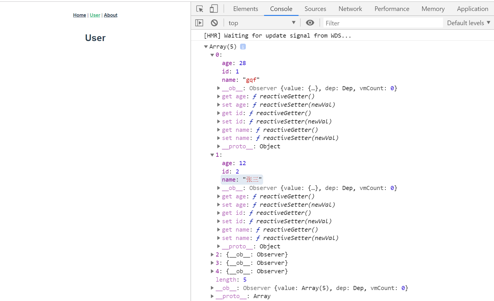
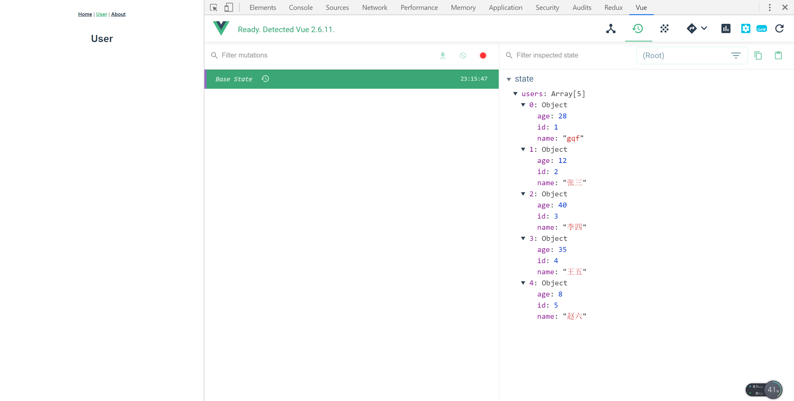
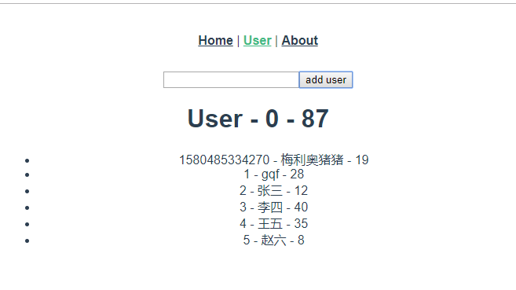
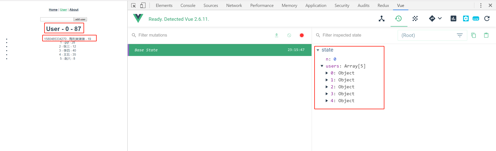
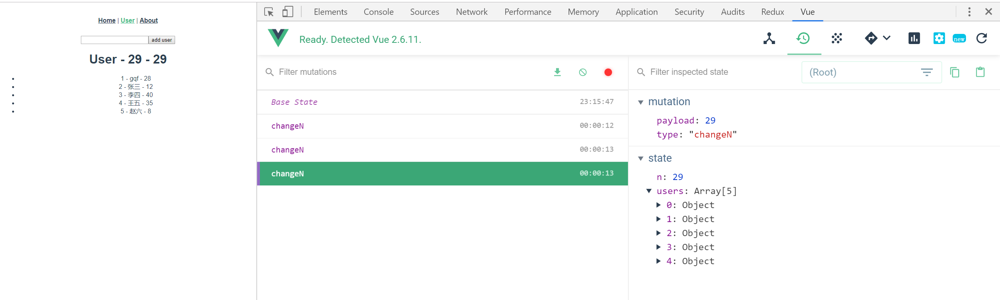
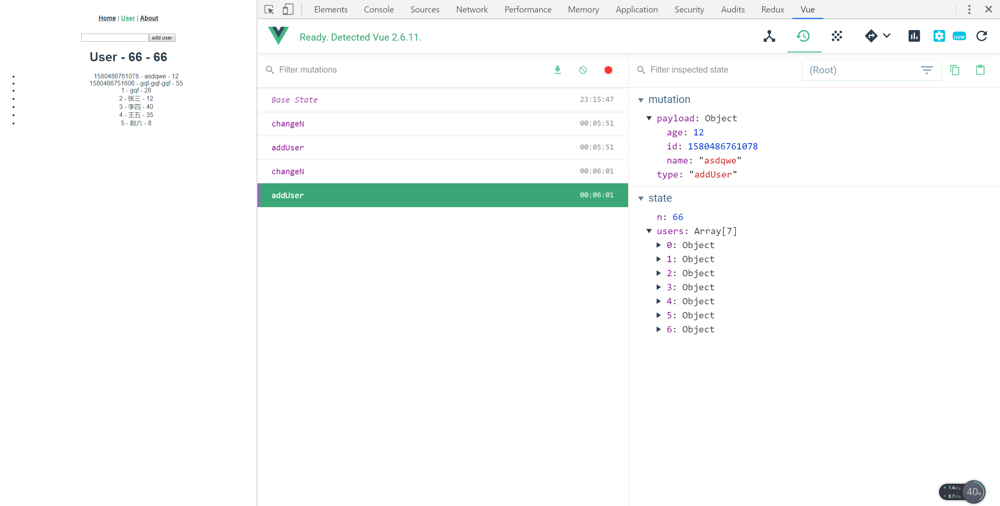
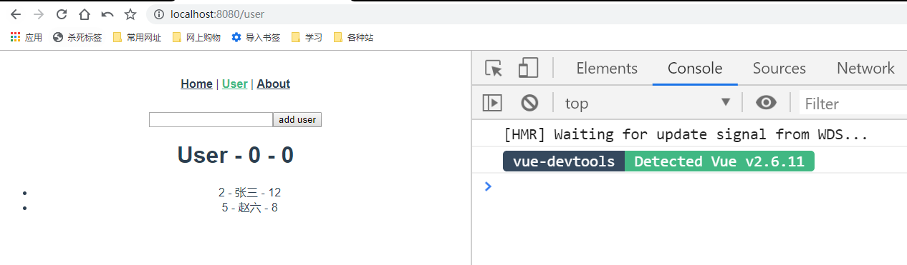
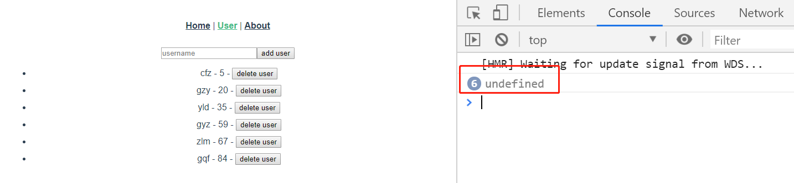
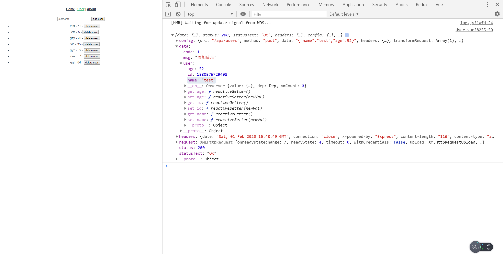

# Vue-07

> 准备工作

* 这次用脚手架新建项目，记得要选中router和vuex

> 知识大纲

* 为什么要使用vuex
    * 多个组件共享状态
        * 多层级父子组件状态传递会特别繁琐
        * 非嵌套父子组件状态传递也会特别繁琐

* vuex
    * Vuex是一个专门为Vue.js应用程序开发的状态管理模式，类似redux
    * 这种状态管理模式包含
        * State - 状态数据源
        * View - 使用状态数据源的视图
        * Actions - 修改更新数据源的操作
    * 这种模式遵循的是单向数据流的模式

* vuex的工作流
    * State - 存储应用状态的数据(React中的State)
    * Vue Component - 消费State
    * Actions - 提交修改State的动作(包括异步行为)(React中的action)
    * Mutations - 唯一更改State的位置(React中的Reducer) 

* 使用辅助函数`mapState`
    * 当一个组件需要获取多个状态的时候，将这些状态都声明为计算属性会有一些重复和冗余。为了解决这个问题，我们可以使用`mapState`辅助函数帮我们生成计算属性，通常我们把`store`的`state`通过`mapState`函数映射到组件的`computed`上
    * 具体代码如下 
        ```js
        import {mapState} from 'vuex'
        export default {
            name: 'home',
            computed: mapState([
                "title",
                "content",
            ])
        }
        ```
    * 还可以起别名
        ```js
        computed: mapState({
            "content": content, 
            "subTitle": title, //key值代表起的别名
        })
        ``` 
    * 也可以使用函数的方式 
        ```js
        computed: mapState({
            "content": content, 
            subTitle(state){
                return state.title + " 特殊处理下";
            }
        })
        ``` 
    * 组件中本身有计算属性，且我们也需要用到mapState，使用解构就可以了~
        ```js
        computed: {
            test(){
                return "test";
            },
            ...mapState(["title", "content"])
        }
        ```  

* getters
    * 有时候我们需要从store中的state中派生出一些状态，类似组件的data与computed，store也提供一个getters对象来处理派生数据
    * getters函数
        * 与组件属性一样，我们是通过定义一个函数的形式来返回派生数据的，getters函数接受两个参数
        * 第一个参数 - state对象
        * 第二个参数 - getters对象
    * 通过属性访问
        * 同样的，与组件计算属性一样，默认是通过属性的方式去访问getters中的数据，这种方式与组件的计算属性一样，也是会缓存结果的
    * 通过方法访问
        * 我们还可以通过闭包函数的形式返回一个函数，来实现给getters函数传参，需要注意的是这种方式不支持结果缓存
    * 使用辅助函数`mapGetters`
        * 与`mapState`函数类似，通常映射到组件的computed上

* 前后端交互 - 在练习中直接演示了

* 还有些辅助函数，模块等请看[vuex官网](https://vuex.vuejs.org/)

> 练习

* 了解项目结构
    * 建立好项目后我们能看到store下的index.js
        ```js
        import Vue from 'vue'
        import Vuex from 'vuex'

        Vue.use(Vuex)

        export default new Vuex.Store({
            state: {
            },
            mutations: {
            },
            actions: {
            },
            modules: {
            }
        }) 
        ```
    * 在来看下main.js 
        ```js
        import Vue from 'vue'
        import App from './App.vue'
        import router from './router'
        import store from './store'

        Vue.config.productionTip = false

        new Vue({
            router,
            store,
            render: h => h(App)
        }).$mount('#app')
        ```   
* 初玩state  
    * 先在store下的index.js，随意写一些默认数据  
        ```js
        import Vue from 'vue'
        import Vuex from 'vuex'

        Vue.use(Vuex)

        export default new Vuex.Store({
        state: {
            users: [
            {
                "id": 1,
                "name": "gqf",
                "age": 28
            },
            {
                "id": 2,
                "name": "张三",
                "age": 12
            },
            {
                "id": 3,
                "name": "李四",
                "age": 40
            },
            {
                "id": 4,
                "name": "王五",
                "age": 35
            },
            {
                "id": 5,
                "name": "赵六",
                "age": 8
            }
            ] 
        },
        mutations: {
        },
        actions: {
        },
        modules: {
        }
        })
        ```    
    * 新建视图组件User
        ```vue
        <template>
        <div>
            <h1>User</h1>
        </div>
        </template>

        <script>
        export default {
            created(){
                console.log(this.$store.state.users)
            }
        }
        </script>

        <style>

        </style>        
        ```    
    * 添加路由添加超链接这里就不多说了
    * 然后看下页面打印的结果，以及我们调试工具

        

         

    * 那接着我们先把数据渲染出来吧    
        ```vue
        <template>
        <div>
            <h1>User</h1>
            <ul>
                <li v-for="user in users" :key="user.id">
                    {{user.id}} - {{user.name}} - {{user.age}}
                </li>
            </ul>
        </div>
        </template>

        <script>
        export default {
            data(){
                return {
                    users: []
                }
            },
            created(){
                // console.log(this.$store.state.users)
                this.users = this.$store.state.users
            }
        }
        </script>

        <style>

        </style>        
        ```    

* 修改store的数据  
    * 为了方便演示，我们仓库中在加一个数据
        ```js
        state: {
            n: 0,
            users: [
            {
                "id": 1,
                "name": "gqf",
                "age": 28
            },
            {
                "id": 2,
                "name": "张三",
                "age": 12
            },
            {
                "id": 3,
                "name": "李四",
                "age": 40
            },
            {
                "id": 4,
                "name": "王五",
                "age": 35
            },
            {
                "id": 5,
                "name": "赵六",
                "age": 8
            }
            ] 
        },        
        ```
    * 然后在User组件里这么渲染
        ```vue
        <template>
        <div>
            <h1>User - {{n}} - {{$store.state.n}}</h1>
            <ul>
                <li v-for="user in users" :key="user.id">
                    {{user.id}} - {{user.name}} - {{user.age}}
                </li>
            </ul>
        </div>
        </template>

        <script>
        export default {
            data(){
                return {
                    users: [],
                    n: 0,
                }
            },
            created(){
                // console.log(this.$store.state.users)
                this.users = this.$store.state.users
                this.n = this.$store.state.n;
            }
        }
        </script>

        <style>

        </style>        
        ```   
    * 先来个错误演示，直接修改store中的数据
        ```vue
        <template>
        <div>
            <input type="text" ref="nameInput"><button @click="addUser">add user</button>
            <h1>User - {{n}} - {{$store.state.n}}</h1>
            <ul>
                <li v-for="user in users" :key="user.id">
                    {{user.id}} - {{user.name}} - {{user.age}}
                </li>
            </ul>
        </div>
        </template>

        <script>
        export default {
            data(){
                return {
                    users: [],
                    n: 0,
                }
            },
            created(){
                // console.log(this.$store.state.users)
                this.users = this.$store.state.users
                this.n = this.$store.state.n;
            },
            methods: {
                addUser(){
                    this.$store.state.n = Math.random() * 100 | 0;
                    let name = this.$refs.nameInput.value;
                    this.$store.state.users.unshift({
                        id: Date.now(),
                        name,
                        age: Math.random() * 100 | 0
                    })
                    this.$refs.nameInput.value = "";
                }
            }
        }
        </script>

        <style>

        </style>        
        ``` 
    * 操作一把看下结果

          

         

    * 注意，数组这边渲染出来了是因为引用传递 
    * 接着正规操作~
    * 先要在仓库里面mutations里添加方法
        ```js
        mutations: {
            changeN(state, payload){
                //第一个参数默认就是state，第二个参数作为需要修改的值
                state.n = payload;
            }
        },        
        ```
    * 接着User.vue里的数据渲染，其实用computed更好，所以把data和created删除
        ```js
        computed: {
            users(){
                return this.$store.state.users;
            },
            n(){
                return this.$store.state.n;
            }
        },        
        ```
    * 然后在添加方法中可以这么调用`this.$store.commit("changeN", Math.random() * 100 | 0)`   
    * 接着我们就可以在页面上操作一下，比如多点几次add，在看下调试工具   

            

    * 所以添加用户，我们也是在mutations新增一个方法
        ```js
        addUser(state, payload){
            state.users = [payload, ...state.users];
        }        
        ```
    * 最后在添加方法中这么写就可以了
        ```js
        methods: {
            addUser(){
                this.$store.commit("changeN", Math.random() * 100 | 0);
                let name = this.$refs.nameInput.value;
                this.$store.commit("addUser", {
                    id: Date.now(),
                    name,
                    age: Math.random() * 100 | 0
                })
                this.$refs.nameInput.value = "";
            }
        }        
        ```  
    * 调试工具呈现的结果是 

            

* 使用辅助函数`mapState` 
    * 直接上代码
        ```js
        // computed: {
        //     users(){
        //         return this.$store.state.users;
        //     },
        //     n(){
        //         return this.$store.state.n;
        //     }
        // },
        computed: mapState(["users", "n"]),        
        ``` 
    * 注释掉的computed和下面的computed效果是一样的，这就是辅助函数的力量~   
    * 实质上mapState最终就是会生成上述我们注释的代码   

* getters     
    * 实际上也是派生数据，比如我们过滤下20岁以下的年轻人，在store下的index里追加getters属性
        ```js
        getters: {
            young(state){
                return state.users.filter(user => user.age <= 20);
            }
        },        
        ```
    * 同时也去修改下User.vue
        ```js
        computed: {
            ...mapState(["n"]),
            young(){
                return this.$store.getters.young;
            }
        },        
        ``` 
    * 这样页面上展现的数据就是小于等于20岁的年轻人  

          

    * 有时候我们想要更灵活的控制过滤条件，像前面写死20岁不太好，于是可以这么改写 
        ```js
        getters: {
            young(state){
            return function(age = 20){
                return state.users.filter(user => user.age <= age);
            }
            }
        },        
        ```
        ```js
        computed: {
            ...mapState(["n"]),
            young(){
                return this.$store.getters.young(30);
            }
        },        
        ``` 
    * 上述代码意思就是小于等于30岁的过滤出来

* 简单搭建后端增删功能
    ```js
    const router = require('koa-router')()
    const fs = require("fs");
    const path = require("path");

    const dbPath = path.join(__dirname, "../data/user.json");

    router.prefix('/users')

    router.get('/', function (ctx, next) {
    // ctx.body = 'this is a users response!'
        let users = JSON.parse(fs.readFileSync(dbPath));
        let sort = ctx.query.sort;
        if(sort){
            if(sort === "asc"){
                ctx.body = users.slice(0).sort((a, b) => a.age - b.age)
            }else{
                ctx.body = users.slice(0).sort((a, b) => b.age - a.age)
            }
        }else{
            ctx.body = users;
        }
    })

    router.get('/bar', function (ctx, next) {
        ctx.body = 'this is a users/bar response'
    })

    router.get('/:id', (ctx, next) => {
        let id = ctx.params.id;
        let users = JSON.parse(fs.readFileSync(dbPath));
        let user = users.find(item => item.id == id);
        ctx.body = user;
    })

    router.post("/", function(ctx, next){
        let user = ctx.request.body;
        if(!user.name){
            ctx.body = {
                code: 0,
                msg: "用户名不能为空"
            }
            return;
        }else{
            let users = JSON.parse(fs.readFileSync(dbPath));
            user.id = Date.now();
            users.unshift(user)
            let result = JSON.stringify(users);
            fs.writeFileSync(dbPath, result)
            ctx.body = {
                code: 1,
                msg: "添加成功",
                user,
            }
        }
    })

    router.delete("/:id", function(ctx, next){
        let id = ctx.params.id;
        let users = JSON.parse(fs.readFileSync(dbPath));
        users = users.filter(user => user.id != id);
        let result = JSON.stringify(users);
        fs.writeFileSync(dbPath, result)
        ctx.body = {
            code: 1,
            msg: "删除成功"
        }
    })

    module.exports = router

    ```  

* 异步操作需要用到action
    * ui => dispatch => actions => commit => mutations => state
    * 先来看下mutation，如果return结果，能否拿到  
        * 在mutation中这么处理addUser
            ```js
            async addUser(state, payload){
                let res = await api.addUser(payload);
                // console.log(res.data.user);
                if(res.data.code == 1){
                    state.users.unshift(res.data.user)
                }
                return res;     
            },            
            ``` 
        * 然后在ui这边试图拿下res  
            ```js
            async addUser(){
                this.$store.commit("changeN", Math.random() * 100 | 0);
                let name = this.$refs.nameInput.value;
                if(!name){
                    alert("名字不能为空")
                    return;
                }
                // this.$store.commit("addUser", {
                //     id: Date.now(),
                //     name,
                //     age: Math.random() * 100 | 0
                // })
                let res = await this.$store.commit("addUser", {
                    name,
                    age: Math.random() * 100 | 0
                })
                console.log(res); //试图拿res
                this.$refs.nameInput.value = "";
            },            
            ```
        * 然后我把页面数据删光，重新添加了些数据，就看到了一堆undefined

               

    * action该如何做    
        * 首先action里添加的函数，第一个参数是store，并不是state
            ```js
            actions: {
                async addUser(store, payload){
                //首先action中第一个参数是store，和mutation第一个参数state是不同的
                let res = await api.addUser(payload);
                // console.log(res.data.user);
                if(res.data.code == 1){
                    store.commit("addUser", res.data.user);
                }
                return res;     
                },
            },            
            ``` 
        * 通过store，commit以后，就到了mutation，所以mutation的代码如下
            ```js
            async addUser(state, payload){
                state.users.unshift(payload)
            },            
            ``` 
        * 然后mutation就可以修改state，最后ui层把之前的commit改成dispatch就可以了  
            ```js
            async addUser(){
                this.$store.commit("changeN", Math.random() * 100 | 0);
                let name = this.$refs.nameInput.value;
                if(!name){
                    alert("名字不能为空")
                    return;
                }
                let res = await this.$store.dispatch("addUser", {
                    name,
                    age: Math.random() * 100 | 0
                })
                console.log(res); //试图拿res
                this.$refs.nameInput.value = "";
            },            
            ```
        * 页面打印结果就能看到了

            

        * 因为ui能拿到res结果，所以可以根据code来判断是否成功，然后在ui层提示信息                          

> 知道你还不过瘾继续吧       

* [返回目录](../../README.md) 