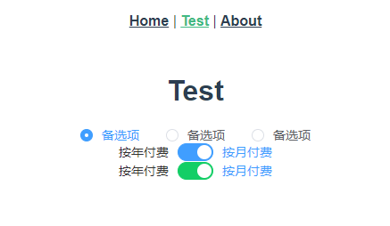

# 演示element

> 练习

* 脚手架工具`vue create app`
* 安装element`yarn add element-ui -S`
* 安装后在main.js中写入以下内容
    ```js
    import ElementUI from 'element-ui';
    import 'element-ui/lib/theme-chalk/index.css';

    Vue.use(ElementUI)    
    ```

* 新建个视图组件，取名为Test
* 复制些elementui组件，看下效果
    ```vue
    <template>
        <div>
            <h1>Test</h1>

            <el-radio-group v-model="radio">
                <el-radio :label="3">备选项</el-radio>
                <el-radio :label="6">备选项</el-radio>
                <el-radio :label="9">备选项</el-radio>
            </el-radio-group>

            <br>

            <el-switch
                v-model="value1"
                active-text="按月付费"
                inactive-text="按年付费">
            </el-switch>
            
            <el-switch
                style="display: block"
                v-model="value2"
                active-color="#13ce66"
                inactive-color="#ff4949"
                active-text="按月付费"
                inactive-text="按年付费">
            </el-switch>
        </div>
    </template>

    <script>
    export default {
        data () {
        return {
            radio: 3,
            value1: true,
            value2: true
        };
        }
    }
    </script>

    <style>

    </style>    
    ```
* 看下实际的效果

        