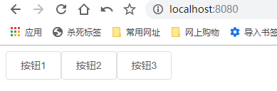

# 项目构建-button组件-基本架子

> 知识大纲

* 前置知识
    * 组件通讯
    * 组件插槽
    * props校验

* 参数支持
    * type - 按钮类型(primary, success, warning, danger, info)
        * 参数类型 - string
        * 默认值 - default
    * plain - 是否是朴素按钮
        * 参数类型 - boolean
        * 默认值 - false
    * round - 是否是圆角按钮
        * 参数类型 - boolean
        * 默认值 - false
    * circle - 是否是圆型按钮
        * 参数类型 - boolean
        * 默认值 - false
    * disabled - 是否禁用按钮
        * 参数类型 - boolean
        * 默认值 - false
    * icon - 图标类名   
        * 参数类型 - string
        * 默认值 - 无 

* 事件支持 - 点击事件   

> css样式
* button样式
    ```scss
    .gqf-button {
        display: inline-block;
        line-height: 1;
        white-space: nowrap;
        cursor: pointer;
        background: #fff;
        border: 1px solid #dcdfe6;
        color: #606266;
        -webkit-appearance: none;
        text-align: center;
        box-sizing: border-box;
        outline: none;
        margin: 0;
        transition: 0.1s;
        font-weight: 500;
        -moz-user-select: none;
        -webkit-user-select: none;
        -ms-user-select: none;
        padding: 12px 20px;
        font-size: 14px;
        border-radius: 4px;
        &:hover,
        &:focus {
            color: #409cff;
            border-color: #c6e2ff;
            background-color: #ecf5ff;
        }
    }        
    ```    

> 练习

* 项目构建
    * 先用脚手架搭建项目`vue create gqf-ui`
        * 选择手动，多加个Css Pre-processors
        * 选择dart-sass，因为自定义图标用的是sass文件，且element-ui源码用的也是sass
        * 选择ESLint + Standard config - 标准配置
        * 选择Lint on save - 保存的时候校验
        * 选择package.json
        * 最后问我们是否记录这个配置，我们选择否
    * 进入src，清理下App.vue(代码如下)，把assets中的图片删了，把components中的HelloWorld.vue删了
        ```vue
        <template>
        <div id="app">
            gqf-ui
        </div>
        </template>

        <script>
        export default {

        }
        </script>

        <style lang="scss">

        </style>

        ```  
    * 然后看到页面就非常色一了~ 

        

* 本节我们先封装个最简单的组件Button
    * 在components下新建button.vue
        ```vue
        <template>
            <button class="gqf-button">按钮组件</button>
        </template>

        <script>
        export default {
            name: 'GqfButton'
        }
        </script>

        <style>

        </style>        
        ```      
    * 接着就是在main.js中注册这个组件 
        ```js
        import Vue from 'vue'
        import App from './App.vue'
        import GqfButton from '@/components/button.vue'

        Vue.config.productionTip = false

        Vue.component(GqfButton.name, GqfButton)

        new Vue({
        render: h => h(App)
        }).$mount('#app')

        ``` 
    * 然后就可以在App.vue中使用我们这个组件了 
        ```vue
        <template>
        <div id="app">
            <gqf-button></gqf-button>
            <gqf-button></gqf-button>
            <gqf-button></gqf-button>
        </div>
        </template>

        <script>
        export default {

        }
        </script>

        <style lang="scss">

        </style>

        ``` 
    * 页面呈现的效果

         

    * 接着我们在组件中使用插槽，这样我们按钮内部的内容就不是写死的了，在外面包个span是为了控制按钮的样式
        ```html
        <button class="gqf-button">
            <span><slot></slot></span>
        </button>        
        ```              
    * 接着把样式复制进去，然后就能看到效果了  

           


> 知道你还不过瘾继续吧       

* [返回目录](../../README.md)         