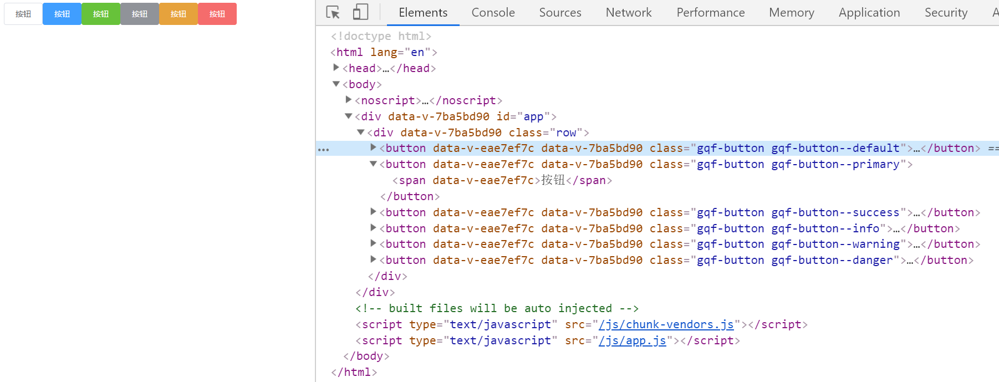

# button组件-type属性的说明

> css样式
* 各type的样式
    ```scss
    .gqf-button--primary{
        color: #fff;
        background-color: #409eff;
        border-color: #409eff;
        &:hover,
        &:focus {
            background-color: #66b1ff;
            border-color: #66b1ff;
            color: #fff;
        }
    }
    .gqf-button--success{
        color: #fff;
        background-color: #67c23a;
        border-color: #67c23a;
        &:hover,
        &:focus {
            background-color: #85ce61;
            border-color: #85ce61;
            color: #fff;
        }
    }
    .gqf-button--info{
        color: #fff;
        background-color: #909399;
        border-color: #909399;
        &:hover,
        &:focus {
            background-color: #a6a9ad;
            border-color: #a6a9ad;
            color: #fff;
        }
    }
    .gqf-button--warning{
        color: #fff;
        background-color: #e6a23c;
        border-color: #e6a23c;
        &:hover,
        &:focus {
            background-color: #ebb563;
            border-color: #ebb563;
            color: #fff;
        }
    }
    .gqf-button--danger{
        color: #fff;
        background-color: #f56c6c;
        border-color: #f56c6c;
        &:hover,
        &:focus {
            background-color: #f78989;
            border-color: #f78989;
            color: #fff;
        }
    }        
    ```

> 练习

* 支持type属性指的就是在我们使用组件的时候传入type属性，可以修改其样式，比如
    ```html
    <gqf-button>按钮</gqf-button>
    <gqf-button type="primary">按钮</gqf-button>
    <gqf-button type="success">按钮</gqf-button>
    <gqf-button type="info">按钮</gqf-button>
    <gqf-button type="warning">按钮</gqf-button>
    <gqf-button type="danger">按钮</gqf-button>    
    ```
* 其实这就是组件通讯的父传子，所以在button组件里写props
    ```js
    export default {
        name: 'GqfButton',
        props: ['type'],
        created () {
            console.log(this.type)
        }
    }    
    ```   
* 然后看下控制台就能看到打印的type，现在我们在给props加上校验  
    ```js
    props: {
        type: {
            type: String,
            default: 'default'
        }
    },    
    ```
* 然后复制下样式，接着就是如何在button元素上动态的加上这个class，我们可以用绑定数组的方式+ES6，`:class="[`gqf-button--${type}`]"`   
* 然后看下效果~

    

> 知道你还不过瘾继续吧       

* [返回目录](../../README.md) 
