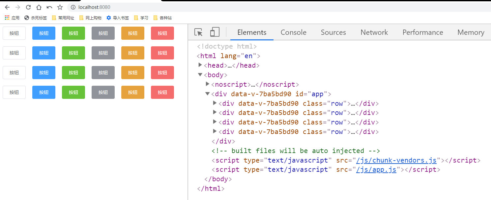
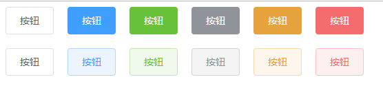
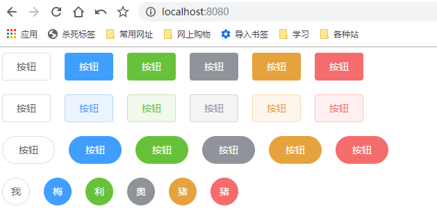

# round-circle-plain属性的支持

> css样式
* plain样式
    ```scss
    // plain样式
    .gqf-button.is-plain{
        &:hover,
        &:focus{
            background-color: #fff;
            border-color: #409eff;
            color: #409eff;
        }
    }
    .gqf-button--primary.is-plain{
        color: #409eff;
        background: #ecf5ff;
        border-color: #b3d8ff;
        &:hover,
        &:focus{
            background: #409eff;
            border-color: #409eff;
            color: #fff;
        }
    }
    .gqf-button--success.is-plain{
        color: #67c23a;
        background: #f0f9eb;
        border-color: #c2e7b0;
        &:hover,
        &:focus{
            background: #67c23a;
            border-color: #67c23a;
            color: #fff;
        }
    }
    .gqf-button--info.is-plain{
        color: #909399;
        background: #f4f4f5;
        border-color: #d3d4d6;
        &:hover,
        &:focus{
            background: #909399;
            border-color: #909399;
            color: #fff;
        }
    }
    .gqf-button--warning.is-plain{
        color: #e6a23c;
        background: #fdf6ec;
        border-color: #f5dab1;
        &:hover,
        &:focus{
            background: #e6a23c;
            border-color: #e6a23c;
            color: #fff;
        }
    }
    .gqf-button--danger.is-plain{
        color: #f56c6c;
        background: #fef0f0;
        border-color: #fbc4c4;
        &:hover,
        &:focus{
            background: #f56c6c;
            border-color: #f56c6c;
            color: #fff;
        }
    }        
    ```
* 圆角按钮
    ```scss
    // 圆角按钮
    .gqf-button.is-round{
        border-radius: 20px;
        padding: 12px 23px;
    }        
    ```

* 圆形按钮
    ```scss
    // 圆形按钮
    .gqf-button.is-circle{
        border-radius: 50%;
        padding: 12px;
    }    
    ```    

> 练习

* 为了方便看演示效果，这边我们在App.vue中也加入样式
    ```vue
    <template>
    <div id="app">
        <div class="row">
            <gqf-button>按钮</gqf-button>
            <gqf-button type="primary">按钮</gqf-button>
            <gqf-button type="success">按钮</gqf-button>
            <gqf-button type="info">按钮</gqf-button>
            <gqf-button type="warning">按钮</gqf-button>
            <gqf-button type="danger">按钮</gqf-button>
        </div>
        <div class="row">
            <gqf-button>按钮</gqf-button>
            <gqf-button type="primary">按钮</gqf-button>
            <gqf-button type="success">按钮</gqf-button>
            <gqf-button type="info">按钮</gqf-button>
            <gqf-button type="warning">按钮</gqf-button>
            <gqf-button type="danger">按钮</gqf-button>
        </div>
        <div class="row">
            <gqf-button>按钮</gqf-button>
            <gqf-button type="primary">按钮</gqf-button>
            <gqf-button type="success">按钮</gqf-button>
            <gqf-button type="info">按钮</gqf-button>
            <gqf-button type="warning">按钮</gqf-button>
            <gqf-button type="danger">按钮</gqf-button>
        </div>
        <div class="row">
            <gqf-button>按钮</gqf-button>
            <gqf-button type="primary">按钮</gqf-button>
            <gqf-button type="success">按钮</gqf-button>
            <gqf-button type="info">按钮</gqf-button>
            <gqf-button type="warning">按钮</gqf-button>
            <gqf-button type="danger">按钮</gqf-button>
        </div>
    </div>
    </template>

    <script>
    export default {

    }
    </script>

    <style lang="scss" scoped>
    .row{
        margin-bottom: 20px;
        .gqf-button {
        margin-right: 20px;
        }
    }
    </style>

    ```
* 这个时候页面的效果是这样的  

    

* 接着处理下plain属性，在props追加校验
    ```js
    plain: {
      type: Boolean,
      default: false
    }    
    ```
* 所以在元素上只要加上plain就是为true了，然后我们复制下样式
* 最后处理下class，之前用数组其实就是为了拼接这么多个class，这里使用对象是最为方便的`:class="[`gqf-button--${type}`, {'is-plain': plain}]"` 
* 看下朴素的按钮吧   

    

* 剩下的round，circle是一样的操作，最终效果就是 

    

> 知道你还不过瘾继续吧       

* [上一节-button组件-type属性的说明](../04-button组件-type属性的说明/button组件-type属性的说明.md)
* [下一节-button组件-字体图标与click事件](../06-button组件-字体图标与click事件/button组件-字体图标与click事件.md)
* [返回目录](../../README.md)     
