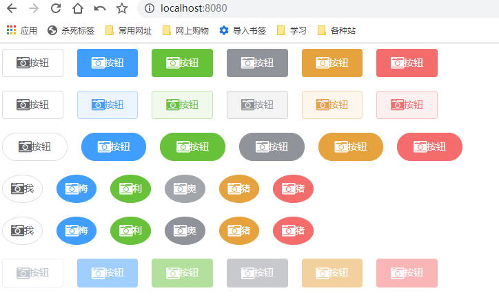
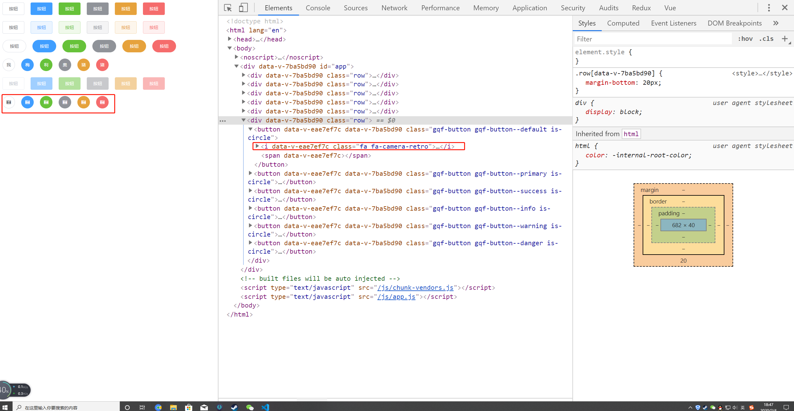
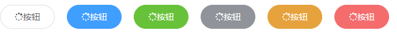
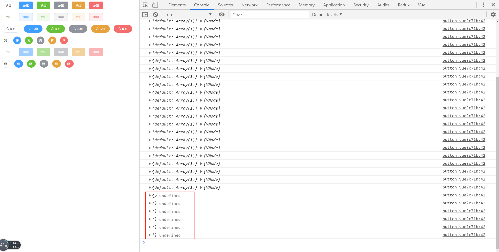

# 06-button组件-字体图标与click事件

> 准备工作

* [Font Awesome](http://fontawesome.dashgame.com/)
* 下载后放到assets
* 在main.js中引入`import '@/assets/font-awesome-4.7.0/scss/font-awesome.scss'`

> 练习

* 字体图标

    * 根据Font Awesome官网，随意复制一行代码`<i class="fa fa-camera-retro fa-lg"></i>`到我们的button组件测试下
        ```vue
        <template>
        <button :disabled="disabled" class="gqf-button" :class="[`gqf-button--${type}`, {'is-plain': plain}, {'is-round': round}, {'is-circle': circle}, {'is-disabled': disabled}]">
            <i class="fa fa-camera-retro fa-lg"></i>
            <span>
            <slot></slot>
            </span>
        </button>
        </template>    
        ```
    * 然后页面的效果是这样的   

        

    * 但实际上我们不可能用这种写死的方式，应该传入一个icon属性
        ```html
        <div class="row">
        <gqf-button circle icon="fa-camera-retro"></gqf-button>
        <gqf-button circle icon="fa-camera-retro" type="primary"></gqf-button>
        <gqf-button circle icon="fa-camera-retro" type="success"></gqf-button>
        <gqf-button circle icon="fa-camera-retro" type="info"></gqf-button>
        <gqf-button circle icon="fa-camera-retro" type="warning"></gqf-button>
        <gqf-button circle icon="fa-camera-retro" type="danger"></gqf-button>
        </div>    
        ``` 
    * 所以在props接受下这个属性  
        ```js
        icon: {
        type: String,
        default: ''
        }    
        ``` 
    * template这么写
        ```html
        <template>
        <button :disabled="disabled" class="gqf-button" :class="[`gqf-button--${type}`, {'is-plain': plain}, {'is-round': round}, {'is-circle': circle}, {'is-disabled': disabled}]">
            <i class="fa" :class="icon"></i>
            <span>
            <slot></slot>
            </span>
        </button>
        </template>    
        ```  
    * 此时就能看到页面的效果是这样的

        

    * 此时的问题就是，如果你不传icon，也会有i标签，所以可以加上个v-if 

    * 现在我们的按钮，即可以传文字，又可以传图标，我们也可以扩展下，两者都有的情况
    * 我们给任意一组有文字的按钮加入图标
        ```html
        <div class="row">
            <gqf-button round icon="fa-spinner">按钮</gqf-button>
            <gqf-button round icon="fa-spinner" type="primary">按钮</gqf-button>
            <gqf-button round icon="fa-spinner" type="success">按钮</gqf-button>
            <gqf-button round icon="fa-spinner" type="info">按钮</gqf-button>
            <gqf-button round icon="fa-spinner" type="warning">按钮</gqf-button>
            <gqf-button round icon="fa-spinner" type="danger">按钮</gqf-button>
        </div>        
        ```
    * 此时的效果是这样的，会发现有点难看，因为图标和文字贴的很紧 

        

    * 添加样式，加完以后就解决了这个问题，但我们会发现如果只传图标的按钮因为这个样式又会变得很难看，变的不居中了
        ```scss
        // 处理文字和图标都传的样式
        .gqf-button [class*='fa'] + span{
            margin-left: 5px;
        }        
        ```
    * 解决的方式很简单，因为span没传内容，但有这个标签，所以有我们marginLeft的样式，所以如果我们没有传入任何的内容，就不显示
    * 所以也是个v-if就能解决的问题，关键是条件关于插槽的该怎么写，任何组件可以通过`this.$slots`拿到所有的插槽，还有个`this.$slots.default`，我们可以一起打印下看下结果     

          

    * 所以我们v-if就这么写就可以了`v-if="$slots.default"`，这样就解决了我们前面的那个问题  

* click事件
    * 我们就给第一个按钮添加点击事件，然后在methods里写上点击的方法
    * 会发现没有任何作用，原因是我们button组件还没有把事件传递    
    * 在button组件上添加`@click="handleClick"`
    * 然后在方法中emit，相当于给父组件派发个事件
        ```js
        methods: {
            handleClick (e) {
            this.$emit('click', e)
            }
        }        
        ```     
               
> 知道你还不过瘾继续吧       

* [上一节-05-round-circle-plain属性的支持](../05-round-circle-plain属性的支持/round-circle-plain属性的支持.md)
* [下一节-07-button组件-disabled属性说明](../07-button组件-disabled属性说明/button组件-disabled属性说明.md)
* [返回目录](../../README.md) 