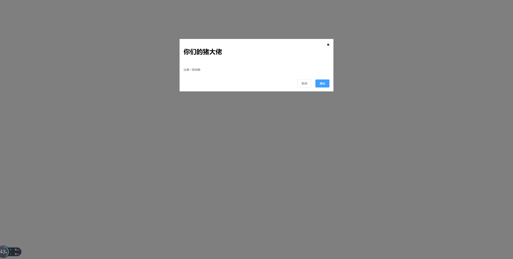

# dialog组件-组件创建标题的处理

> 知识大纲

* 前置知识
    * vue过渡动画
    * sync修饰符
    * 具名插槽与v-slot指令

* 参数支持
    * title
        * 参数描述 - 对话框标题
        * 参数类型 - string
        * 默认值 - 提示
    * width
        * 参数描述 - 宽度
        * 参数类型 - string
        * 默认值 - 50%
    * top
        * 参数描述 - 与顶部的距离
        * 参数类型 - string
        * 默认值 - 15vh
    * visible   
        * 参数描述 - 是否显示dialog(支持sync修饰符)
        * 参数类型 - boolean
        * 默认值 - false

* 事件支持
    * opened - 模态框显示的事件
    * closed - 模态框关闭的事件 

* 插槽说明
    * default - dialog的内容 
    * title - dialog的标题
    * footer - dialog的底部操作区 

> 提供的模板及样式

* 模板
    ```html
    <div class="gqf-dialog__wrapper">
        <div class="gqf-dialog">
        <div class="gqf-dialog__header">
            <span class="gqf-dialog__title">提示</span>
            <button class="gqf-dialog__headerbtn">
            <i class="fa fa-close"></i>
            </button>
        </div>
        <div class="gqf-dialog__body">
            <span>这是一段消息</span>
        </div>
        <div class="gqf-dialog__footer">
            <gqf-button>取消</gqf-button>
            <gqf-button type="primary">确定</gqf-button>
        </div>
        </div>
    </div>    
    ```
* 样式
    ```scss
    .gqf-dialog__wrapper {
        position: fixed;
        top: 0;
        right: 0;
        bottom: 0;
        left: 0;
        overflow: auto;
        margin: 0;
        z-index: 2020;
        background-color: rgba(0, 0, 0, .5);

        .gqf-dialog {
            position: relative;
            margin: 15vh auto 50px;
            background-color: #fff;
            border-radius: 2px;
            box-shadow: 0 1px 3px rgba(0, 0, 0, .3);
            box-sizing: border-box;
            width: 30%;

            &__header {
                padding: 20px 20px 10px;
                .gqf-dialog__title {
                    line-height: 24px;
                    font-size: 18px;
                    color: #303133;
                }
                .gqf-dialog__headerbtn {
                    position: absolute;
                    top: 20px;
                    right: 20px;
                    padding: 0;
                    background: transparent;
                    border: none;
                    outline: none;
                    cursor: pointer;
                    font-size: 16px;
                    .el-icon-close {
                        color: #909399;
                    }
                }
            }

            &__body {
                padding: 30px 20px;
                color: #606266;
                font-size: 14px;
                word-break: break-all;
            }

            &__footer {
                padding: 10px 20px 20px;
                text-align: right;
                box-sizing: border-box;
                .gqf-button:first-child {
                    margin-right: 20px;
                }
            }
        }
    }    
    ```

> 练习

* 和button一样，我们先来注册下dialog组件，组件里面先写个最简单的div   
    * dialog.vue
        ```vue
        <template>
        <div class="gqf-dialog">对话框</div>
        </template>

        <script>
        export default {
            name: 'GqfDialog'
        }
        </script>

        <style lang="scss" scoped>

        </style>    
        ```
    * main.js里注册下gqf-dialog组件
    * 接着就可以在App.vue里使用`<gqf-dialog></gqf-dialog>` 
* 然后处理下dialog的template结构，总体来说主要分3部分(header, body, footer) 
* 复制下样式，然后在看下我们现在的页面效果 

    

* 处理title
    * 我们先来玩下传入title属性，父组件添加属性`<gqf-dialog title="我是梅利奥猪猪"></gqf-dialog>`  
    * 子组件添加props验证
        ```js
        props: {
            title: {
            type: String,
            default: '提示'
            }
        }        
        ```
    * 然后在模板中这么改`<span class="gqf-dialog__title">{{title}}</span>` 
    * 这样最基本的传入title属性就做好了

         

    * 接着来玩具名插槽，其实就是我想用自己定义的title，比如h3标签   
    * 子组件即我们的dialog.vue中这么处理
        ```html
        <slot name="title">
          <span class="gqf-dialog__title">{{title}}</span>
        </slot>        
        ```  
    * 这样处理的方式就可以兼顾，传入插槽就用插槽，不传入就用上述span标签
    * 然后在App.vue我们传入插槽试下   
        ```vue
        <gqf-dialog>
            <template v-slot:title>
                <h1>你们的猪大佬</h1>
            </template>
        </gqf-dialog>        
        ``` 
    * 下面见证奇迹~

               

> 知道你还不过瘾继续吧       

* [返回目录](../../README.md) 