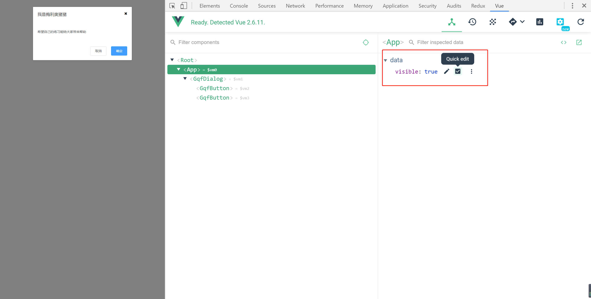

# 10-dialog组件-对话框的显示和隐藏

> 练习

* visible属性

    * 显示和隐藏其实就是给个布尔值，在App.vue中我们这边给个默认隐藏的值，即`visible: false`
    * 在`gqf-dialog`标签上传入`visible`，写上`:visible="visible"`
    * 在子组件props上传入visible值，类型为布尔，默认为false
    * 然后就可以在div标签上加上`<div class="gqf-dialog__wrapper" v-show="visible">`
    * 最后我们可以通过调试工具，直接来控制显示隐藏

        

    * 当然我们可以在App.vue里给个按钮，用来点击显示dialog，`<gqf-button @click="visible=true">按钮</gqf-button>`  
    * 点击确认和取消，隐藏dialog，这个在App.vue中就可以处理了 
        ```
        <template v-slot:footer>
            <gqf-button @click="visible = false">取消</gqf-button>
            <gqf-button type="primary" @click="visible = false">确定</gqf-button>
        </template>        
        ``` 
    * 隐藏dialog难点是在点击x按钮，以及点击dialog外面隐藏dialog
        * 给wrap和close按钮点击事件handleClose
        * wrap要加上修饰符self，指的是点击自己才能触发
        * 接着就是最重要的子传父的逻辑了
            * 不能直接在子组件里修改visible，单向数据流props，只读属性不能修改，应该让父组件去改
            * 所以要使用`this.$emit('close', false)`
            * 父组件gqf-dialog元素上要写`@close='close'`，还有要写close方法
                ```js
                close () {
                    this.visible = false
                }                
                ```
    * 这样整个dialog的显示隐藏就做好了，但处理方式上不是很好，下一节我们会说一个更好的方式sync        

> 知道你还不过瘾继续吧 

* [上一节-09-dialog组件的内容给处理-插槽的使用](../09-dialog组件的内容给处理-插槽的使用/dialog组件的内容给处理-插槽的使用.md)
* [下一节-11-dialog组件-sync修饰符的使用](../11-dialog组件-sync修饰符的使用/dialog组件-sync修饰符的使用.md)
* [返回目录](../../README.md) 