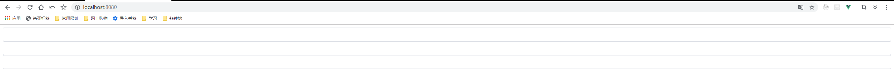

# 14-input组件-基本结构与常用的属性

> 知识大纲

* 参数支持
    * placeholder
        * 参数描述 - 占位符 
        * 参数类型 - string
        * 默认值 - 无
    * type
        * 参数描述 - 文本框类型 
        * 参数类型 - string
        * 默认值 - text
    * disabled
        * 参数描述 - 禁用
        * 参数类型 - boolean
        * 默认值 - false
    * clearable
        * 参数描述 - 是否显示清空按钮 
        * 参数类型 - boolean
        * 默认值 - false
    * show-password
        * 参数描述 - 是否显示密码切换按钮
        * 参数类型 - boolean
        * 默认值 - false
    * name
        * 参数描述 -  name属性
        * 参数类型 - string
        * 默认值 - 无

* 事件支持
    * blur - 失去焦点事件
    * change - 内容改变事件
    * focus - 获取的焦点事件

* 基本结构
    * html结构
        ```html
        <div class="gqf-input">
            <input type="text" class="gqf-input__inner" />
        </div>        
        ```

    * 样式   
        ```scss
        .gqf-input {
            width: 100%;
            position: relative;
            font-size: 14px;
            display: inline-block;
            .gqf-input__inner {
                -webkit-appearance: none;
                background-color: #fff;
                background-image: none;
                border-radius: 4px;
                border: 1px solid #dcdfe6;
                box-sizing: border-box;
                color: #606266;
                display: inline-block;
                font-size: inherit;
                height: 40px;
                line-height: 40px;
                outline: none;
                padding: 0 15px;
                transition: border-color .2s cubic-bezier(.645, .045, .344, 1);
                width: 100%;
            }
            &:focus {
                outline: none;
                border-color: #409eff;
            }
        }        
        ``` 

    * 禁用样式 
        ```scss
        &. is-disabled {
            background-color: #f5f7fa;
            border-color: #e4e7ed;
            color: #c0c4cc;
            cursor: not-allowed;
        }        
        ```   

> 练习
* 准备工作
    * 新建input组件，复制下基本结构和样式
        ```vue
        <template>
        <div class="gqf-input">
            <input type="text" class="gqf-input__inner" />
        </div>
        </template>

        <script>
        export default {
        name: 'GqfInput'
        }
        </script>

        <style lang="scss">
        .gqf-input {
            width: 100%;
            position: relative;
            font-size: 14px;
            display: inline-block;
            .gqf-input__inner {
                -webkit-appearance: none;
                background-color: #fff;
                background-image: none;
                border-radius: 4px;
                border: 1px solid #dcdfe6;
                box-sizing: border-box;
                color: #606266;
                display: inline-block;
                font-size: inherit;
                height: 40px;
                line-height: 40px;
                outline: none;
                padding: 0 15px;
                transition: border-color .2s cubic-bezier(.645, .045, .344, 1);
                width: 100%;
            }
            &:focus {
                outline: none;
                border-color: #409eff;
            }
        }
        </style>
        
        ```
    * 在main.js中注册
    * 在App.vue使用，比如先随手复制3个gqf-input 
        ```html
        <gqf-input></gqf-input>
        <gqf-input></gqf-input>
        <gqf-input></gqf-input>        
        ```
    * 结果如下 

         

* 编写功能
    * placeholder属性
        * App.vue中传入
            ```html
            <gqf-input placeholder="gqf"></gqf-input>
            <gqf-input placeholder="is"></gqf-input>
            <gqf-input placeholder="梅利奥猪猪"></gqf-input>            
            ```   
        * 子组件接收并处理
            ```js
            placeholder: {
                type: String,
                default: ''
            }            
            ```
            ```html
            <input type="text" class="gqf-input__inner" :placeholder="placeholder"/>
            ```
        * 为了展示稍微好看点，给App.vue先加上这个样式
            ```css
            .gqf-input{
                width: 200px;
            }            
            ```
        * 此时页面效果是

            

    * type属性和name属性和上述的差不多就不一一演示了

    * disabled属性  
        * 接受参数，处理参数
        * 添加样式  
        * 具体代码`<input class="gqf-input__inner" :class="{'is-disabled': disabled}" :type="type" :placeholder="placeholder" :name="name" :disabled="disabled"/>`

* 效果展示
    * 本节做了placeholder，type，name，disabled属性支持
    * 最终效果展示

            
       


> 知道你还不过瘾继续吧       

* [返回目录](../../README.md)
* [上一节-13-dialog组件-涉及到的深度选择器](../13-dialog组件-涉及到的深度选择器/dialog组件-涉及到的深度选择器.md)
* [下一节-15-input组件-v-model属性支持](../15-input组件-v-model属性支持/input组件-v-model属性支持.md)