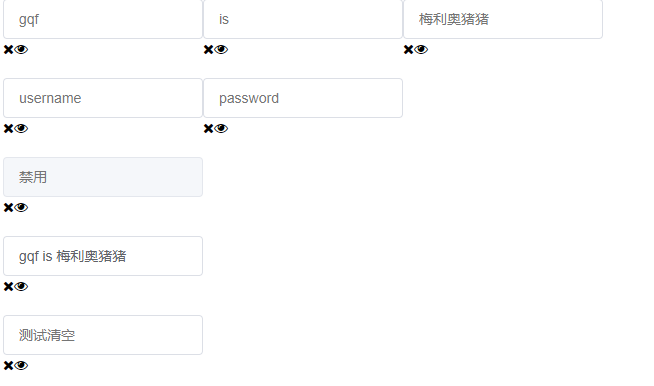
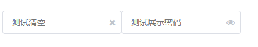

# 16-input组件-清空value值的功能

> 小图标样式
* 样式如下
    ```scss
    .gqf-input--suffix {
        .gqf-input__inner {
            padding-right: 30px;
        }
        .gqf-input__suffix {
            position: absolute;
            height: 100%;
            right: 10px;
            top: 0;
            line-height: 40px;
            text-align: center;
            color: #c0c4cc;
            transition: all .3s;
            z-index: 900;
            i {
            color: #c0c4cc;
            font-size: 14px;
            cursor: pointer;
            transition: color .2s cubic-bezier(.645, .045, .355, 1);
            }
        }
    }    
    ```

> 练习

* 支持clearable属性(可以把showPassword一起加上)
    * 在App.vue中，组件传入clearable属性
    * 子组件props接收clearable参数，默认给个false
    * 在模板中记得写上`:clearable = "clearable"`
    * 接着来看下我们的小图标
        ```html
        <span class="gqf-input__suffix"><i class="fa fa-close"></i><i class="fa fa-eye"></i></span>
        ```
    * 如下图所示

         

    * 所以这里我们加上个`v-if="clearable"`，就可以让我们设置clearable的input框有这么个清空的按钮  
    * 然后复制一样，不要忘记给gqf-input类名这里追加个类名`gqf-input--suffix`，并且需要动态去控制`:class="{'gqf-input--suffix': clearable || showPassword}"`
    * 此时的页面效果是这样的

          

    * 上述动态控制class，其实可以给个计算属性  
        ```js
        computed: {
            showSuffix () {
                return this.clearable || this.showPassword
            }
        }        
        ```  
    * 这样我们动态控制类名就可以这么写`:class="{'gqf-input--suffix': showSuffix}">`，这里还可以做个优化，span的标签需要加上同样的`v-if="showSuffix"`
    * 最后就是注册个点击事件`@click="clear"`，在methods完成功能，主要这边依旧是要用emit通知父级去改 
        ```js
        clear () {
            this.$emit('input', '')
        }        
        ```
    * 这边还可以做个优化，小图标显示的优化，追加个条件有输入信息的时候才显示`v-if="clearable && value"`          

> 知道你还不过瘾继续吧       

* [上一节-15-input组件-v-model属性支持](../15-input组件-v-model属性支持/input组件-v-model属性支持.md)
* [下一节-17-input组件-显示和隐藏密码](../17-input组件-显示和隐藏密码/input组件-显示和隐藏密码.md)
* [返回目录](../../README.md)