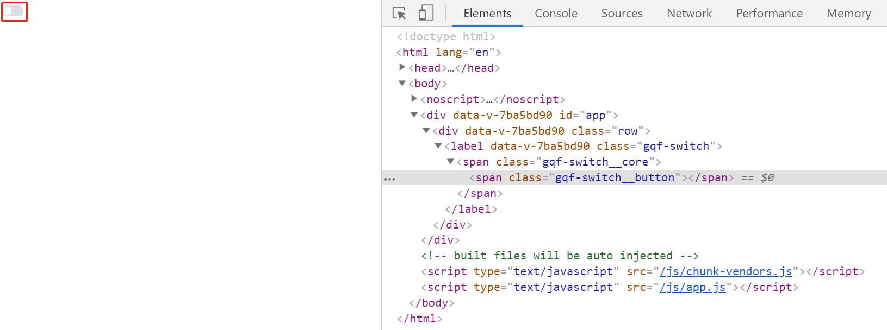
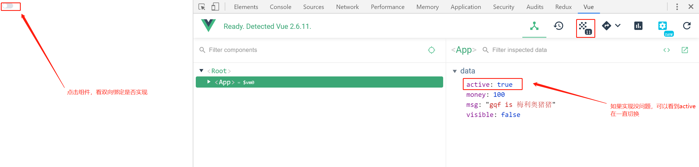

# switch组件-开关自定义颜色

> 知识大纲

* 参数支持
    * v-model
        * 参数描述 - 双向绑定 
        * 参数类型 - 布尔类型
        * 默认值 - false
    * name
        * 参数描述 - name属性
        * 参数类型 - string
        * 默认值 - text
    * activeColor
        * 参数描述 - 自定义的激活的颜色
        * 参数类型 - string
        * 默认值 - ''
    * inactiveColor
        * 参数描述 - 自定义的不激活的颜色 
        * 参数类型 - string
        * 默认值 - '' 

* 事件支持
    * change - change时触发的事件

* 基本结构
    * 页面
        ```
        <template>
            <label class="gqf-switch">
                <span class="gqf-switch__core">
                    <span class="gqf-switch__button"></span>
                </span>
            </label>
        </template>        
        ```
    * 样式
        ```scss
        .gqf-switch {
            display: inline-flex;
            align-items: center;
            position: relative;
            font-size: 14px;
            line-height: 20px;
            height: 20px;
            vertical-align: middle;
            .gqf-switch__core {
                margin: 0;
                display: inline-block;
                position: relative;
                width: 40px;
                height: 20px;
                border: 1px solid #dcdfe6;
                outline: none;
                border-radius: 10px;
                box-sizing: border-box;
                background: #dcdfe6;
                cursor: pointer;
                transition: border-color .3s, background-color .3s;
                vertical-align: middle;
                .gqf-switch__button {
                    position: absolute;
                    top: 1px;
                    left: 1px;
                    border-radius: 100%;
                    transition: all .3s;
                    width: 16px;
                    height: 16px;
                    background-color: #fff;
                }
            }
        }        
        ```  
    * 选中的样式
        ```scss
        .gqf-switch.is-checked {
            .gqf-switch__core {
                border-color: #409eff;
                background-color: #409eff;
                .gqf-switch__button{
                    transform: translateX(20px);
                }
            }
        }        
        ```     

> 练习

* 注册switch组件，复制模板页面和样式 
* 此时页面效果如下  

    

* v-model属性  
    * 在App.vue中data给个active属性，值为false，然后通过v-model绑定
    * 子组件中接受value属性，类型布尔，默认值为false
    * 子组件添加点击事件，注册后完成逻辑，通过emit传给父组件，值传取反的value，代码如下
        ```vue
        <template>
        <label class="gqf-switch" @click="handleClick">
            <span class="gqf-switch__core">
                <span class="gqf-switch__button"></span>
            </span>
        </label>
        </template>

        <script>
        export default {
        name: 'GqfSwitch',
        props: {
            value: {
            type: Boolean,
            default: false
            }
        },
        methods: {
            handleClick () {
            this.$emit('input', !this.value)
            }
        }
        }
        </script>

        <style lang="scss">
        .gqf-switch {
            display: inline-flex;
            align-items: center;
            position: relative;
            font-size: 14px;
            line-height: 20px;
            height: 20px;
            vertical-align: middle;
            .gqf-switch__core {
                margin: 0;
                display: inline-block;
                position: relative;
                width: 40px;
                height: 20px;
                border: 1px solid #dcdfe6;
                outline: none;
                border-radius: 10px;
                box-sizing: border-box;
                background: #dcdfe6;
                cursor: pointer;
                transition: border-color .3s, background-color .3s;
                vertical-align: middle;
                .gqf-switch__button {
                position: absolute;
                top: 1px;
                left: 1px;
                border-radius: 100%;
                transition: all .3s;
                width: 16px;
                height: 16px;
                background-color: #fff;
                }
            }
        }
        </style>
        ```
    * 此时点击switch组件，可以看到控制台Vue的调试工具，active的值能被改变

           

* 添加选中样式
    * 复制知识大纲的选中样式
    * 添加class，`:class="{'is-checked': value}"`

* name属性就不说了，很简单
* 接着来处理下传开关颜色   
    * 父组件`<gqf-switch v-model="active" active-color="red" inactive-color="green"></gqf-switch>`
    * 子组件接收 
        ```js
        props: {
            value: {
                type: Boolean,
                default: false
            },
            activeColor: {
                type: String,
                default: ''
            },
            inactiveColor: {
                type: String,
                default: ''
            },
            name: {
                type: String,
                default: 'text'
            }
        },        
        ``` 
    * 封装个setColor的方法，这样可以在mounted的时候和点击的时候调用   
        ```js
        setColor () {
            if (this.activeColor || this.inactiveColor) {
                let color = this.value ? this.activeColor : this.inactiveColor
                this.$refs.core.style.borderColor = color
                this.$refs.core.style.backgroundColor = color
            }
        }        
        ``` 
    * 然后调用的时候也有个细节，比如click的时候调用，需要`nextTick`，因为要等父级更改后再去设置颜色，mounted就直接调用`this.setColor`就可以了
        ```js
        async handleClick () {
            this.$emit('input', !this.value)
            await this.$nextTick()
            this.setColor()
        },
        ```


> 知道你还不过瘾继续吧       

* [上一节-input组件-显示和隐藏密码](../17-input组件-显示和隐藏密码/input组件-显示和隐藏密码.md)
* [返回目录](../../README.md)