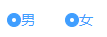

# 20-radio组件-基本结构.md

> 知识大纲

* 前置知识点
    * radio的基本使用 - 可以看下vue官网双向数据绑定，radio的使用

* 参数支持
    * v-model
        * 参数描述 - 双向绑定
        * 参数类型 - 布尔类型
        * 默认值 - false
    * lable
        * 参数描述 - 单选框的value值
        * 参数类型 - string，num，boolean
        * 默认值 - 
    * name
        * 参数描述 - name属性 
        * 参数类型 - string
        * 默认值 -    

* 基本结构
    * html结构
        ```html
        <template>
            <label class="gqf-radio">
                <span class="gqf-radio__input">
                <span class="gqf-radio__inner"></span>
                <input type="radio" class="gqf-radio__original">
                </span>
                <span class="gqf-radio__label">
                我是label
                </span>
            </label>
        </template>        
        ```
    * 样式
        ```scss
        .gqf-radio {
        color: #606266;
        font-weight: 500;
        line-height: 1;
        position: relative;
        cursor: pointer;
        display: inline-block;
        white-space: nowrap;
        outline: none;
        font-size: 14px;
        margin-right: 30px;
        -moz-user-select: none;
        -webkit-user-select: none;
        -ms-user-select: none;
        .gqf-radio__input {
            white-space: nowrap;
            cursor: pointer;
            display: inline-block;
            line-height: 1;
            position: relative;
            vertical-align: middle;
            .gqf-radio__inner {
            border: 1px solid #dcdfe6;
            border-radius: 100%;
            width: 14px;
            height: 14px;
            background-color: #fff;
            position: relative;
            cursor: pointer;
            display: inline-block;
            box-sizing: border-box;
            &:after {
                width: 4px;
                height: 4px;
                border-radius: 100%;
                background-color: #fff;
                content: "";
                position: absolute;
                left: 50%;
                top: 50%;
                transform: translate(-50%, -50%) scale(0);
                transition: transform .15s ease-in;
            }
            }
            .gqf-radio__original {
            opacity: 0;
            outline: none;
            position: absolute;
            z-index: -1;
            top: 0;
            left: 0;
            right: 0;
            bottom: 0;
            margin: 0;
            }
        }
        .gqf-radio__lable {
            font-size: 14px;
            padding-left: 10px;
        }
        }

        .gqf-radio.is-checked {
        .gqf-radio__input {
            .gqf-radio__inner {
            border-color: #409eff;
            background: #409eff;
            &:after {
                transform: translate(-50%, -50%) scale(1);
            }
            }
        }
        .gqf-radio__label {
            color: #409eff;
        }
        }        
        ```

> 练习

* 先注册单选框组件，把html结构和样式复制好

    

* 样式中有选中的样式，我们可以在class上加上is-checked，`<label class="gqf-radio is-checked">`看下效果  

    

* 我们最终做个性别的单选框吧，男和女，在App.vue中这么写
    * data中给个gender，值为`'1'`    
    * 父组件这么处理
        ```html
        <gqf-radio label="1" v-model="gender">男</gqf-radio>
        <gqf-radio label="0" v-model="gender">女</gqf-radio>        
        ```

* props属性接受
    ```js
    export default {
        name: 'GqfRadio',
        props: {
            label: {
            type: [String, Number, Boolean],
            default: ''
            },
            value: null,
            name: {
            type: String,
            default: ''
            }
        }
    }    
    ```
* 如何显示男和女，这里要使用插槽slot   
    ```html
    <span class="gqf-radio__label">
      <slot></slot>
    </span    
    ```

    

* 这边显示文字还可以做个优化，如果之前父组件没有传男和女，默认希望展示label  
    ```html
    <span class="gqf-radio__label">
      <slot></slot>
      <template v-if="!$slots.default">{{label}}</template>
    </span>    
    ```

    


> 知道你还不过瘾继续吧       

* [返回目录](../../README.md)
* [上一节-19-switch组件-开关自定义颜色](../19-switch组件-添加input框/switch组件-添加input框.md)
* [下一节-21-radio组件-控制选中](../21-radio组件-控制选中/radio组件-控制选中.md)