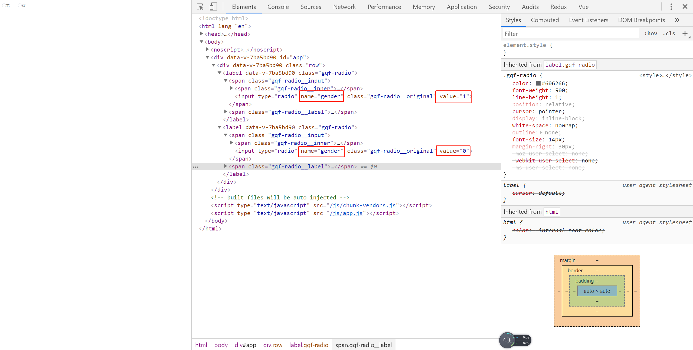

# 21-radio组件-控制选中

> 练习
* 先处理下input的value和name
    * 代码`<input type="radio" class="gqf-radio__original" :name="name" :value="label">`
    * 看下页面效果

        

* 双向数据绑定
    * 不能`v-model="value"`，因为这个是父组件给的，不能直接修改
    * 所以我们自己定义个计算属性`model`，这样就可以`v-model="model"`
    * 因为是双向数据绑定，所以计算属性get和set方法都需要实现
        ```js
        computed: {
            model: {
                get () {
                    return this.value
                },
                set (val) {
                    this.$emit('input', val)
                }
            }
        },        
        ``` 
    * 此时可以用vue的调试工具调试，点击男女，观察gender的变化
    * 最后就只要加class样式就可以了~`:class="{'is-checked': label === value}"`          

> 知道你还不过瘾继续吧       

* [返回目录](../../README.md)
* [上一节-20-radio组件-基本结构](../20-radio组件-基本结构/radio组件-基本结构.md)
* [下一节-22-radio-group组件封装](../22-radio-group组件封装/radio-group组件封装.md)