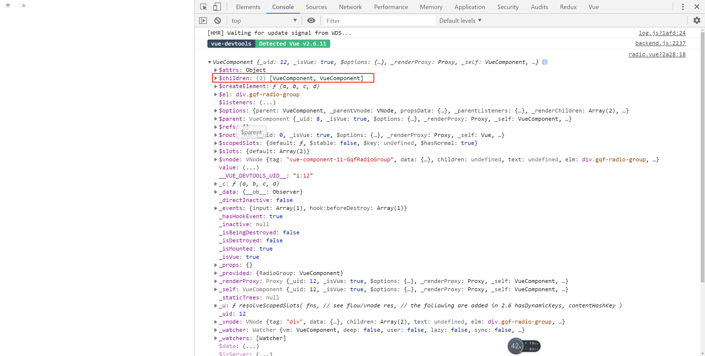
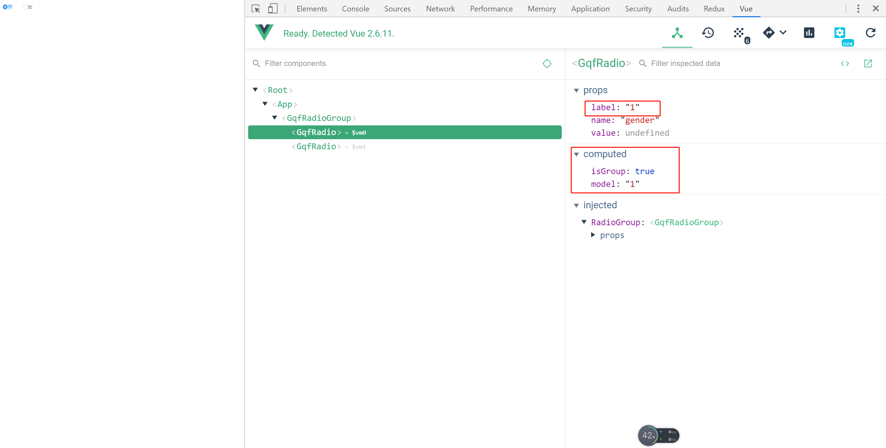

# 22-radio-group组件封装

> 背景 - 为什么要在封装个单选框组

* 上一节我们已经简单封装好了一个radio组件，我们来看下我们在App.vue中怎么使用的
    ```html
    <gqf-radio label="1" v-model="gender" name="gender">男</gqf-radio>
    <gqf-radio label="0" v-model="gender" name="gender">女</gqf-radio>
    ```
* 上述代码可以看到，我们的单选框组件每次都需要双向绑定，需要加上v-model的属性
* 如果选项很多，每个都要写v-model其实不是很方便，所以我们可以封装个radio-group的组件把单选框组件包裹住，只需要写一次v-model就可以了
* 可以参考下element-ui，该组件库也是这么实现的

> 知识大纲

* 前置知识
    * provide与inject

* 基本结构
    * 结构
        ```html
        <template>
            <div class="gqf-radio-group">
                <slot></slot>
            </div>
        </template>
        ```
    * 数据
        ```js
        export default {
            name: 'GqfRadioGroup',
            provide () {
                return {
                    RadioGroup: this
                }
            },
            props: {
                value: null
            }
        }        
        ```

> 练习

* 创建新的组件`radio-group`，复制结构和数据，用来配合radio使用，并且在main.js中注册
* 在App.vue中，我们最终使用的方式应该是这样的
    ```html
    <gqf-radio-group v-model="gender">
        <gqf-radio label="1" name="gender">男</gqf-radio>
        <gqf-radio label="0" name="gender">女</gqf-radio>
    </gqf-radio-group>    
    ```
* 很明显，我们radio组件之后会去操作radio-group，具体该怎么做
    * 我们先在radio组件中，给个created的生命周期函数，打印下`this.$parent`
        ```js
        created () {
            console.log(this.$parent)
        },        
        ```  
    * 看下页面打印的信息，拿到了parent，并且的确它有2个孩子

          

    * 但parent其实是有风险的，因为如果在radio组件外面在包了一层，也就是说radio-group里面的子组件并不是radio组件，这个parent不一定能拿到我们的radio-group组件
    * 所以我们需要使用provide与inject， 这个就是祖孙间的通讯
        * 祖级提供provide
        * 子孙通过inject接受
        * 参考[官网-provide-inject](https://cn.vuejs.org/v2/api/#provide-inject)   
    * 所以在之前的知识大纲中数据里我们能看到provide是这么使用  
        ```js
        provide () {
            return {
                RadioGroup: this
            }
        },        
        ``` 
    * 这样我们子孙组件radio就可以通过reject去接受，默认值给个空，因为radio不一定会包在radio-group组件中
        ```js
        inject: {
            RadioGroup: {
                default: ''
            }
        },        
        ```  
    * 这个时候我们radio组件中，计算属性get，set都要做下处理，因为可能要在group组件处理
    * 我们先在计算属性里封装个方法isGroup，用于判断是否有祖先级组件group
        ```js
        isGroup () {
            return !!this.RadioGroup
        }        
        ``` 
    * 接着处理get和set
        ```js
        model: {
            get () {
                // return this.value
                return this.isGroup ? this.RadioGroup.value : this.value
            },
            set (val) {
                // this.$emit('input', val)
                this.isGroup ? this.RadioGroup.$emit('input', val) : this.$emit('input', val)
            }
        },        
        ```
    * 添加class这边也有细节需要处理，其实就让label和model做比较就可以了`:class="{'is-checked': label === model}"`
    * 最终效果 - 留图纪念

                      

> 练习

> 知道你还不过瘾继续吧       

* [返回目录](../../README.md)
* [上一节-21-radio组件-控制选中](../21-radio组件-控制选中/radio组件-控制选中.md)
* [下一节-23-checkbox与checkbox-group](../23-checkbox与checkbox-group/checkbox与checkbox-group.md)