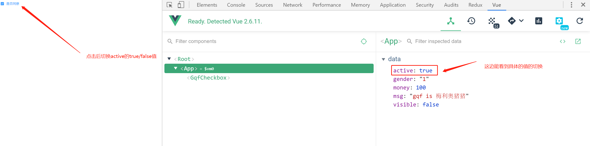
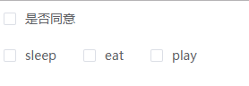

# 23-checkbox与checkbox-group

> 温故而知新

* radio与radio-group已经封装好了，checkbox其实是差不多的
* radio与checkbox的区别在于
    * radio一般不会单独使用，至少也会有2个radio组件
    * checkbox可以单独一个使用，比如我同意，checkbox代表的就是true和false
    * checkbox也可以多个使用，绑定的是个数组

> 知识大纲

* 结构
    * html结构
        ```html
        <template>
            <label class="gqf-checkbox">
                <span class="gqf-checkbox__input">
                <span class="gqf-checkbox__inner"></span>
                <input type="checkbox" class="gqf-checkbox__original"/>
                </span>
                <span class="gqf-checkbox__label">
                <slot></slot>
                <template v-if="!$slots.default">{{label}}</template>
                </span>
            </label>
        </template>        
        ```
    * 样式
        ```scss
        .gqf-checkbox {
        color: #606266;
        font-weight: 500;
        font-size: 14px;
        position: relative;
        cursor: pointer;
        display: inline-block;
        white-space: nowrap;
        user-select: none;
        margin-right: 30px;
        .gqf-checkbox__input {
            white-space: nowrap;
            cursor: pointer;
            outline: none;
            display: inline-block;
            line-height: 1;
            position: relative;
            vertical-align: middle;
            .gqf-checkbox__inner {
            display: inline-block;
            position: relative;
            border: 1px solid #dcdfe6;
            border-radius: 2px;
            box-sizing: border-box;
            width: 14px;
            height: 14px;
            background-color: #fff;
            z-index: 1;
            transition: border-color .25s cubic-bezier(.71, -.46, .29, 1.46) background-color .25s cubic-bezier(.71, -.46, .29, 1.46);
            &:after {
                box-sizing: content-box;
                content: "";
                border: 1px solid #fff;
                border-left: 0;
                border-top: 0;
                height: 7px;
                left: 4px;
                position: absolute;
                top: 1px;
                transform: rotate(45deg) scaleY(0);
                width: 3px;
                transition: transform .15s ease-in .05s;
                transform-origin: center;
            }
            }
            .gqf-checkbox__original {
            opacity: 0;
            outline: none;
            position: absolute;
            left: 10px;
            margin: 0;
            width: 0;
            height: 0;
            z-index: -1;
            }
        }
        .gqf-checkbox__label {
            display: inline-block;
            padding-left: 10px;
            line-height: 19px;
            font-size: 14px;
        }
        }
        .gqf-checkbox.is-checked {
        .gqf-checkbox__input {
            .gqf-checkbox__inner {
            background-color: #409eff;
            border-color: #409eff;
            &:after {
                transform: rotate(45deg) scaleY(1);
            }
            }
        }
        .gqf-checkbox__label {
            color: #409eff;
        }
        }              
        ```    

> 练习

* 老样子新建组件，复制结构及样式，然后不要忘记在main中注册
* 单个checkbox
    * 我们先做一个是否同意的复选框，`<gqf-checkbox v-model="agree">是否同意</gqf-checkbox>`
    * props接受还是老样子的那几个
        ```js
        props: {
            label: {
                type: String,
                default: null
            },
            name: {
                type: String,
                default: ''
            },
            value: {
                type: Boolean,
                default: false
            }
        }
        ```
    * 处理下双向数据绑定
        * 老样子先用个计算属性处理model
            ```js
            computed: {
                model: {
                get () {
                    return this.value
                },
                set (value) {
                    this.$emit('input', value)
                }
                }
            },        
            ```
        * 处理v-model和name，代码为`<input type="checkbox" class="gqf-checkbox__original" :name="name" v-model="model" />`
        * 添加class`:class="{'is-checked': model}"`
        * 此时单个checkbox，true/false选择功能就完成了

            

* 多个checkbox - 新建新组件gqf-checkbox-group并注册
    * 模板
        ```html
        <template>
            <div class="gqf-checkbox-group">
                <slot></slot>
            </div>
        </template>        
        ```
    * 数据
        ```js
        export default {
            name: 'GqfCheckboxGroup',
            props: {
                value: {
                type: Array
                }
            },
            provide () {
                return {
                CheckboxGroup: this
                }
            }
        }        
        ```        
    * App.vue中data给个hobby，`hobby: ['eat', 'play', 'sleep']`
    * 然后使用方式具体是这样的
        ```html
        <gqf-checkbox-group v-model="hobby">
            <gqf-checkbox label="sleep"></gqf-checkbox>
            <gqf-checkbox label="eat"></gqf-checkbox>
            <gqf-checkbox label="play"></gqf-checkbox>
        </gqf-checkbox-group>        
        ```
    * 此时页面的效果是这样的

         

    * checkbox组件inject接受
        ```js
        inject: {
            CheckboxGroup: {
                default: ''
            }
        },        
        ```       
    * 因为多选通过数组判断，input这时候`:value="label"`就起作用了    
    * isGroup方法，model重新的处理，isChecked方法
        ```js
        computed: {
            isGroup () {
                return !!this.CheckboxGroup
            },
            model: {
                get () {
                    return this.isGroup ? this.CheckboxGroup.value : this.value
                },
                set (value) {
                    this.isGroup ? this.CheckboxGroup.$emit('input', value) : this.$emit('input', value)
                }
            },
            isChecked () {
                return this.isGroup ? this.model.includes(this.label) : this.model
            }
        },        
        ```
    * class处理`:class="{'is-checked': isChecked}"`     


> 知道你还不过瘾继续吧       

* [返回目录](../../README.md)
* [上一节-22-radio-group组件封装](../22-radio-group组件封装/radio-group组件封装.md)
* [下一节-24-form组件的说明](../24-form组件的说明/form组件的说明.md)