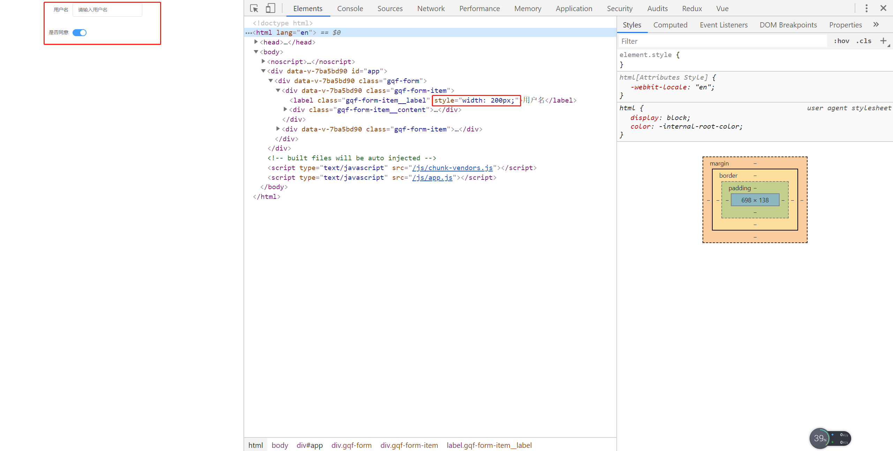

# 25-form与form-item组件的使用

> 知识大纲

* form-item的结构
    ```vue
    <template>
    <div class="gqf-form-item">
        <label class="gqf-form-item__label"></label>
        <div class="gqf-form-item__content">
        <slot></slot>
        </div>
    </div>
    </template>

    <script>
    export default {
    name: 'GqfFormItem'
    }
    </script>

    <style lang="scss">
    .gqf-form-item {
    margin-bottom: 25px;
    .gqf-form-item__label {
        text-align: right;
        vertical-align: middle;
        float: left;
        font-size: 14px;
        color: #606266;
        line-height: 40px;
        padding: 0 12px 0 0;
        box-sizing: border-box;
    }
    .gqf-form-item__content {
        line-height: 40px;
        position: relative;
        font-size: 14px;
        overflow: hidden;
    }
    }
    </style>

    ```


> 练习

* form-item组件props接受label属性
* App.vue中我们在玩下switch
    ```html
    <gqf-form :model="model" label-width="200px">
      <gqf-form-item label="用户名">
        <gqf-input placeholder="请输入用户名" v-model="model.username"></gqf-input>
      </gqf-form-item>
      <gqf-form-item label="是否同意">
        <gqf-switch v-model="model.active"></gqf-switch>
      </gqf-form-item>
    </gqf-form>    
    ```
* 之前Form提供了provide，这里我们item组件可以接受下`inject: ['Form'],`
* 之后item中的label就可以做下处理`:style="{width: Form.labelWidth}"` 
* 这样form和form-item就简单处理好了

    


> 知道你还不过瘾继续吧       

* [返回目录](../../README.md)
* [上一节-24-form组件的说明](../24-form组件的说明/form组件的说明.md)
* [下一节-26-把package处理成vue插件](../26-把package处理成vue插件/把package处理成vue插件.md)