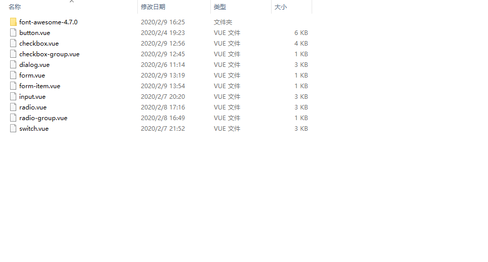

# 26-把package处理成vue插件

> 知识大纲

* 封装成UI组件库
    * 目录调整
        * 根目录创建两个文件夹packages和examples
        * packages - 用于存放所有的组件
        * examples - 用于进行测试，把src改成examples

    * 之后详细步骤跟着练习一步一步来    

> 练习

* 在gqf-ui下新建个文件夹为packages，把src改名为examples
    * 真正的组件库其实主要是这个packages
    * examples是用来放测试案例的
* 因为把src的名字改了，所以项目肯定起不了了，此时可以用配置文件vue.config.js
    ```js
    const path = require('path')
    module.exports = {
    pages: {
        index: {
        // 修改项目的入口文件
        entry: 'examples/main.js',
        template: 'public/index.html',
        filename: 'index.html'
        }
    },
    // 扩展webpack配置，使packages加入编译
    chainWebpack: config => {
        config.module
        .rule('js')
        .include.add(path.resolve(__dirname, 'packages')).end()
        .use('babel')
        .loader('babel-loader')
        .tap(options => {
            // 修改其他选项...
            return options
        })
    }
    }    
    ```
* 接着我们要把我们之前components中的组件全部copy到packages   
* 字体图标也要放到packages，此时packages里面应该有这些东西 

    

* 接着我们把main.js中所有的import和注册注释掉(或者删掉)
* App.vue也清空成最干净的
* 要做成vue的插件，必须要懂install方法，可以查看官网
* 在packages中新建个index.js 
    ```js
    // 整个包的入口
    // 定义install方法，接受Vue作为参数，如果使用use注册插件，则所有的组件都将被注册
    const install = function (Vue) {
        console.log('helo GqfUI')
    }

    export default {
        install
    }
    ```
* 在main.js中引入并且Vue.use
    ```js
    import GqfUI from '../packages'
    Vue.use(GqfUI)    
    ``` 
* 此时页面就能看到，其实也就说明了use的原理其实就是找到install方法并且执行

    

* 接着需要注册所有组件及一些其他的处理
    * 导入所有组件及样式
    * 把组件放到数组里
    * 在install中遍历注册
    * 不需要调用use的一些处理，比如vue-router，在检测Vue是访问的全局变量时会自动调用`Vue.use()`，然而像CommonJS这样的模块环境中，你应该始终显示地调用`Vue.use()`   
    * 最终代码如下
        ```js
        // 整个包的入口
        // 定义install方法，接受Vue作为参数，如果使用use注册插件，则所有的组件都将被注册
        import Button from './button'
        import Dialog from './dialog'
        import Input from './input'
        import Checkbox from './checkbox'
        import CheckboxGroup from './checkbox-group'
        import Radio from './radio'
        import RadioGroup from './radio-group'
        import Switch from './switch'
        import Form from './form'
        import FormItem from './form-item'
        import './font-awesome-4.7.0/scss/font-awesome.scss'

        const components = [
        Button,
        Dialog,
        Input,
        Checkbox,
        CheckboxGroup,
        Radio,
        RadioGroup,
        Switch,
        Form,
        FormItem
        ]
        const install = function (Vue) {
        // console.log('helo GqfUI')
        components.forEach(item => {
            Vue.component(item.name, item)
        })
        }

        // 判断是否是直接引入文件，如果是，就不用调用Vue.use()
        if (typeof window !== 'undefined' && window.Vue) {
        install(window.Vue)
        }

        export default {
        install
        }

        ``` 
* 这个时候我们可以试下我们做的组件了
    ```html
    <div>测试制作ui库</div>
    <br>
    <gqf-button type='primary'>按钮</gqf-button>    
    ``` 

            


> 知道你还不过瘾继续吧       

* [返回目录](../../README.md)
* [上一节-25-form组件的说明](../25-form与form-item组件的使用/form与form-item组件的使用.md)
* [下一节-27-组件库的制作](../27-组件库的制作/组件库的制作.md)