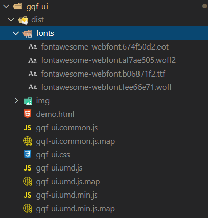
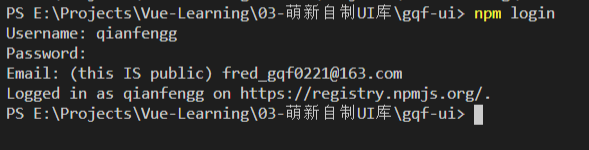
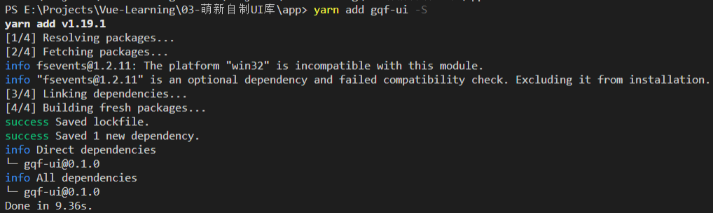
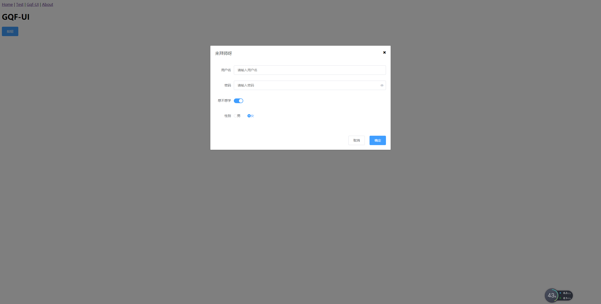

# 27-组件库的制作

> 准备工作

* github注册过账号
* npm注册过账号
* vue-cli有个构建目标 - 构建库

> 练习

* 在package.json中追加命令，注意该命令最后还要加上打包的文件，指令为`"lib": "vue-cli-service build --target lib packages/index.js"`
* 接着我们就来试下`yarn lib`是否可以打包，发现图标什么也都打包好了

    

* 在github上开源，这里可以处理下README，这里我偷懒下就先不改了 
    * 在github上新建仓库
    * 在gqf-ui提交
        * `git status`
        * `git add .`
        * `git commit -m '提交'`
    * 最后根据github网页提示复制2条指令
        * `git remote add origin https://github.com/qianfengg/gqf-ui.git`
        * `git push -u origin master` 

* 发布到npm上
    * package.json首先要把private改成false，如果是私有的npm是不会让你上传的
    * 需要增加main属性，`"main": "dist/gqf-ui.umd.min.js",`  
    * 还可以指定作者什么的   
        ```json
        "author": {
            "name": "顾乾峰"
        },        
        ``` 
    * 在项目根目录下还需要增加.npmignore文件，这个文件是用来忽略不被npm上传的，其实用户只要dist就可以了
        ```
        # 忽略目录
        examples/
        packages/
        public/

        # 忽略指定文件
        vue.config.js
        babel.config.js
        *.map        
        ```  
    * 使用npm上传
        * npm login - 登录   

            

        * npm publish - 发布
        * 发布完成后就能看到自己的包了

* 如何升级版本
    * 在packages里面加组件
    * 在index.js中统一导出
    * 在examples里做测试
    * 然后继续执行指令`yarn lib`打包
    * 在上传npm前，需要在package.json里升级版本  

* 测试下我们的gqf-ui
    * 之前我们用个app来演示element，这次我们安装下我们的gqf-ui 

          

    * 在main.js中import我自己的UI库，记得导入样式，并且使用`Vue.use()`
        ```js
        import GqfUI from 'gqf-ui'
        import 'gqf-ui/dist/gqf-ui.css'

        Vue.use(GqfUI)        
        ```   
    * 新建个路由页面专门来测试我的组件库 
        ```vue
        <template>
        <div>
                <h1>GQF-UI</h1>
                <gqf-button type="primary" @click="visible=true">按钮</gqf-button>
                <gqf-dialog :title="'来拜师呀'" :visible.sync="visible" width="30%">
                    <gqf-form :model="model">
                        <gqf-form-item label="用户名">
                            <gqf-input placeholder="请输入用户名" v-model="model.username" clearable></gqf-input>
                        </gqf-form-item>
                        <gqf-form-item label="密码">
                            <gqf-input placeholder="请输入密码" type="password" v-model="model.password" show-password></gqf-input>
                        </gqf-form-item>
                        <gqf-form-item label="想不想学">
                            <gqf-switch v-model="model.callMeTeacher"></gqf-switch>
                        </gqf-form-item>
                        <gqf-form-item label="性别">
                            <gqf-radio-group v-model="model.gender">
                                <gqf-radio label="1">男</gqf-radio>
                                <gqf-radio label="0">女</gqf-radio>
                            </gqf-radio-group>
                        </gqf-form-item>
                    </gqf-form>
                    <template v-slot:footer>
                    <gqf-button @click="visible=false">取消</gqf-button>
                    <gqf-button type="primary" @click="visible=false">确定</gqf-button>
                    </template>
                </gqf-dialog>
        </div>
        </template>

        <script>
        export default {
            data () {
                return {
                    visible: false,
                    model: {
                        username: '',
                        password: '',
                        callMeTeacher: false,
                        gender: '1'
                    }
                }
            }
        }
        </script>

        <style>

        </style>        
        ```  

    * 页面效果如下，美滋滋

                                

> 知道你还不过瘾继续吧       

* [返回目录](../../README.md)
* [上一节-26-把package处理成vue插件](../26-把package处理成vue插件/把package处理成vue插件.md)