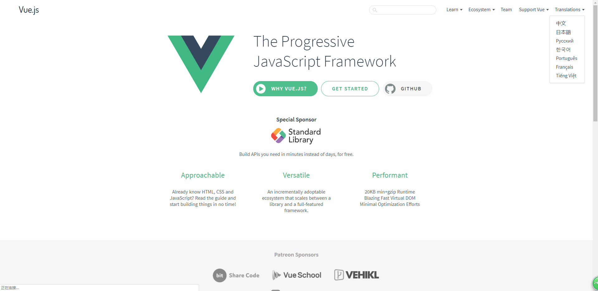
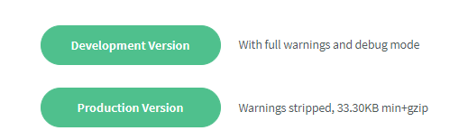
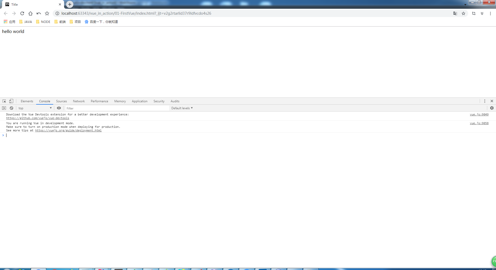

# 第一个Vue程序

> 知识大纲
* [官方网站](https://vuejs.org/)

    * 可以在右上角选择翻译->中文
    
        
    
* 安装    
    
    * 点击GET STARTED - installation，查看安装的说明
    
    * 这个时候能看到有2个版本，开发和生产  
    
          
        
    * 我们也可以使用下面的CDN，直接通过script标签引入，萌新建议使用这种方式开始学习
        ```html
        <script src="https://cdn.jsdelivr.net/npm/vue@2.6.10/dist/vue.js"></script>
        ```    
        
> 练习
1. 新建个index.html,将前面的script标签引入
    ```html
    <!DOCTYPE html>
    <html lang="en">
    <head>
        <meta charset="UTF-8">
        <title>Title</title>
    </head>
    <body>
    <div>hello world</div>
    <script src="https://cdn.jsdelivr.net/npm/vue@2.6.10/dist/vue.js"></script>
    </body>
    </html>
    ``` 
           
2. 打开浏览器看下控制台
    1. 控制台截图如下
    
            
        
    2. 能够清楚的看到控制台打印了Vue的相关信息

3. 此刻我们还没有和Vue正式打交道
    1. div上加个id属性，然后新写个script标签     
    2. 实例化Vue对象，el关联这个div这个元素
    3. 在data方法中返回对象，对象里写个属性msg，写入你想要展示的文字内容
    4. 在div标签内使用双括号括号，展示msg
    5. 具体代码如下
        ```html
        <!DOCTYPE html>
        <html lang="en">
        <head>
            <meta charset="UTF-8">
            <title>Title</title>
        </head>
        <body>
        <div id="app">{{msg}}</div>
        <script src="https://cdn.jsdelivr.net/npm/vue@2.6.10/dist/vue.js"></script>
        <script>
            new Vue({
                el: "#app",
                data(){
                    return {
                        msg: "Hello Vue"
                    }
                }
            })
        </script>
        </body>
        </html>
        ```
    6. 这个时候打开页面就能看到我们的**Hello Vue**了，这就是我们最简单的一个Vue程序了 
    
4. 完成todo-list的demo
    1. html结构
        ```html
        <div id="app">
            {{msg}}
            <div>
                <input type="text">
                <button>添加</button>
            </div>
            <ul>
                <li>1</li>
            </ul>
        </div>
        ```  
    2. 需要实现的功能就是点击添加能够动态的添加li
    3. 如何获取input里的值
        1. 我们使用指令`v-model="info"`，这个是vue的双向绑定           
        2. 我们在data里return的对象中也要添加info属性
    4. 给button按钮绑定个点击事件
        1. 我们要给button添加个属性`@click="handleClick"`    
        2. 在Vue的实例选项中，定义handleClick方法，在对象上声明个methods属性，
            然后编写handleClick方法，可以通过this.info拿到表单的值
    5. 如何把数据渲染到ul中
        1. `v-for`指令就是用来做循环的，我们来循环list，所以要在data里定义list，
            这里先定义成空的数组
        2. 然后就在前面的handleClick编写逻辑，给数组添加元素 
    6. 最终代码如下
        ```html
        <!DOCTYPE html>
        <html lang="en">
        <head>
            <meta charset="UTF-8">
            <title>Title</title>
        </head>
        <body>
        <div id="app">
            {{msg}}
            <div>
                <input type="text" v-model="info">
                <button @click="handleClick">添加</button>
            </div>
            <ul>
                <li v-for="item in list">{{item}}</li>
            </ul>
        </div>
        <script src="https://cdn.jsdelivr.net/npm/vue@2.6.10/dist/vue.js"></script>
        <script>
            new Vue({
                el: "#app",
                data(){
                    return {
                        msg: "Hello Vue",
                        info: "",
                        list: []
                    }
                },
                methods:{
                    handleClick(){
                        this.list.push(this.info);
                        this.info = "";
                    }
                }
            })
        </script>
        </body>
        </html>
        ```            
    7. 打开页面就可以玩耍这个todo-list了
    
5. 扩展，使用Vue的组件
    * 具体代码如下
        ```html
        <!DOCTYPE html>
        <html lang="en">
        <head>
            <meta charset="UTF-8">
            <title>Title</title>
        </head>
        <body>
        <div id="app">
            {{msg}}
            <div>
                <input type="text" v-model="info">
                <button @click="handleClick">添加</button>
            </div>
            <ul>
                <!--<li v-for="item in list">{{item}}</li>-->
                <todo-item v-for="item in list" :item="item"></todo-item>
            </ul>
        </div>
        <script src="https://cdn.jsdelivr.net/npm/vue@2.6.10/dist/vue.js"></script>
        <script>
            Vue.component("todo-item", {
               props: ["item"],
               template: "<li>{{item}}</li>"
            });
            new Vue({
                el: "#app",
                data(){
                    return {
                        msg: "Hello Vue",
                        info: "",
                        list: []
                    }
                },
                methods:{
                    handleClick(){
                        this.list.push(this.info);
                        this.info = "";
                    }
                }
            })
        </script>
        </body>
        </html>
        ```      