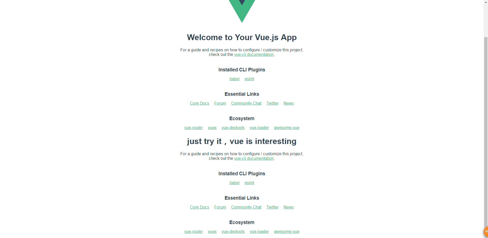

# 初识单文件组件

> 知识大纲
* [vue-cli官方网站](https://cli.vuejs.org/)
* npm install -g @vue/cli
* vue create my-app
* cd my-app
* npm run serve

> 练习
1. 安装脚手架，输入指令`npm install -g @vue/cli`
2. 创建我们的项目，`vue create my-app`
    * 如果提示是否使用淘宝镜像，可以选择是
    * 这里使用默认的default
3. 简单了解项目目录
    1. node_modules - 项目所有的依赖    
    2. public - 里面有我们很重要的index.html,相当于项目的载体
        * 在这里我们看到了熟悉的html结构
            ```html
            <div id="app"></div>
            ```
    3. src - 项目的源代码
        * main.js - 入口文件
    4. 一些配置文件
4. 接下去我们把之前第一个Vue程序在该项目中实现
    1. 先把项目跑起来，输入指令`npm run serve`  
    2. 我们来看下入口文件**main.js**
        1. main.js代码如下     
            ```
            import Vue from 'vue'
            import App from './App.vue'
            
            Vue.config.productionTip = false
            
            new Vue({
              render: h => h(App),
            }).$mount('#app')
            ```
        2. 我们能看到Vue实例绑定在了Id为app的div元素上
        3. App.vue相当于根节点，我们最上面一层的组件
    3. 我们再来看下App.vue
        1. 先上代码 
            ```vue
            <template>
              <div id="app">
                
                <HelloWorld msg="Welcome to Your Vue.js App"/>
              </div>
            </template>
            
            <script>
            import HelloWorld from './components/HelloWorld.vue'
            
            export default {
              name: 'app',
              components: {
                HelloWorld
              }
            }
            </script>
            
            <style>
            #app {
              font-family: 'Avenir', Helvetica, Arial, sans-serif;
              -webkit-font-smoothing: antialiased;
              -moz-osx-font-smoothing: grayscale;
              text-align: center;
              color: #2c3e50;
              margin-top: 60px;
            }
            </style>

            ```   
        2. 这个就是个单文件组件，有自己独立的js和css，并且在这里还引用了HelloWorld的组件
        3. 如何使用HelloWorld组件
            1. 在代码中我们能看到首先要import
            2. 然后在components属性中注册        
    4. 看下HelloWorld.vue
        1. 会发现和我们的App.vue的结构是类似的
        2. style标签上有个scope，它的意思是只会对这个HelloWorld模板的标签会生效，
            其他地方不会生效
    5. 组件化开发就像搭积木这样，比方说我们现在在App.vue里在加一行HelloWorld标签，
        在改下msg的属性
        1. 代码如下
            ```vue
            <template>
              <div id="app">
                
                <HelloWorld msg="Welcome to Your Vue.js App"/>
                <HelloWorld msg="just try it，vue is interesting"/>
              </div>
            </template>
            ```    
        2. 打开浏览器，我们的页面是热更新的，就能看到   
        
             
    6. 现在我们开始实现我们之前的第一个Vue的程序
        1. 我们先在components文件夹中新建一个**TodoItem.vue**
        2. 之前我们使用Vue.component实现了一个简单的组件，现在单文件组件，写法是这样的
            ```vue
            <template>
                <li>{{item}}</li>
            </template>
            
            <script>
                export default {
                    name: "TodoItem",
                    props: ["item"],
                }
            </script>
            
            <style scoped>
            
            </style>
            ```      
        3. 接下去我们在App.vue中编写代码
            1. 我们先把HelloWorld相关的注释掉       
            2. 把之前第一个vue程序中div#app下的内容拷贝到App.vue的div#app下
            3. 我们import我们的TodoItem组件，并且在components属性中注册
            4. 还有我们的data和methods也要拷贝到App.vue
            5. 最终代码如下
                ```vue
                <template>
                    <div id="app">
                        <!---->
                        <!--<HelloWorld msg="Welcome to Your Vue.js App"/>-->
                        <!--<HelloWorld msg="just try it，vue is interesting"/>-->
                        {{msg}}
                        <div>
                            <input type="text" v-model="info">
                            <button @click="handleClick">添加</button>
                        </div>
                        <ul>
                            <todo-item v-for="item in list" :item="item"></todo-item>
                        </ul>
                    </div>
                </template>
                
                <script>
                    // import HelloWorld from './components/HelloWorld.vue'
                    import TodoItem from './components/TodoItem.vue'
                
                    export default {
                        name: 'app',
                        data() {
                            return {
                                msg: "Hello Vue",
                                info: "",
                                list: []
                            }
                        },
                        methods: {
                            handleClick() {
                                this.list.push(this.info);
                                this.info = "";
                            }
                        },
                        components: {
                            // HelloWorld
                            TodoItem
                        }
                    }
                </script>
                
                <style>
                    #app {
                        font-family: 'Avenir', Helvetica, Arial, sans-serif;
                        -webkit-font-smoothing: antialiased;
                        -moz-osx-font-smoothing: grayscale;
                        text-align: center;
                        color: #2c3e50;
                        margin-top: 60px;
                    }
                </style>

                ```
        4. 然后就能看到和我们第一个vue程序一毛一样了 
5. 扩展
    * 我们给li加上样式，使用插槽   
        1. 在TodoItem组件中
            * li上添加class属性`class="item"`
            * 在style标签中
                ```css
                .item {
                  color: red;
                }
                ``` 
            * 使用slot标签，为了在App.vue中使用
            * TodoItem的最终代码是
                ```vue
                <template>
                    <li class="item">
                        <slot></slot>
                    </li>
                </template>
                
                <script>
                    export default {
                        name: "TodoItem",
                        props: ["item"],
                    }
                </script>
                
                <style scoped>
                    .item{
                        color: red;
                    }
                </style>
                ```          
        2. 在App组件中 
            * 最终代码
                ```
                <template>
                    <div id="app">
                        <!---->
                        <!--<HelloWorld msg="Welcome to Your Vue.js App"/>-->
                        <!--<HelloWorld msg="just try it，vue is interesting"/>-->
                        {{msg}}
                        <div>
                            <input type="text" v-model="info">
                            <button @click="handleClick">添加</button>
                        </div>
                        <ul>
                            <todo-item v-for="item in list" :item="item">
                                <span style="font-size: 50px;">{{item}}</span>
                            </todo-item>
                        </ul>
                    </div>
                </template>
                
                <script>
                    // import HelloWorld from './components/HelloWorld.vue'
                    import TodoItem from './components/TodoItem.vue'
                
                    export default {
                        name: 'app',
                        data() {
                            return {
                                msg: "Hello Vue",
                                info: "",
                                list: []
                            }
                        },
                        methods: {
                            handleClick() {
                                this.list.push(this.info);
                                this.info = "";
                            }
                        },
                        components: {
                            // HelloWorld
                            TodoItem
                        }
                    }
                </script>
                
                <style>
                    /*#app {
                        font-family: 'Avenir', Helvetica, Arial, sans-serif;
                        -webkit-font-smoothing: antialiased;
                        -moz-osx-font-smoothing: grayscale;
                        text-align: center;
                        color: #2c3e50;
                        margin-top: 60px;
                    }*/
                </style>

                ```  
        3. 插槽取名
            1. TodoItem
                ```vue
                <template>
                    <li class="item">
                        <slot name="item"></slot>
                    </li>
                </template>
                
                <script>
                    export default {
                        name: "TodoItem",
                        props: ["item"],
                    }
                </script>
                
                <style scoped>
                    .item{
                        color: red;
                    }
                </style>
                ```
            2. App
                ```vue
                <template>
                    <div id="app">
                        <!---->
                        <!--<HelloWorld msg="Welcome to Your Vue.js App"/>-->
                        <!--<HelloWorld msg="just try it，vue is interesting"/>-->
                        {{msg}}
                        <div>
                            <input type="text" v-model="info">
                            <button @click="handleClick">添加</button>
                        </div>
                        <ul>
                            <todo-item v-for="item in list" :item="item">
                                <template v-slot:item>
                                    <span style="font-size: 50px;">{{item}}</span>
                                </template>
                            </todo-item>
                        </ul>
                    </div>
                </template>
                
                <script>
                    // import HelloWorld from './components/HelloWorld.vue'
                    import TodoItem from './components/TodoItem.vue'
                
                    export default {
                        name: 'app',
                        data() {
                            return {
                                msg: "Hello Vue",
                                info: "",
                                list: []
                            }
                        },
                        methods: {
                            handleClick() {
                                this.list.push(this.info);
                                this.info = "";
                            }
                        },
                        components: {
                            // HelloWorld
                            TodoItem
                        }
                    }
                </script>
                
                <style>
                    /*#app {
                        font-family: 'Avenir', Helvetica, Arial, sans-serif;
                        -webkit-font-smoothing: antialiased;
                        -moz-osx-font-smoothing: grayscale;
                        text-align: center;
                        color: #2c3e50;
                        margin-top: 60px;
                    }*/
                </style>
                ```        
    * 额外补充(作用域插槽)，做个复选框选中和不选中展示不一样的颜色
        1. 在TodoItem中添加功能，增加个复选框         
            * v-model绑定checked
            * 在data中定义checked属性   
        2. 把checked传递出去，在slot上绑定   
        3. 在App中如何获取checked
            * `v-slot:item = "itemProps"` 
            * `:style="{fontSize: '50px', color: itemProps.checked ? 'red' : 'blue'}"`